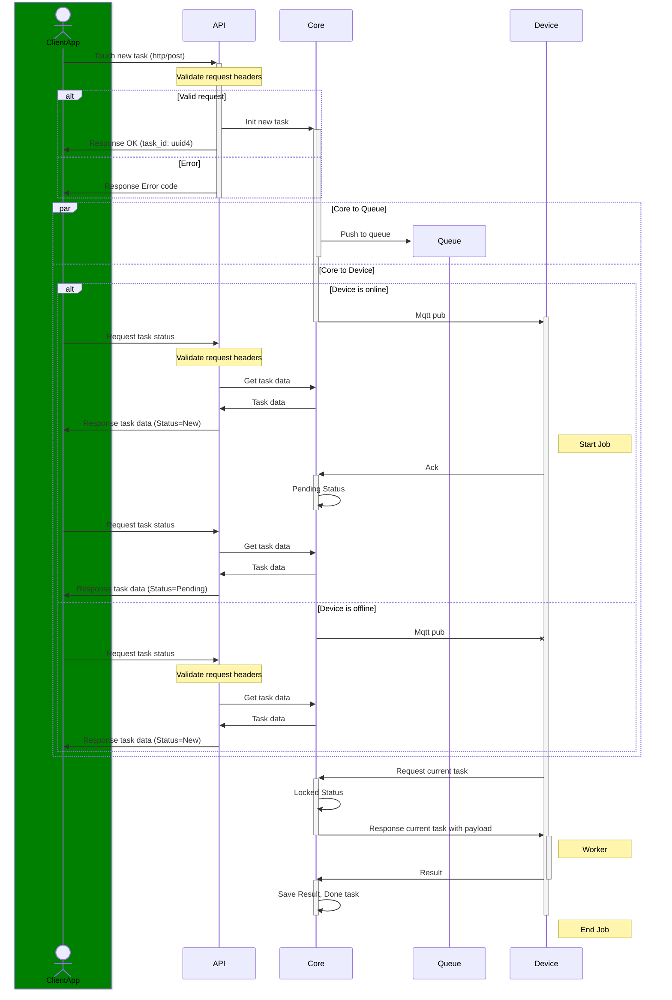

# Iot Async-RPC Core

[**Swarm of devices**] <--> [**Core**] <--> [**Control center**]

### Concepts:

- Iot is lifetime 'Loose Coupling' in Event-Driven Systems
- Remote calls are usually orders of magnitude slower and less reliable
- The call is a POST request to REST-API, with parameters pushed on to the core stack (server-side persistent storage)
- A combination of request/response and polling methods on remote machines
- Iot: lightweight protocol MQTT 5.0 for swarm control
- Event processing at the core level
- Persistent event queues

### Services:

- PostgreSQL
- RabbitMQ + MQTT Plugin (native)
- nginx + jwt module
- CA (openssl)
- optional avahi (local deployment case)
- app

### App:

- Python3
- FastAPI
- FastStream
- Pydantic
- SQLAlchemy
- Alembic
- APScheduler

### Infra:

- Docker Compose
- PKI (X.509)

### Links:

- X.509 https://datatracker.ietf.org/group/pkix/about/
- Rabbit MQ MQTT X.509 Auth https://www.rabbitmq.com/docs/mqtt#tls-certificate-authentication
- RabbitMQ Topic Auth (adopt ACL) https://www.rabbitmq.com/docs/access-control#topic-authorisation
- RabbitMQ example config https://github.com/rabbitmq/rabbitmq-server/blob/main/deps/rabbit/docs/rabbitmq.conf.example
- FastAPI lifespan events https://fastapi.tiangolo.com/advanced/events/#lifespan-function
- SQLAlchemy create engine https://docs.sqlalchemy.org/en/20/core/engines.html#sqlalchemy.create_engine
- Python typing https://docs.python.org/3/library/typing.html
- pydantic settings dotenv https://docs.pydantic.dev/latest/concepts/pydantic_settings/#dotenv-env-support
- pydantic settings env variables https://docs.pydantic.dev/latest/concepts/pydantic_settings/#parsing-environment-variable-values
- case converter https://github.com/mahenzon/ri-sdk-python-wrapper/blob/master/ri_sdk_codegen/utils/case_converter.py
- SQLAlchemy constraint naming conventions https://docs.sqlalchemy.org/en/20/core/constraints.html#constraint-naming-conventions
- Alembic cookbook https://alembic.sqlalchemy.org/en/latest/cookbook.html
- Alembic naming conventions https://alembic.sqlalchemy.org/en/latest/naming.html#integration-of-naming-conventions-into-operations-autogenerate
- Alembic + asyncio recipe https://alembic.sqlalchemy.org/en/latest/cookbook.html#using-asyncio-with-alembic
- orjson https://github.com/ijl/orjson
- FastAPI ORJSONResponse https://fastapi.tiangolo.com/advanced/custom-response/#use-orjsonresponse

### Notes:

````
rabbitmqctl set_topic_permissions -p my-vhost user amq.topic "*.{client_id}-." "*.{client_id}-.*"
````
RABBITMQ_CONFIG_FILE=/path/to/a/custom/location/rabbitmq/my.conf

debian/ubuntu - /etc/rabbitmq/rabbitmq.conf



