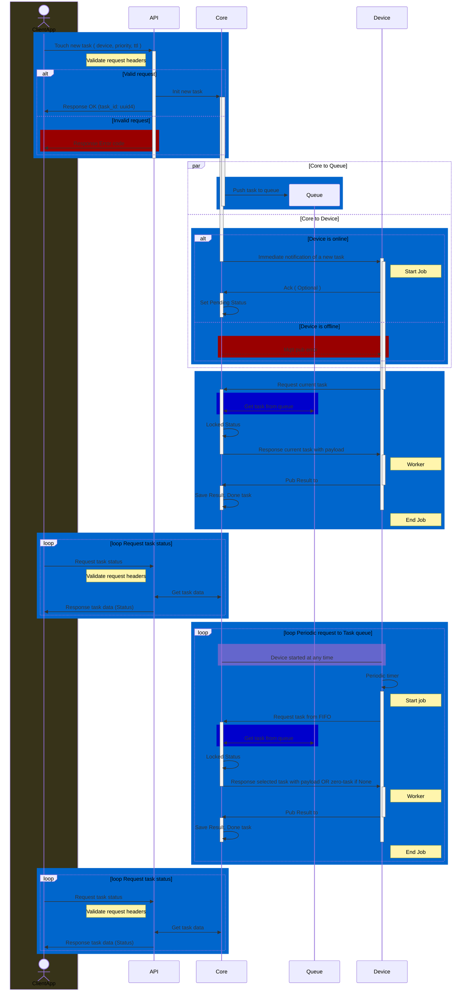

# Iot Async-RPC Core

[**Swarm of devices**] <--> [**Core**] <--> [**Control center**]

### Concepts:

- Iot is lifetime 'Loose Coupling' in Event-Driven Systems
- Thousands (swarms) of IOT devices should be represented by a simple and reliable end-to-end addressing system based on x509
- Remote calls are usually orders of magnitude slower and less reliable
- The App call is a simple request to REST-API, with async queued paradigm
- A combination of request/response and polling methods on remote machines
- Lightweight "The last mile protocol" MQTT 5.0

### The architectural stack:

- PostgreSQL
- RabbitMQ + MQTT Plugin (native) with permission definitions
- nginx + jwt (RSA) module
- CA (openssl, pyca/cryptography)
- optional mDNS like avahi (for local deployment case)
- app-services
- Swagger Api docs

### App:

- Python3
- FastAPI
- FastStream
- Pydantic
- SQLAlchemy
- Alembic

### Infra:

- Docker Compose
- PKI (X.509)

### Examples

#### Windows, Linux
Python agent

#### FreeRtos
c
ESP-IDF

