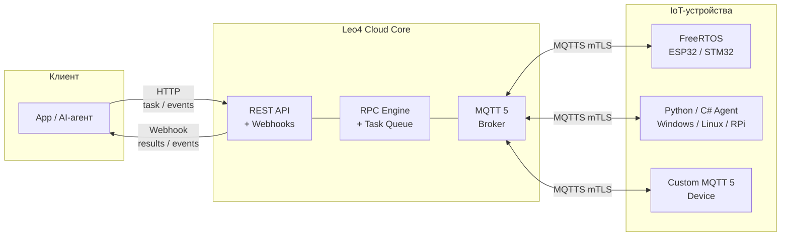
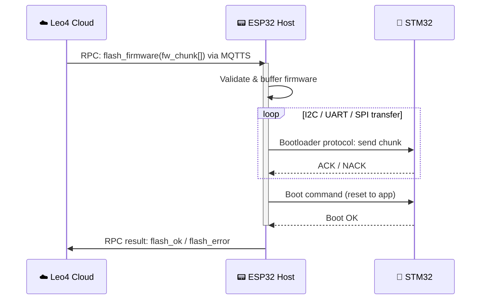
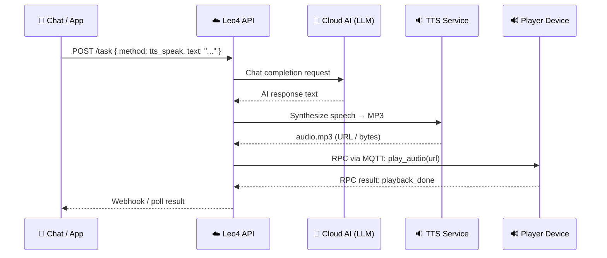
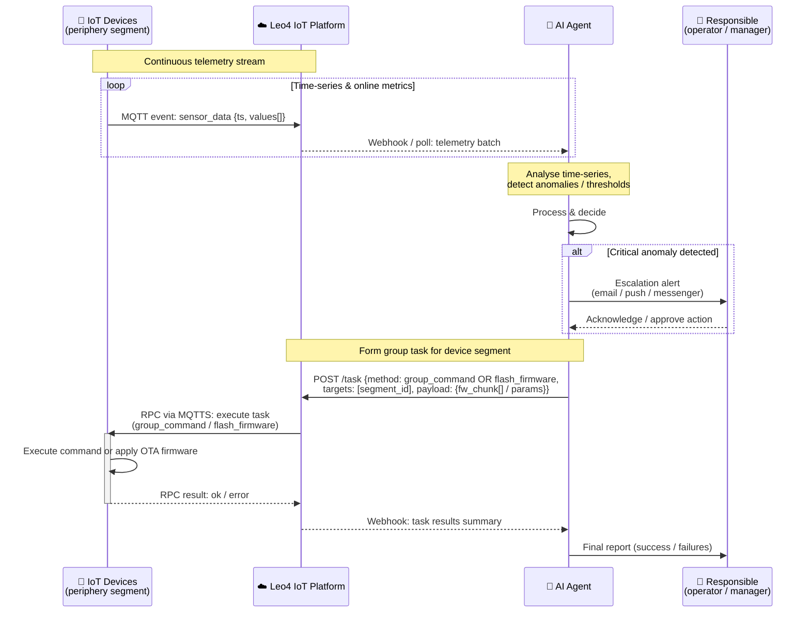

# 🌐 Leo4 IoT Platform

> Транспортный фреймворк для создания защищённых систем управления и телеметрии распределённой сети кроссплатформенных IoT-устройств.

```
[ЛК / App / AI-агент] ←→ [REST API + Core] ←→ [Рой устройств]
```

---

## 🏗️ Архитектура


```mermaid
flowchart LR
    subgraph Client["Клиент"]
        App["App / AI-агент"]
    end

    subgraph Core["Leo4 Cloud Core"]
        API["REST API\n+ Webhooks"]
        Engine["RPC Engine\n+ Task Queue"]
        Broker["MQTT 5\nBroker"]
        API --- Engine --- Broker
    end

    subgraph Devices["IoT-устройства"]
        D1["FreeRTOS\nESP32 / STM32"]
        D2["Python / C# Agent\nWindows / Linux / RPi"]
        D3["Custom MQTT 5\nDevice"]
    end

    App -->|"HTTP\ntask / events"| API
    API -->|"Webhook\nresults / events"| App
    Broker <-->|MQTTS mTLS| D1
    Broker <-->|MQTTS mTLS| D2
    Broker <-->|MQTTS mTLS| D3
```

---

## ✨ Ключевые принципы

| | |
|---|---|
| 🔗 **Loose Coupling** | Событийная модель, слабосвязанные устройства |
| 🔑 **PKI / x509** | Сквозная адресация устройств через сертификаты |
| ⚡ **Async RPC** | Очередь задач с приоритетами и TTL |
| 🔄 **Push + Pull** | Двойная стратегия доставки для нестабильных сетей |
| 🛡️ **Security** | mutual TLS, JWT (RSA), API-ключи, ACL брокера |
| 🤖 **AI-ready** | REST + Webhooks совместимы с Function Calling / MCP |

---

## 📚 Документация

### Протоколы и API

| Документ | Описание |
|---|---|
| 📡 [**RPC-протокол (MQTT v5)**](./docs/mqtt-rpc-protocol.md) | Асинхронный RPC поверх MQTT 5: топики, correlation data, Polling & Trigger |
| 📋 [**REST API: задачи (task workflow)**](./docs/1-task-workflow-doc.md) | HTTP-интерфейс управления задачами: touch_task, статусы, вебхуки |
| 📨 [**API событий устройств (events)**](./docs/2-events-api-format-description.md) | Получение асинхронных событий и телеметрии через REST |
| 🔔 [**Webhooks**](./docs/3-webhooks.md) | Push-уведомления о результатах задач и событиях |

### Диаграммы и сценарии

| Документ | Описание |
|---|---|
| 🔀 [**Sequence диаграммы**](./docs/sequence.md) | End-to-end сценарии: touch_task → MQTT RPC → result |
| 🗂️ [**Состояния задачи**](./docs/task_states.md) | State machine задачи: READY → PENDING → LOCK → DONE/FAILED |
| 📊 [**Граф клиентского потока RPC**](./docs/mqtt-rpc-client-flow.md) | Mermaid-диаграммы: Polling, Trigger, Fail-fast |

### Интеграция

| Документ | Описание |
|---|---|
| 🤖 [**AI-агент: руководство**](./docs/ai-agent-integration-guide.md) | Подключение LLM, MCP-сервера или чат-бота к Leo4 API |
| 🖥️ [**Серверная интеграция**](./docs/server-integration-guide.md) | Руководство по интеграции серверной стороны с IoT RPC |
| 🟠 [**Серверная интеграция: Kotlin + Spring Boot**](./docs/server-integration-guide-kotlin-spring.md) | Пример интеграции на Kotlin + Spring Boot |
| 🤖 [**Robotics**](./robotics/marketing-overview.md) | LEO4 Robotics Platform: управление автономными устройствами и роботами |

### Обзор платформы

| Документ | Описание |
|---|---|
| 🎯 [**Презентация решения**](./docs/solution-presentation.md) | Полный обзор платформы: концепция, архитектура, сценарии |
| ⏱️ [**TTL**](./docs/TTL.md) | Правила декремента TTL, поллинг и поведение при TTL=0 |
| 🔢 [**Справочник method_code**](./docs/method-codes-reference.md) | Реестр команд: диапазоны, форматы payload, ответы |
| 🏷️ [**Теги событий**](./docs/event-property-tags.md) | Справочник числовых тегов payload событий устройств |

---

## 💻 Примеры и симуляторы

> Все примеры используют двустороннюю SSL-аутентификацию (mutual TLS)

### 🐍 Python
- [`mqtt5-paho-full-rpc-client-example.py`](./examples/mqtt5-paho-full-rpc-client-example.py) — полный RPC-клиент на paho-mqtt
- [`mini-native-paho-mqttv5-corrdata-client.py`](./examples/mini-native-paho-mqttv5-corrdata-client.py) — минимальный пример с correlation data
- [`rpc-client-example.py`](./examples/rpc-client-example.py) — базовый пример клиента

### 🐍 Device emulator (python)
- [`device-emulator/`](./device-emulator/) — Device emulator (mock RPC method 51 + healthcheck/test events)

### 🔷 C# / .NET
- [`rpc-client-example.cs`](./examples/rpc-client-example.cs) — RPC-клиент на .NET
- [`rpc-client-native-correlation-example.cs`](./examples/rpc-client-native-correlation-example.cs) — native correlation data
- [`rpc-client-extract-SN-from-cert-example.cs`](./examples/rpc-client-extract-SN-from-cert-example.cs) — извлечение SN из сертификата

### ⚙️ C / Windows
- [`c-win-clion-rpc-client/`](./examples/c-win-clion-rpc-client/) — RPC-клиент для Windows

### ⚙️ C / FreeRTOS
- Siplite — RPC-клиент + SIP + WebRTC для ESP32/STM32 (по запросу)

### 🎮 Сценарии устройств

| Платформа | Сценарий |
|---|---|
| 🖥️ Windows / Linux | Удалённая отправка файла в Telegram, запись экрана (ffmpeg), запуск произвольных команд |
| 🐍 Python Agent | Удалённый запуск fullscreen-формы (tkinter), выполнение произвольного кода, WebRTC-стриминг с Raspberry Pi |
| 📟 ESP32 (ESP-IDF) | PWM-управление LED, RS-485, SIP-звонок (ESP-ADF), управление постаматом |
| 🔬 STM32 | Удалённый запуск измерений с кастомными параметрами, передача массива данных |

---

## 📊 Diagrams (three usage examples)

### 🔬 STM32 | Cloud Bootloader

> Обновление прошивки STM32 через облако: ESP32 выступает хостом и передаёт прошивку на STM32 по шине I2C / UART / SPI.


```mermaid
sequenceDiagram
    participant Cloud as ☁️ Leo4 Cloud
    participant ESP32 as 📟 ESP32 Host
    participant STM32 as 🔬 STM32

    Cloud->>ESP32: RPC: flash_firmware(fw_chunk[]) via MQTTS
    activate ESP32
    ESP32->>ESP32: Validate & buffer firmware
    loop I2C / UART / SPI transfer
        ESP32->>STM32: Bootloader protocol: send chunk
        STM32-->>ESP32: ACK / NACK
    end
    ESP32->>STM32: Boot command (reset to app)
    STM32-->>ESP32: Boot OK
    deactivate ESP32
    ESP32->>Cloud: RPC result: flash_ok / flash_error
```

---

### 🔊 TTS Voice-Terminal | Chat → Cloud AI → TTS.MP3 → Player

> Голосовой терминал: текстовый чат отправляется в облачный AI, ответ синтезируется в MP3 и воспроизводится на устройстве через Leo4 RPC-сигнализацию.


```mermaid
sequenceDiagram
    participant User  as 💬 Chat / App
    participant Leo4  as ☁️ Leo4 API
    participant AI    as 🤖 Cloud AI (LLM)
    participant TTS   as 🔉 TTS Service
    participant Dev   as 🔊 Player Device

    User->>Leo4: POST /task  { method: tts_speak, text: "..." }
    Leo4->>AI: Chat completion request
    AI-->>Leo4: AI response text
    Leo4->>TTS: Synthesize speech → MP3
    TTS-->>Leo4: audio.mp3 (URL / bytes)
    Leo4->>Dev: RPC via MQTT: play_audio(url)
    Dev-->>Leo4: RPC result: playback_done
    Leo4-->>User: Webhook / poll result
```

---

### 🤖 AI | Bulk Telemetry → Decision → Escalation → Group Task / OTA

> AI массово принимает через Leo4 IoT Platform временные ряды данных и онлайн-показатели от периферии, обрабатывает их, принимает решение и эскалирует важное на ответственного, затем формирует групповое задание (включая новую прошивку MCU) и отправляет его на сегменты устройств.


```mermaid
sequenceDiagram
    participant Devs  as 📡 IoT Devices<br/>(periphery segment)
    participant Leo4  as ☁️ Leo4 IoT Platform
    participant AI    as 🤖 AI Agent
    participant Resp  as 👤 Responsible<br/>(operator / manager)

    Note over Devs,Leo4: Continuous telemetry stream
    loop Time-series & online metrics
        Devs->>Leo4: MQTT event: sensor_data {ts, values[]}
        Leo4-->>AI: Webhook / poll: telemetry batch
    end

    Note over AI: Analyse time-series,<br/>detect anomalies / thresholds
    AI->>AI: Process & decide

    alt Critical anomaly detected
        AI->>Resp: Escalation alert<br/>(email / push / messenger)
        Resp-->>AI: Acknowledge / approve action
    end

    Note over AI,Leo4: Form group task for device segment
    AI->>Leo4: POST /task {method: group_command OR flash_firmware,<br/>targets: [segment_id], payload: {fw_chunk[] / params}}
    Leo4->>Devs: RPC via MQTTS: execute task<br/>(group_command / flash_firmware)
    activate Devs
    Devs->>Devs: Execute command or apply OTA firmware
    Devs-->>Leo4: RPC result: ok / error
    deactivate Devs
    Leo4-->>AI: Webhook: task results summary
    AI->>Resp: Final report (success / failures)
```

---

## 🔐 Безопасность

- **mutual TLS** — аутентификация устройств по клиентским сертификатам
- **PKI (x509)** — CA на базе openssl / pyca/cryptography
- **JWT (RSA)** — авторизация API-клиентов
- **RabbitMQ ACL** — строгие политики маршрутизации на уровне брокера
- **nginx** — TLS-терминация, JWT-терминация, rate limiting

---

## 🛠️ Технологический стек

`Python 3` · `FastAPI` · `FastStream` · `PostgreSQL` · `RabbitMQ + MQTT 5` · `nginx` · `Docker Compose` · `PKI (x509)`

---

## 🎛️ Контроллеры

`STM32` · `ESP32` · `C` · `FreeRTOS` · `ESP-IDF` · `ESP-ADF`

---

> 📧 info@platerra.ru · 🌐 https://platerra.ru · © 2026 Leo4
