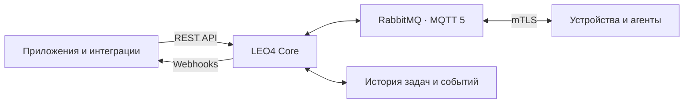

# 🌐 LEO4 IoT Platform

### Управление устройствами · События · Защищённые интеграции

От команды в приложении до ответа устройства и наблюдаемого результата — единый контур взаимодействия для распределённой сети IoT.

[📚 Документация](docs/README.md) · [📡 RPC](docs/mqtt-rpc-protocol.md) · [🔌 REST API](docs/rest-api.md) · [📨 События](docs/event-protocol-mqtt.md)

---

## ✨ Что даёт платформа

LEO4 соединяет бизнес-приложения, серверные сервисы и AI-интеграции с устройствами через REST API и защищённый MQTT 5. Ядро управляет очередью команд, сохраняет результаты и события, предоставляет историю и отправляет уведомления.

| Возможность | Для чего нужна |
| :--- | :--- |
| ⚡ **Асинхронные команды** | Приоритеты, ограниченный срок действия и получение результата без удержания HTTP-соединения |
| 🔄 **Trigger + Polling** | Немедленный анонс команды и выборка очереди устройством после восстановления связи |
| 📨 **События и телеметрия** | Датчики, действия пользователей, состояние оборудования и история операций |
| 🔔 **Webhooks** | Передача новых событий и результатов прямо в приложение |
| 🔐 **Идентичность устройств** | Клиентские сертификаты, mTLS и доступ к топикам своего устройства |
| 🏢 **Организации и доступ** | API-ключи организаций, разграничение данных и отдельный межсервисный интерфейс |
| 🖥️ **Удалённое обслуживание** | Диагностика, потоковый вывод, удалённые сеансы и файловый менеджер |
| 🧩 **Развитие парка устройств** | Контракты для контроллеров и программных агентов, инвентаризация и сопровождение обновлений |

## 🧭 Как это работает

```mermaid
flowchart LR
    A["Приложения и интеграции"] -->|"REST API"| C["LEO4 Core"]
    C -->|"Webhooks"| A
    C <--> B["RabbitMQ · MQTT 5"]
    B <-->|"mTLS"| D["Устройства и агенты"]
    C <--> H["История задач и событий"]
```

**Команда → ответ → факт.** Приложение создаёт задачу, устройство получает её и возвращает результат RPC. Отдельное событие сообщает о наблюдаемом изменении: например, датчик подтверждает открытие двери. Эти сигналы позволяют приложению различать ответ на команду и физический результат.

## 🎯 Где применять

| Сценарий | Что связывает LEO4 |
| :--- | :--- |
| 📦 **Постаматы и системы доступа** | Команды замкам, состояния ячеек, идентификаторы и события датчиков |
| 🏭 **Распределённое оборудование** | Управление контроллерами, телеметрия и интеграция с прикладными системами |
| 🛠️ **Обслуживание терминалов** | Диагностика, удалённые сеансы, работа с файлами и инвентаризация ПО |
| 🤖 **Автоматизация и AI** | Вызовы REST, результаты задач и события для внешних сценариев и ассистентов |

Поддержка конкретной команды зависит от прошивки или агента устройства. [Реестр методов](docs/method-codes-reference.md) и [реестр событий](docs/event-types-reference.md) помогают выбрать подходящий контракт.

## 📚 Начните с нужного маршрута

| Ваша задача | Документ |
| :--- | :--- |
| Познакомиться с интерфейсами платформы | [🧭 Навигатор документации](docs/README.md) |
| Подключить приложение или сервер | [🔌 Обзор REST API](docs/rest-api.md) · [Руководство интеграции](docs/server-integration-guide.md) |
| Реализовать обмен на устройстве | [📡 MQTT RPC](docs/mqtt-rpc-protocol.md) · [События MQTT](docs/event-protocol-mqtt.md) |
| Получать результаты и историю | [📋 Задачи](docs/1-task-workflow-doc.md) · [События REST](docs/2-events-api-format-description.md) · [Webhooks](docs/3-webhooks.md) |
| Разобраться с удалённым обслуживанием | [🖥️ Диагностика](docs/remote-diagnostics-protocol.md) · [Удалённый ввод](docs/remote-input-protocol.md) · [Файловый менеджер](docs/file-manager-v2.md) |
| Работать с репозиторием | [🛠️ Участие в разработке](CONTRIBUTING.md) · [Безопасность](SECURITY.md) |

## 🗂️ Что в репозитории

| Каталог | Содержание |
| :--- | :--- |
| `app-service/` | Ядро платформы: API, обработка сообщений и доменная логика |
| `docs/` | Протоколы, интеграции, справочники и эксплуатационные руководства |
| `rmq/`, `docker-files/`, `deploy/` | Конфигурация брокера, контейнеризация и выпуск сервиса |
| `l4desk-service/` | Сервис удалённых сеансов и его документация |
| `examples/`, `device-emulator/` | Примеры клиентов и эмулятор устройства |
| `mcp/`, `robotics/` | MCP-интеграция и материалы по роботизированным сценариям |

**Основа ядра:** Python 3.14 · FastAPI · FastStream · PostgreSQL · RabbitMQ · Redis · Docker Compose.

Документация основных интерфейсов сверена с кодом `master` 9 октября 2026 года. Правила эксплуатации и выпуска сервиса вынесены в [runbook](docs/manual-app1-deploy-runbook.md).

---

📧 [info@platerra.ru](mailto:info@platerra.ru) · 🌐 [platerra.ru](https://platerra.ru)

