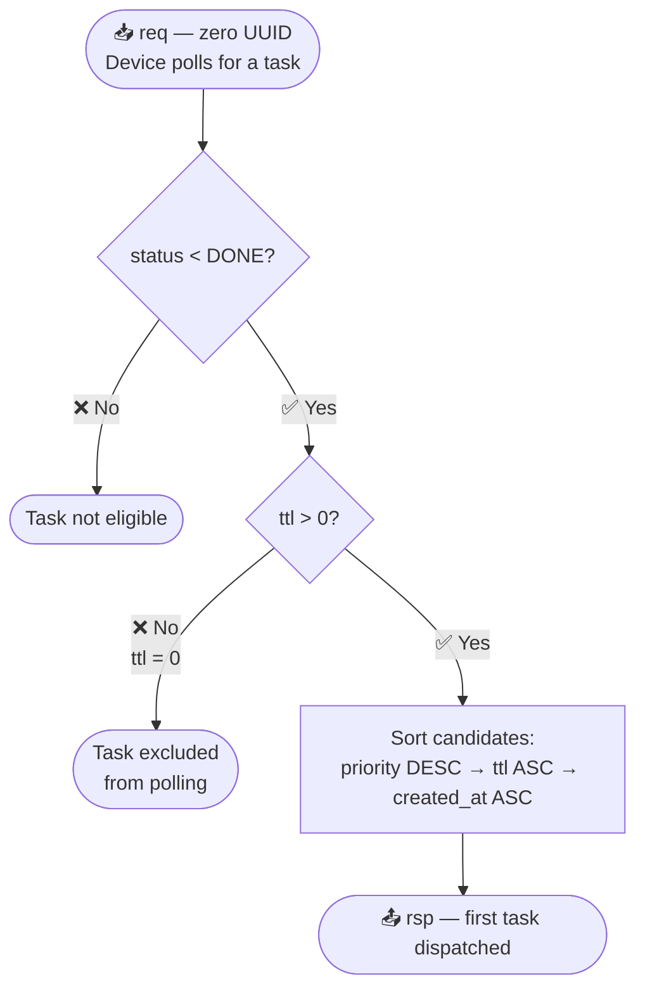

# ⏱️ TTL

> **File:** `docs/TTL.md`

---

## ⚙️ How TTL Works

| Property | Value |
|---|---|
| ⏲️ Unit | Minutes |
| 📌 Initial value | Set once via the **Touch task** API request |
| 🔁 Update cadence | Core decrements TTL by **1** every minute |
| 🔝 Maximum value | **44 640 min** ≈ 1 month |

---

## 🔄 Polling Strategy and TTL

Tasks with `ttl = 0` are **excluded from the polling selection** (`req` with zero UUID).

The server selects the next task for the device using the following rules, applied in order:

| Step | Rule | Detail |
|:---:|---|---|
| 1 | ✅ Eligible status | Only tasks with `status < DONE` are considered |
| 2 | 🚫 Exclude zero-TTL | Tasks with `ttl = 0` are skipped (`WHERE ttl > 0`) |
| 3 | 🔀 Sort order | `priority DESC` → `ttl ASC` → `created_at ASC` |
| 4 | 📤 Dispatch | The first task after sorting is sent as `rsp` |

**Selection priority summary:**

- Higher `priority` → always wins.  
- Equal `priority` → task closest to expiration (smallest positive TTL) wins.  
- Equal `priority` and `ttl` → oldest task (`created_at`) wins.

### 📊 Polling Selection Flowchart

---

## ⚡ Case TTL = 0

Setting `ttl = 0` means the task **will not be served during polling** (`req` with zero UUID).  
See full polling strategy in [`mqtt-rpc-protocol.md`](./mqtt-rpc-protocol.md).

### When to use TTL = 0

| Use-case | Notes |
|---|---|
| 🔥 Urgent / fire-and-forget commands | Server trigger (`tsk`) + device `ack` matter more than the full `rsp` round-trip |
| 📡 No delivery guarantee needed | E.g. reverse polling without result correlation |
| ⚡ Momentary signals | Only needs to reach the transport layer; payload processing is secondary |

### ⚠️ Race condition risk

> When the kernel TTL job encounters `ttl = 0` it moves the task to `EXPIRED`.  
> If the device simultaneously requests the task via a trigger (non-zero correlation), a **race condition** may occur.

### 📝 Key distinction: polling vs. trigger

| Flow | `ttl = 0` supported? |
|---|:---:|
| 🔍 Polling — `req` with zero UUID | ❌ Task will **not** be selected |
| 🎯 Trigger — `tsk` → `req` with specific correlation UUID | ✅ Task **can** be delivered |

---

## 📚 See Also

- [`mqtt-rpc-protocol.md`](./mqtt-rpc-protocol.md) — Full RPC protocol specification with polling strategy and TTL=0 behaviour
- [`1-task-workflow-doc.md`](./1-task-workflow-doc.md) — Task API workflow documentation
