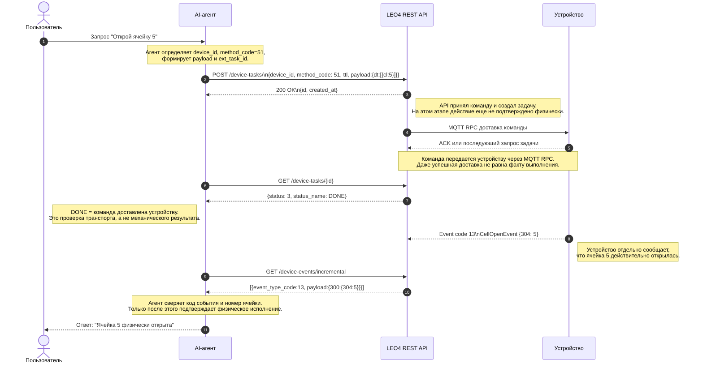

# Практическое руководство: Интеграция AI-агента с LEO4 API

> **Версия:** 2.0  
> **Дата:** 2026-04-04  
> **Платформа:** dev.leo4.ru  
> **Контакты:** info@platerra.ru | https://platerra.ru

---

## Введение

Данное руководство описывает, как практически подключить AI-агента (LLM с Function Calling, MCP-сервер, чат-бот) к REST API платформы LEO4 для управления IoT-устройствами.

> ⚠️ **Важно:** Task status = 3 (DONE) означает только **доставку** команды на устройство. Для подтверждения **физического исполнения** (например, открытия ячейки) необходимо отследить событие `CellOpenEvent` (код 13) с номером ячейки в теге `304` через `GET /device-events/incremental` или вебхук `msg-event`.

**Итоговый сценарий:**

```
Пользователь: "Открой ячейку 5"

① AI-агент → POST /device-tasks/ {method_code: 51, payload: {dt: [{cl: 5}]}}
② AI-агент → GET /device-tasks/{id}          → status: 3 (DONE) — команда доставлена
③ AI-агент → GET /device-events/incremental  → event_type_code: 13, 304: 5 — ячейка физически открыта

AI-агент → "Ячейка 5 физически открыта ✅"
```

### Общая схема потока данных



---

## Быстрый старт (чек-лист)

1. **Получите API-ключ** в личном кабинете (dev.leo4.ru) — он привязан к вашей организации
2. **Узнайте `device_id`** целевого устройства (виден в ЛК → левая панель → Номер связи)
3. **Проверьте связь** — отправьте hello-запрос (см. раздел ниже)
4. **Подключите LLM** с Function Calling (см. раздел «Полный пример AI-агента»)
5. **Проверьте события** — после открытия ячейки убедитесь, что приходит CellOpenEvent (код 13) через `GET /device-events/incremental`
6. **Для продакшена** — настройте вебхуки вместо polling (см. раздел «Webhook»)

---

## Получение ключа LLM-провайдера

### OpenAI

1. Зарегистрируйтесь в [OpenAI Platform](https://platform.openai.com/).
2. Перейдите в раздел управления API-ключами.
3. Создайте новый secret key.
4. Сохраните ключ в безопасном месте — повторно он обычно не показывается.
5. Передавайте ключ через переменную окружения, а не храните его в коде.

```bash
export OPENAI_API_KEY="sk-..."
```

Пример использования в Python:

```python
import os
from openai import OpenAI

client = OpenAI(api_key=os.environ["OPENAI_API_KEY"])
```

> ⚠️ Не храните API-ключ в исходном коде, Dockerfile, публичных `.env` или репозитории Git.

### Yandex AI Studio (Responses API)

Yandex AI Studio можно использовать как альтернативного LLM-провайдера, если это подходит по требованиям инфраструктуры и доступности.

#### Как получить API-ключ Yandex AI Studio

1. Откройте интерфейс [Yandex AI Studio](https://aistudio.yandex.ru/).
2. Перейдите в раздел управления API-ключами.
3. Создайте новый API-ключ.
4. Сохраните ключ в безопасном месте.
5. Передавайте его в приложение через переменную окружения.

Подробная инструкция: [aistudio.yandex.ru — получение API-ключа](https://aistudio.yandex.ru/docs/ru/ai-studio/operations/get-api-key.html)

```bash
export YANDEX_AI_API_KEY="yandex_..."
```

> ⚠️ API-ключ даёт доступ к вашей квоте и должен храниться так же аккуратно, как и ключ OpenAI.

#### Как отправить запрос через Responses API

Yandex AI Studio предоставляет собственный Responses API для генерации ответов. Базовая схема интеграции:

1. Выберите модель в Yandex AI Studio.
2. Сформируйте запрос в формате Responses API.
3. Передайте API-ключ в заголовке авторизации.
4. Получите текст ответа модели и используйте его в цикле AI-агента.

Документация: [aistudio.yandex.ru — Responses API](https://aistudio.yandex.ru/docs/ru/ai-studio/operations/generation/create-prompt.html)

> ⚠️ Перед внедрением обязательно сверьтесь с актуальной документацией Yandex AI Studio:
> - точный URL endpoint;
> - формат заголовка авторизации;
> - имя модели;
> - поддержка tools / function calling / structured output для вашего сценария.

---

## Проверка связи (curl)

```bash
curl -X POST https://dev.leo4.ru/api/v1/device-tasks/ \
  -H "x-api-key: ApiKey ВАШ_КЛЮЧ" \
  -H "Content-Type: application/json" \
  -d '{
    "ext_task_id": "test-hello-001",
    "device_id": 4619,
    "method_code": 20,
    "ttl": 5,
    "payload": {"dt": [{"mt": 0}]}
  }'
```

**Ожидаемый ответ:**

```json
{
  "id": "a1b2c3d4-e5f6-7890-g1h2-i3j4k5l6m7n8",
  "created_at": 1712345678
}
```

---

## Структура HTTP-запроса к LEO4 API

### Эндпоинт

```
POST https://dev.leo4.ru/api/v1/device-tasks/
```

### Заголовки

| Заголовок | Значение | Описание |
|-----------|----------|----------|
| `Content-Type` | `application/json` | Формат тела запроса |
| `x-api-key` | `ApiKey ваш-секретный-ключ` | API-ключ организации |

> ⚠️ Без заголовка `x-api-key` сервер вернёт `401 Unauthorized`.

### Поля тела запроса

| Поле | Тип | Обязательное | По умолчанию | Описание |
|------|-----|:---:|:---:|----------|
| `ext_task_id` | string | ✅ | — | Ваш внешний идентификатор (для идемпотентности) |
| `device_id` | int | ✅ | — | ID устройства в системе LEO4 |
| `method_code` | int (0–65534) | ✅ | 20 | Код команды |
| `priority` | int (0–9) | — | 0 | Приоритет задачи в очереди |
| `ttl` | int (0–44639) | — | 1 | Время жизни задачи в минутах |
| `payload` | object | — | null | Параметры команды в формате `{\"dt\": [...]}` |

### Основные коды команд (method_code)

| Код | Команда | Пример payload |
|-----|---------|----------------|
| 20 | Короткая команда (hello) | `{\"dt\": [{\"mt\": 0}]}` |
| 20 | Список ячеек | `{\"dt\": [{\"mt\": 4}]}` |
| 21 | Перезагрузка | `{\"dt\": [{\"mt\": 0}]}` |
| 51 | Открыть ячейку N | `{\"dt\": [{\"cl\": N}]}` |
| 16 | Привязка карты/пинкода | `{\"dt\": [{\"cl\": N, \"cd\": \"...\"}]}` |
| 49 | Запись в NVS | `{\"dt\": [{\"ns\": \"...\", \"k\": \"...\", \"v\": \"...\", \"t\": \"...\"}]}` |
| 50 | Чтение NVS | `{\"dt\": [{\"ns\": \"...\", \"k\": \"...\"}]}` |

### Статусы задач

| Код | Состояние | Описание |
|-----|-----------|----------|
| 0 | READY | Задача создана, ожидает устройство |
| 1 | PENDING | Устройство подтвердило получение |
| 2 | LOCK | Устройство выполняет задачу |
| 3 | DONE | Команда доставлена на устройство; физический результат подтверждайте отдельным событием |
| 4 | EXPIRED | TTL истёк |
| 5 | DELETED | Удалена через API |
| 6 | FAILED | Ошибка выполнения |

---

## 1. Полный пример AI-агента (Python)

Зависимости:

```bash
pip install openai httpx
```

### Код агента

```python
"""
AI-агент: чат-сообщение → POST /device-tasks/ → GET /device-tasks/{id}
→ GET /device-events/incremental → результат пользователю
Зависимости: pip install openai httpx
"""
import json
import os
import time

import httpx
from openai import OpenAI

# ── Конфигурация ──
LEO4_API_URL = "https://dev.leo4.ru/api/v1"
LEO4_API_KEY = "ApiKey ВАШ_КЛЮЧ"            # x-api-key из ЛК LEO4
DEVICE_ID = 4619                             # ID целевого устройства

LLM_PROVIDER = os.getenv("LLM_PROVIDER", "openai")
OPENAI_KEY = os.getenv("OPENAI_API_KEY")
YANDEX_AI_API_KEY = os.getenv("YANDEX_AI_API_KEY")

client = OpenAI(api_key=OPENAI_KEY)

# ── Tool-описание для LLM (Function Calling) ──
TOOLS = [
    {
        "type": "function",
        "function": {
            "name": "create_device_task",
            "description": "Отправить команду IoT-устройству через LEO4 API",
            "parameters": {
                "type": "object",
                "properties": {
                    "method_code": {
                        "type": "integer",
                        "description": (
                            "Код команды: 51=открыть ячейку, "
                            "20=короткая команда, 21=перезагрузка"
                        )
                    },
                    "payload": {
                        "type": "object",
                        "description": (
                            'Параметры команды, например '
                            '{"dt": [{"cl": 5}]} для открытия ячейки 5'
                        )
                    },
                    "ttl": {
                        "type": "integer",
                        "description": "Время жизни задачи в минутах (по умолчанию 5)"
                    }
                },
                "required": ["method_code", "payload"]
            }
        }
    },
    {
        "type": "function",
        "function": {
            "name": "get_task_status",
            "description": (
                "Проверить статус доставки задачи на устройство. "
                "status=3 (DONE) означает только доставку команды, а не физическое исполнение."
            ),
            "parameters": {
                "type": "object",
                "properties": {
                    "task_id": {
                        "type": "string",
                        "description": "UUID задачи, полученный при создании"
                    }
                },
                "required": ["task_id"]
            }
        }
    },
    {
        "type": "function",
        "function": {
            "name": "poll_cell_open_event",
            "description": (
                "Дождаться физического подтверждения открытия ячейки. "
                "Ищет событие CellOpenEvent (код 13) с номером ячейки в теге 304. "
                "Вызывай после того, как get_task_status вернул status=3 (DONE)."
            ),
            "parameters": {
                "type": "object",
                "properties": {
                    "cell_number": {
                        "type": "integer",
                        "description": "Номер ячейки, которую нужно подтвердить"
                    },
                    "last_event_id": {
                        "type": "integer",
                        "description": "Последний известный ID события перед началом ожидания",
                        "default": 0
                    },
                    "timeout_s": {
                        "type": "integer",
                        "description": "Сколько секунд ждать событие",
                        "default": 30
                    }
                },
                "required": ["cell_number"]
            }
        }
    }
]


# ── Функции взаимодействия с LEO4 API ──

def create_device_task(method_code: int, payload: dict, ttl: int = 5) -> dict:
    """POST /api/v1/device-tasks/ — создание задачи для устройства."""
    with httpx.Client() as http:
        response = http.post(
            f"{LEO4_API_URL}/device-tasks/",
            headers={
                "Content-Type": "application/json",
                "x-api-key": LEO4_API_KEY,
            },
            json={
                "ext_task_id": f"chat-{method_code}-auto",
                "device_id": DEVICE_ID,
                "method_code": method_code,
                "priority": 1,
                "ttl": ttl,
                "payload": payload,
            },
        )
        response.raise_for_status()
        return response.json()


def get_task_status(task_id: str) -> dict:
    """GET /api/v1/device-tasks/{id} — подтверждение доставки задачи."""
    with httpx.Client() as http:
        response = http.get(
            f"{LEO4_API_URL}/device-tasks/{task_id}",
            headers={"x-api-key": LEO4_API_KEY},
        )
        response.raise_for_status()
        return response.json()


def poll_cell_open_event(
    cell_number: int,
    last_event_id: int = 0,
    timeout_s: int = 30,
) -> dict:
    """GET /api/v1/device-events/incremental — ожидание CellOpenEvent."""
    deadline = time.time() + timeout_s
    current_event_id = last_event_id

    with httpx.Client() as http:
        while time.time() < deadline:
            response = http.get(
                f"{LEO4_API_URL}/device-events/incremental",
                headers={"x-api-key": LEO4_API_KEY},
                params={
                    "device_id": DEVICE_ID,
                    "last_event_id": current_event_id,
                    "limit": 50,
                },
            )
            response.raise_for_status()
            events = response.json()

            for event in events:
                current_event_id = max(current_event_id, event["id"])
                if event.get("event_type_code") != 13:
                    continue

                for row in event.get("payload", {}).get("300", []):
                    if row.get("304") == cell_number:
                        return {
                            "confirmed": True,
                            "event_id": event["id"],
                            "cell_number": cell_number,
                            "event": event,
                        }

            time.sleep(2)

    return {
        "confirmed": False,
        "cell_number": cell_number,
        "last_event_id": current_event_id,
        "message": "CellOpenEvent не найден за отведённое время",
    }


# ── Маршрутизатор tool-вызовов ──

TOOL_DISPATCH = {
    "create_device_task": create_device_task,
    "get_task_status": get_task_status,
    "poll_cell_open_event": poll_cell_open_event,
}


def execute_tool(tool_name: str, arguments: dict) -> dict:
    """Выполнить tool-вызов по имени."""
    func = TOOL_DISPATCH[tool_name]
    return func(**arguments)


# ── Основной цикл чат-агента ──

def chat(user_message: str) -> str:
    """Обработка сообщения пользователя через LLM с Function Calling."""
    messages = [
        {
            "role": "system",
            "content": (
                "Ты — AI-ассистент для управления IoT-устройствами через платформу LEO4. "
                "Когда пользователь просит открыть ячейку, сначала вызови create_device_task, "
                "затем проверь доставку через get_task_status. "
                "Если status=3 (DONE), это значит только, что команда доставлена. "
                "После этого обязательно вызови poll_cell_open_event, чтобы подтвердить "
                "физическое открытие ячейки по событию CellOpenEvent (код 13, тег 304). "
                "Для других команд используй create_device_task и get_task_status по ситуации."
            ),
        },
        {"role": "user", "content": user_message},
    ]

    response = client.chat.completions.create(
        model="gpt-4o",
        messages=messages,
        tools=TOOLS,
    )

    msg = response.choices[0].message

    while msg.tool_calls:
        messages.append(msg)

        for tool_call in msg.tool_calls:
            name = tool_call.function.name
            args = json.loads(tool_call.function.arguments)

            print(f"  🔧 Вызов: {name}({args})")
            result = execute_tool(name, args)
            print(f"  ✅ Результат: {result}")

            messages.append({
                "role": "tool",
                "tool_call_id": tool_call.id,
                "content": json.dumps(result, ensure_ascii=False),
            })

        response = client.chat.completions.create(
            model="gpt-4o",
            messages=messages,
            tools=TOOLS,
        )
        msg = response.choices[0].message

    return msg.content


# ── Запуск ──
if __name__ == "__main__":
    while True:
        user_input = input("\n💬 Вы: ")
        if user_input.lower() in ("exit", "quit"):
            break
        answer = chat(user_input)
        print(f"🤖 Агент: {answer}")
```

### Пример диалога

```
💬 Вы: Открой ячейку 5
  🔧 Вызов: create_device_task({"method_code": 51, "payload": {"dt": [{"cl": 5}]}, "ttl": 5})
  ✅ Результат: {"id": "a1b2c3d4-...", "created_at": 1712345678}
  🔧 Вызов: get_task_status({"task_id": "a1b2c3d4-..."})
  ✅ Результат: {"status": 3, "results": [{"status_code": 200, ...}]}
  🔧 Вызов: poll_cell_open_event({"cell_number": 5, "last_event_id": 150280, "timeout_s": 30})
  ✅ Результат: {"confirmed": true, "event_id": 150283, "cell_number": 5, "event": {"event_type_code": 13, ...}}
🤖 Агент: Ячейка 5 физически открыта и подтверждена событием CellOpenEvent ✅

💬 Вы: Перезагрузи устройство
  🔧 Вызов: create_device_task({"method_code": 21, "payload": {"dt": [{"mt": 0}]}, "ttl": 5})
  ✅ Результат: {"id": "b2c3d4e5-...", "created_at": 1712345700}
🤖 Агент: Команда на перезагрузку отправлена. Подтверждение физического открытия здесь не требуется.

💬 Вы: Какие ячейки есть?
  🔧 Вызов: create_device_task({"method_code": 20, "payload": {"dt": [{"mt": 4}]}, "ttl": 5})
  ✅ Результат: {"id": "c3d4e5f6-...", "created_at": 1712345720}
  🔧 Вызов: get_task_status({"task_id": "c3d4e5f6-..."})
  ✅ Результат: {"status": 3, "results": [{"status_code": 200, "result": {...}}]}
🤖 Агент: Команда доставлена, устройство вернуло список доступных ячеек 1–12.
```

---

## 2. Получение результата: Polling vs Webhook

### Вариант A — Polling (простой)

Подходит для отладки и простых сценариев, но помните: `status=3 (DONE)` подтверждает только доставку команды.

```python
import time
import httpx


def wait_for_task_delivery(task_id: str, timeout: int = 30) -> dict:
    """Ждём, пока задача дойдёт до финального статуса."""
    headers = {"x-api-key": "ApiKey ВАШ_КЛЮЧ"}
    deadline = time.time() + timeout

    while time.time() < deadline:
        resp = httpx.get(
            f"https://dev.leo4.ru/api/v1/device-tasks/{task_id}",
            headers=headers,
        )
        data = resp.json()
        if data["status"] >= 3:
            return data
        time.sleep(2)

    raise TimeoutError(f"Задача {task_id} не завершилась за {timeout}с")


def wait_for_cell_open_event(
    device_id: int,
    cell_number: int,
    last_event_id: int = 0,
    timeout: int = 30,
) -> dict:
    """Ждём физическое подтверждение открытия ячейки через incremental events."""
    headers = {"x-api-key": "ApiKey ВАШ_КЛЮЧ"}
    deadline = time.time() + timeout
    current_event_id = last_event_id

    while time.time() < deadline:
        resp = httpx.get(
            "https://dev.leo4.ru/api/v1/device-events/incremental",
            headers=headers,
            params={
                "device_id": device_id,
                "last_event_id": current_event_id,
                "limit": 50,
            },
        )
        events = resp.json()

        for event in events:
            current_event_id = max(current_event_id, event["id"])
            if event.get("event_type_code") != 13:
                continue

            for row in event.get("payload", {}).get("300", []):
                if row.get("304") == cell_number:
                    return event

        time.sleep(2)

    raise TimeoutError(f"CellOpenEvent для ячейки {cell_number} не пришёл за {timeout}с")


# Использование:
# task = create_device_task(method_code=51, payload={"dt": [{"cl": 5}]})
# delivery = wait_for_task_delivery(task["id"])
# if delivery["status"] == 3:
#     event = wait_for_cell_open_event(device_id=4619, cell_number=5, last_event_id=150280)
#     print(f"Открытие подтверждено событием {event['id']}")
```

### Вариант B — Webhook (рекомендуется для продакшена)

Для полного 3-шагового цикла удобно подписаться сразу на два вебхука: `msg-task-result` и `msg-event`.

#### Шаг 1: Регистрация вебхуков (один раз)

```python
import httpx

headers = {
    "x-api-key": "ApiKey ВАШ_КЛЮЧ",
    "Content-Type": "application/json",
}

auth_payload = {
    "headers": {"Authorization": "Bearer ваш-токен"},
    "is_active": True,
}

httpx.put(
    "https://dev.leo4.ru/api/v1/webhooks/msg-task-result",
    headers=headers,
    json={
        "url": "https://your-ai-agent.com/hooks/task-result",
        **auth_payload,
    },
)

httpx.put(
    "https://dev.leo4.ru/api/v1/webhooks/msg-event",
    headers=headers,
    json={
        "url": "https://your-ai-agent.com/hooks/device-event",
        **auth_payload,
    },
)
```

#### Шаг 2: Приём вебхуков на стороне AI-агента

```python
from fastapi import FastAPI, Request

app = FastAPI()


@app.post("/hooks/task-result")
async def handle_task_result(request: Request):
    """msg-task-result: команда доставлена или завершилась ошибкой."""
    device_id = request.headers.get("x-device-id")
    status_code = request.headers.get("x-status-code")
    ext_id = request.headers.get("x-ext-id")
    body = await request.json()

    print(f"Устройство {device_id}: status_code={status_code}, ext_id={ext_id}")
    print(f"Результат задачи: {body}")
    return {"ok": True}


@app.post("/hooks/device-event")
async def handle_device_event(request: Request):
    """msg-event: физическое событие от устройства."""
    device_id = request.headers.get("x-device-id")
    body = await request.json()

    event_type = body.get("event_type_code") or body.get("200")
    payload = body.get("payload", body)

    if event_type == 13:
        for row in payload.get("300", []):
            if "304" in row:
                print(
                    f"Устройство {device_id}: ячейка {row['304']} подтверждена событием CellOpenEvent"
                )

    return {"ok": True}
```

#### Как интерпретировать вебхуки

| Тип события | Что подтверждает |
|------------|------------------|
| `msg-task-result` | Доставка команды и результат выполнения на уровне task/result |
| `msg-event` | Физическое событие устройства, например `CellOpenEvent` с тегом `304` |

> ⚠️ Для команды открытия ячейки ответ пользователю стоит отправлять после получения `msg-event` с `event_type_code = 13`.

---

## 3. Интеграция через MCP (Model Context Protocol)

Для LLM с поддержкой MCP (Claude, GPT и др.) API LEO4 удобно описывать как набор tools, где открытие ячейки состоит из трёх последовательных шагов.

```json
{
  "tools": [
    {
      "name": "create_device_task",
      "description": "Создать задачу (команду) для IoT-устройства через LEO4",
      "inputSchema": {
        "type": "object",
        "properties": {
          "device_id":   { "type": "integer", "description": "ID устройства" },
          "method_code": { "type": "integer", "description": "Код команды (51=открыть, 20=короткая, 21=reboot)" },
          "payload":     { "type": "object", "description": "Параметры: {\"dt\": [{\"cl\": 5}]}" },
          "ttl":         { "type": "integer", "description": "TTL в минутах", "default": 5 }
        },
        "required": ["device_id", "method_code", "payload"]
      }
    },
    {
      "name": "get_task_status",
      "description": "Проверить статус доставки задачи по UUID; DONE подтверждает только доставку команды",
      "inputSchema": {
        "type": "object",
        "properties": {
          "task_id": { "type": "string", "description": "UUID задачи" }
        },
        "required": ["task_id"]
      }
    },
    {
      "name": "poll_cell_open_event",
      "description": "Найти физическое подтверждение открытия ячейки через CellOpenEvent (код 13, тег 304)",
      "inputSchema": {
        "type": "object",
        "properties": {
          "device_id":     { "type": "integer", "description": "ID устройства" },
          "cell_number":   { "type": "integer", "description": "Номер ожидаемой ячейки" },
          "last_event_id": { "type": "integer", "description": "Последний обработанный event id", "default": 0 },
          "limit":         { "type": "integer", "description": "Лимит событий за запрос", "default": 50 }
        },
        "required": ["device_id", "cell_number"]
      }
    },
    {
      "name": "get_telemetry",
      "description": "Получить временные ряды телеметрии устройства",
      "inputSchema": {
        "type": "object",
        "properties": {
          "device_id": { "type": "integer", "description": "ID устройства" }
        },
        "required": ["device_id"]
      }
    },
    {
      "name": "configure_webhook",
      "description": "Настроить вебхук для получения событий и результатов",
      "inputSchema": {
        "type": "object",
        "properties": {
          "event_type": { "type": "string", "enum": ["msg-event", "msg-task-result"] },
          "url":        { "type": "string", "description": "URL вашего сервера" },
          "headers":    { "type": "object", "description": "Дополнительные заголовки" },
          "is_active":  { "type": "boolean", "default": true }
        },
        "required": ["event_type", "url"]
      }
    }
  ]
}
```

### Маппинг MCP Tool → LEO4 API

| MCP Tool | HTTP-метод | LEO4 API Endpoint |
|----------|------------|-------------------|
| `create_device_task` | `POST` | `/api/v1/device-tasks/` |
| `get_task_status` | `GET` | `/api/v1/device-tasks/{id}` |
| `poll_cell_open_event` | `GET` | `/api/v1/device-events/incremental` |
| `get_telemetry` | `GET` | `/api/v1/device-events/fields/` |
| `configure_webhook` | `PUT` | `/api/v1/webhooks/{event_type}` |

> MCP-агенту для команды открытия ячейки нужно сначала вызвать `create_device_task`, затем `get_task_status`, и только после `status=3` ожидать `poll_cell_open_event`.

---

## 4. Продвинутые сценарии

### Каскадная оркестрация (Closed-Loop)

AI-агент получает событие через вебхук и автоматически реагирует:

```python
@app.post("/hooks/device-event")
async def handle_device_event(request: Request):
    """Автономный контур: событие → анализ → действие."""
    body = await request.json()
    event_code = body.get("200")  # код типа события
    params = body.get("300", [])  # параметры

    # Пример: температура превысила порог
    if event_code == 44:  # DevHealthCheck
        temperature = extract_temperature(params)
        if temperature and temperature > 85:
            # AI-агент автоматически отправляет команду
            create_device_task(
                method_code=20,
                payload={"dt": [{"mt": 7}]},  # снизить мощность
                ttl=2,
            )
            notify_operator(
                f"⚠️ Температура {{temperature}}°C — команда отправлена"
            )

    return {"ok": True}
```

### Параллельная массовая активация

Отправка команд на множество устройств одновременно:

```python
import asyncio
import httpx

async def mass_activate(
    device_ids: list[int],
    method_code: int,
    payload: dict,
):
    """Параллельная отправка задач на N устройств."""
    async with httpx.AsyncClient() as http:
        tasks = [
            http.post(
                f"{LEO4_API_URL}/device-tasks/",
                headers={
                    "Content-Type": "application/json",
                    "x-api-key": LEO4_API_KEY,
                },
                json={
                    "ext_task_id": f"mass-{device_id}-{method_code}",
                    "device_id": device_id,
                    "method_code": method_code,
                    "priority": 1,
                    "ttl": 5,
                    "payload": payload,
                },
            )
            for device_id in device_ids
        ]
        results = await asyncio.gather(*tasks, return_exceptions=True)

    success = sum(
        1 for r in results
        if not isinstance(r, Exception) and r.status_code == 200
    )
    failed = len(device_ids) - success
    print(f"Отправлено: {{len(device_ids)}}, Успешно: {{success}}, Ошибок: {{failed}}")
    return results


# Использование:
# asyncio.run(mass_activate(
#     [4619, 4620, 4621],
#     method_code=51,
#     payload={"dt": [{"cl": 1}]},
# ))
```

---

## 5. Безопасность

- Все запросы требуют заголовок `x-api-key: ApiKey <ключ>`
- `org_id` извлекается из API-ключа автоматически — данные изолированы по организации
- HTTPS обязательно для всех вызовов
- Webhook-запросы могут содержать кастомные `headers` для авторизации на вашей стороне
- Каждый API-ключ даёт доступ только к устройствам своей организации

---

## Связанные документы

- [Презентация решения LEO4](./solution-presentation.md)
- [Workflow задач (Task Workflow)](./1-task-workflow-doc.md)
- [Документация по вебхукам](./3-webhooks.md)
- [Формат событий устройств](./2-device-events-doc.md)

---

> © 2026 Leo4 / Platerra. Все права защищены.  
> Контакты: info@platerra.ru | +7 (916) 206-71-24 | https://platerra.ru
