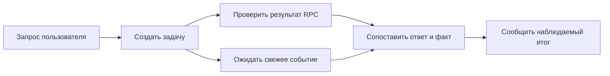

# 🤖 Интеграция AI-агента с LEO4

> REST и события позволяют агенту запрашивать действие и проверять наблюдаемый результат.

[← Документация](README.md) · [REST API](rest-api.md) · [Серверная интеграция](server-integration-guide.md)

## 🧭 Инструменты сценария

| Операция агента | API | Что получает агент |
| :--- | :--- | :--- |
| Найти устройство | `GET /api/v1/devices/` | Доступные устройства организации |
| Отправить команду | `POST /api/v1/device-tasks/` | UUID задачи |
| Прочитать результат | `GET /api/v1/device-tasks/{id}` | Состояние и `results[]` |
| Проверить факт | `GET /api/v1/device-events/fields/` или история | События датчика/агента |
| Получить уведомление | Подписки `msg-task-result`, `msg-event` | Push-данные для оркестратора |

Tool wrapper хранит API-ключ серверно, задаёт допустимые устройства и команды и проверяет параметры. Передавайте исходный ключ в `x-api-key`; JWT не заменяет ключ публичного API. Не включайте секрет в текст prompt или аргументы, которые видит пользователь.

## ⚡ Пример: открыть ячейку 5

```json
{
  "ext_task_id": "assistant-open-cell-5",
  "device_id": 4619,
  "method_code": 51,
  "priority": 1,
  "ttl": 5,
  "payload": {"dt": [{"cl": 5}]}
}
```


```mermaid
flowchart LR
    A["Запрос пользователя"] --> T["Создать задачу"]
    T --> R["Проверить результат RPC"]
    T --> E["Ожидать свежее событие"]
    R --> C["Сопоставить ответ и факт"]
    E --> C
    C --> U["Сообщить наблюдаемый итог"]
```

Сохраняйте UUID задачи. При потере HTTP-ответа не повторяйте POST автоматически: `ext_task_id` не обеспечивает идемпотентность создания. Действия повторяются только по прикладной политике.

## 💬 Как трактовать ответ

| Наблюдение | Что можно сообщить |
| :--- | :--- |
| Успешный POST | Задача создана |
| `status=3`, result success | Устройство вернуло успешный RPC-ответ |
| `status=3`, result error | Устройство вернуло ошибку |
| Свежий `CellOpenEvent (13)`, `304=5` | Датчик сообщил об открытии нужной ячейки |
| EXPIRED или timeout ожидания | Подтверждение не получено в отведённый срок |

DONE означает сохранённый результат, а не только доставку. Физический эффект проверяется отдельно. Событие может прийти раньше результата; wrapper должен учитывать оба потока. Событие без operation correlation нельзя строго связать с конкретной командой только по совпадению ячейки и времени.

## 🔄 События пользовательского сценария

l4con поддерживает события `900–999`: текст в `446`, пользовательский код в `447`, внешний UUID в `448`. Значение event code задаётся сценарием. В доверенном межсервисном контуре [поиск истории](user-event-history-iot-handoff.md) фильтрует по `448` и не меняет consumer offsets. UUID — фильтр, не разрешение доступа.

Для публичного incremental независимый читатель хранит собственный `last_event_id`, поскольку серверный offset устройства общий. Webhook приёмник должен быть идемпотентным; REST позволяет сверить пропущенные данные.

## 📚 Контракты для tool wrapper

[Создание и статусы задач](1-task-workflow-doc.md) · [История событий](2-events-api-format-description.md) · [Webhooks](3-webhooks.md) · [Реестр методов](method-codes-reference.md) · [MCP-подпроект](../mcp/README.md).

Названия операций в таблице — роли инструментов интеграции, а не обещание конкретных имён MCP tools. Точный набор смотрите в документации используемого wrapper.

Сверено с REST и event-контрактами `master` на 09.10.2026.
