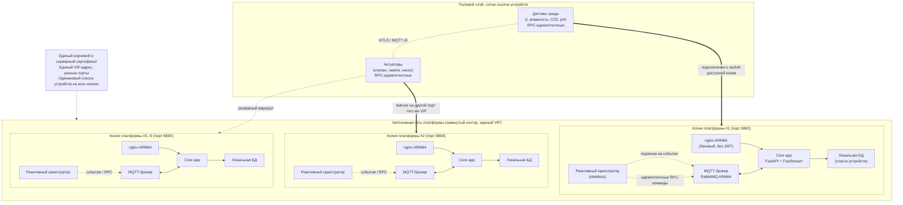

# 🕸️ Leo4 Autonomous Mesh

> Автономная отказоустойчивая архитектура Leo4 для замкнутых контуров управления: **3–5 (N) идентичных ARM64-копий платформы** с **реактивным оркестратором без состояния (stateless)** на каждой копии, единым VIP и переключением устройств между портами при отказах.

---

## 📌 Краткое резюме

Leo4 Autonomous Mesh — это модель, где несколько одинаковых копий платформы работают как взаимозаменяемые узлы одного контура. Каждая копия развёрнута в усечённом виде и содержит одинаковый базовый набор компонентов.

Ключевая идея: надёжность достигается не межузловой репликацией, а **простотой, идентичностью копий и идемпотентным поведением устройств**. Устройство подключено только к одной копии одновременно, а при сбое переключается на другой порт того же VIP.

---

## 🧭 Принципы построения (инварианты)

1. Автономная замкнутая сеть из **3–5 (N) идентичных копий** платформы на ARM64-платах (например, Raspberry Pi 4/5). Диапазон выбран как практичный баланс между резервированием и простотой эксплуатации: обычно этого достаточно, чтобы переживать отказ части узлов без усложнения локального контура.
2. Копии платформы разворачиваются в **усечённом виде**:
   - убран JWT-контур (используется базовый nginx ARM64 без JWT-модуля),
   - убран `nginx-mutual` (legacy-mTLS частный случай),
   - убран `avahi`,
   - убран Let's Encrypt / `certbot`.
3. Для всех копий используется **единый VIP-адрес**, копии отличаются **только портом подключения** (например, 8883, 8884, 8885, ...).
4. На всех копиях одинаковые корневой и серверный сертификаты, а также одинаковый список устройств в пределах замкнутой сети.
5. Устройство в каждый момент времени подключено **строго к одной** копии; при сбое выполняется failover на другой порт того же VIP.
6. Устройства выполняют RPC-команды в **идемпотентном режиме** (exactly-once effect при исполнении, см. разделы про Task Selection Race и идемпотентность в [`mqtt-rpc-protocol.md`](./mqtt-rpc-protocol.md)).
7. На каждой копии развёрнут **реактивный оркестратор без состояния (stateless)**: он не опирается на накопленное состояние и реагирует только на входящие события по фиксированному алгоритму.

---

## ❗ Критически важные инварианты согласованности

> **Обязательно для всей концепции Leo4 Autonomous Mesh**

- Между оркестраторами и копиями **запрещены любые взаимодействия, репликации и обмен состоянием**.  
  Это прямое требование полной взаимозаменяемости копий в любой момент времени.
- Компромисс этого подхода: потенциально дорогие повторные действия на стороне управления компенсируются обязательной идемпотентностью исполнения на устройстве.
- **Базовый вариант**: алгоритм оркестратора **коммутативен** (не зависит от порядка).  
  Реакция на один и тот же набор событий должна быть одинаковой при любом порядке их обработки.
  Например, если получены события «сухо» и «допустимый диапазон температуры», итоговое действие для полива должно быть одинаковым независимо от того, какое событие пришло первым.
- **Расширение**: если нужна зависимость от порядка, она закладывается в **формат/тип самого события**.  
  Событие должно быть self-contained (содержать необходимые и достаточные данные для решения) без межузловой координации.
- **Список устройств** задаётся на этапе провижионинга (или автоматического провижионинга) так, чтобы не требовались репликации и межузловые синхронизации.
- Почему это безопасно: устройство подключено к одной копии одновременно, а исполнение на устройстве идемпотентно — итоговый эффект детерминирован независимо от того, какая копия обработала событие.

---

## 🗺️ Архитектура Leo4 Autonomous Mesh (GitHub-UI-safe)

---

## 🧠 Заготовка оркестратора (концептуально, без деталей реализации)

Оркестратор в Leo4 Autonomous Mesh — это реактивный компонент без состояния (stateless), развёрнутый на каждой копии платформы. Он подписывается на события устройств и, по фиксированным правилам, публикует идемпотентные RPC-команды.

Оркестратор не хранит межсобытийный контекст устройства и не выполняет межузловую синхронизацию. Его поведение определяется только входящим событием и заранее заданным алгоритмом реакции.

В базовой модели алгоритм коммутативен, что устраняет зависимость от порядка событий. Если доменная логика требует учитывать порядок, необходимые данные должны приходить в самом событии (self-contained event), без введения координации между копиями.

> Детальная реализация оркестратора (конкретные структуры, внутренние механизмы, код и тонкости исполнения) находится вне рамок данного документа и оформляется отдельным техническим design-doc/ADR в рамках внедрения.

---

## 🚀 Почему это решение работает (промо-обзор)

Leo4 Autonomous Mesh даёт практичную отказоустойчивость для автономных контуров управления без сложных кластерных механизмов. Вместо хрупкой межузловой связности используется простая модель: N одинаковых копий, единая точка входа (VIP), идемпотентный RPC и локальная реакция на события.

Это позволяет строить сети, которые продолжают работать даже при отказе отдельных плат, без зависимости от интернета, облачных сервисов и внешнего DNS/ACME-контура.

| Преимущество | Практический эффект |
|---|---|
| N идентичных копий + единый VIP | Быстрый failover между портами без изменения клиентской модели |
| Идемпотентный RPC | Exactly-once effect на исполнительных устройствах |
| Stateless-оркестратор без репликации | Нет межузловой синхронизации и связанных точек отказа |
| Полностью автономный контур | Работа без интернета/облака/Let's Encrypt/DNS |
| Усечённый лёгкий стек | Меньше компонентов, ниже операционная сложность |
| Масштаб на сотни-тысячи устройств | Подходит для крупных полевых контуров |
| Экономика «замени плату, а не чини кластер» | Предсказуемое обслуживание и быстрое восстановление |

---

## 🌿 Пример применения: тепличное хозяйство

В тепличном контуре разворачиваются 3–5 ARM64-плат с Leo4 Autonomous Mesh. К ним подключаются сотни-тысячи датчиков (температура, влажность, освещённость, CO₂, pH, влажность почвы) и актуаторов (клапаны полива, досветка, вентиляция, форточки).

Типовой сценарий:
- датчик влажности почвы формирует событие «сухо»,
- оркестратор ближайшей живой копии по фиксированному правилу отправляет идемпотентную RPC-команду «открыть клапан на N минут»,
- даже если событие обработано более чем одной копией, фактическое действие на клапане выполняется один раз за счёт идемпотентности устройства.

Сценарий отказа:
- во время полива одна плата выходит из строя,
- устройство теряет соединение и переподключается на другой порт того же VIP,
- процесс продолжается без ручного вмешательства и без межузлового восстановления состояния.

Ожидаемое время переподключения определяется политикой самого устройства и параметрами локальной сети; целевые значения RTO фиксируются в эксплуатационном регламенте конкретного объекта, а в рамках данного концептуального документа конкретные тайминги не нормируются.

---

## 🏭 Другие отрасли с похожими задачами

- Точное земледелие и животноводство
- Водоснабжение и ЖКХ (насосные станции, задвижки, узлы учёта)
- Аквакультура
- Промышленный edge / АСУ ТП нижнего уровня
- Умные здания и дата-центры
- Тепличные комбинаты и вертикальные фермы

---

## 🔗 Связанные документы

| Документ | Назначение |
|---|---|
| [`./mqtt-rpc-protocol.md`](./mqtt-rpc-protocol.md) | Базовый RPC-протокол, включая идемпотентность и правила обмена |
| [`./mqtt-rpc-client-flow.md`](./mqtt-rpc-client-flow.md) | Клиентские сценарии Polling/Trigger |
| [`./TTL.md`](./TTL.md) | Поведение TTL и истечение задач |
| [`./method-codes-reference.md`](./method-codes-reference.md) | Реестр `method_code` |
| [`./deploy-plan.md`](./deploy-plan.md) | Общие ориентиры по развёртыванию |
| [`./event-protocol-mqtt.md`](./event-protocol-mqtt.md) | Протокол событий устройств |
