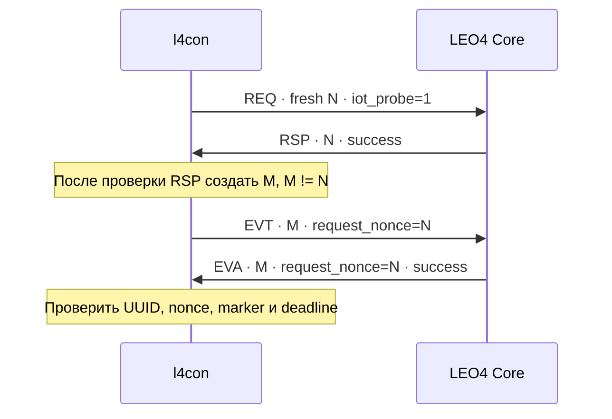

# 🧪 Channel Probe · Проверка канала

> Transport-probe v1: свежий обмен REQ/RSP и EVT/EVA на существующих MQTT-топиках. Принят 08.10.2026.

[← Документация](README.md) · [MQTT RPC](mqtt-rpc-protocol.md) · [События](event-protocol-mqtt.md)

## 🧭 Что проверяется

Probe проверяет transport handlers и read-only lookup зарегистрированного устройства с активной tenant-привязкой. Он не исполняет RPC, не выбирает очередь задач, не меняет task state, не создаёт PostgreSQL-записи, webhook или billing. Payload не может выбрать SN или tenant; идентичность задают CN сертификата и ACL брокера.

Все четыре сообщения имеют User Property `iot_probe=1`. Неизвестный marker и невалидное маркированное сообщение отбрасываются, без перехода в обычный RPC/event handler. Native MQTT Correlation Data обязательна: ненулевой canonical UUID.

## 🔄 Два свежих этапа

| Топик | Корреляция | Точный JSON body | Дополнительные User Properties |
| :--- | :--- | :--- | :--- |
| `dev/<SN>/req` | Fresh N | `{"v":1,"type":"channel_probe"}` | — |
| `srv/<SN>/rsp` | N | `{"v":1,"type":"channel_probe","status":"success"}` | `method_code=0` |
| `dev/<SN>/evt` | Fresh M, M ≠ N | `{"v":1,"type":"channel_probe","request_nonce":"N"}` | `event_type_code=0`, `dev_event_id` — ненулевой uint32 |
| `srv/<SN>/eva` | M | `{"v":1,"type":"channel_probe","status":"success","request_nonce":"N"}` | `event_type_code=0`, совпадающий `dev_event_id` |

N в таблице заменяется фактическим текстом UUID. Дополнительные или дублирующиеся JSON-поля, строковая версия `"1"` и превышение размера недопустимы. User Properties передаются строками.

## 🚦 Успех, ошибка и timeout

Для валидных CN-scoped запросов неизвестное/непривязанное устройство или ошибка lookup дают тот же конверт с `status=error`, без раскрытия tenant/DB деталей. Ответ означает, что IoT доступен, но барьер успешной проверки остаётся закрытым. Невалидная схема/marker и превышение rate limit дают drop.

Клиент сначала проверяет RSP с N, затем генерирует M и EVT. Успешный EVA должен совпадать по M, N, event ID, marker и event code в пределах monotonic deadline. Ответ прежней сессии или этапа не удовлетворяет свежей проверке.

Сервер не хранит общую сессию между workers и не доказывает, что N был обработан раньше. Последовательность этапов контролирует клиент; каждый ответ независимо проверяет актуальную identity/tenant-привязку SN.

## ⏱️ Ограничения

| Ограничение | Значение |
| :--- | :--- |
| Request body | До 512 байт |
| Broker expiration ответа | 10 секунд, без retain |
| Lookup identity | До 2 секунд |
| Общий lookup + publish budget | 10 секунд; после истечения ответ не отправляется |
| На один SN в одном процессе | 64 marked messages за 10 секунд |
| Глобально в одном процессе | 128 сообщений в секунду |
| Live rate-limit identities | До 4096; новые identity при заполнении отбрасываются |
| Жизнь rate-limit entry | 10 секунд |

Суммарные лимиты развёртывания растут с количеством процессов. Проверка не доказывает запись обычного EVT или доставку webhook. Для этого нужна проверка обычного хранимого события. Старый сервер не может выполнить probe; автоматический fallback не снимает обязательный барьер обновления.

Новый MQTT client и дублирующий production client ID не создаются: native consumer использует существующее соединение l4con.

**Реализация:** [probe service](../app-service/core/services/channel_probe.py) · [схемы](../app-service/core/schemas/channel_probe.py) · [early dispatch](../app-service/core/topologys/fs_queues.py). Сверено с `master` на 09.10.2026.
