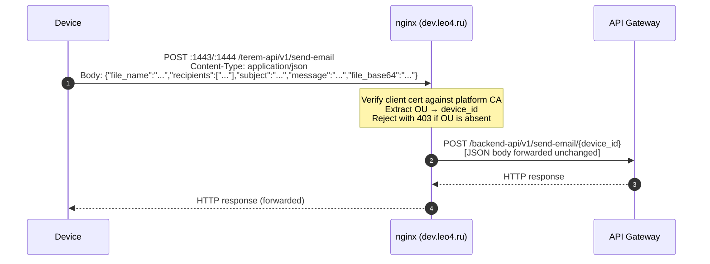

# Send-email HTTP API — Device-Facing mTLS Endpoint

> **File:** `docs/device-http-mtls-send-email.md`
> **Version:** 1.0
> **Date:** 2026
> **See also:**
> [`client-cert-ssl-rmq-config.md`](./client-cert-ssl-rmq-config.md) · [`glossary.md`](./glossary.md) · [`mqtt-rpc-protocol.md`](./mqtt-rpc-protocol.md)

---

## Overview

The `send-email` endpoint is a **device-facing HTTP API** that accepts a JSON envelope with file metadata, recipient list, optional email subject, optional email message body, and a base64-encoded file attachment.

Authentication is performed exclusively via **mutual TLS (mTLS)**: no API key or bearer token is required. The device's identity is derived directly from its client certificate, so the `device_id` is never passed in the request body or as a URL parameter — it is extracted from the certificate automatically by the nginx ingress.

> **This endpoint is the canonical reference example for any device-facing HTTP endpoint that uses mTLS in this platform.** All future device-side HTTP integrations should follow the same pattern: dedicated port on `dev.leo4.ru`, client certificate mandatory, device identity from certificate `OU`.

---

## Architecture

```
Device
  │  POST /terem-api/v1/send-email
  │  Content-Type: application/json
  │  Body: {"file_name":"...","recipients":[...],"subject":"...","message":"...","file_base64":"..."}
  │  Client cert: signed by platform CA, OU = device_id
  ▼
nginx (dev.leo4.ru:1443 or :1444)
  │  mTLS termination
  │  Extract OU from client cert subject DN → $terem_device_id
  │  Return 403 if OU is empty
  ▼
API Gateway / backend upstream
  https://<api-gateway-host>
  POST /backend-api/v1/send-email/{device_id}
  Body: JSON (forwarded unchanged)
```



---

## Client Certificate Requirements

The client certificate **must**:

| Requirement | Details |
|---|---|
| Signed by | Platform CA (`ca_certificate.pem`), depth ≤ 2 |
| `OU` field | Set to the numeric `device_id` of the device (e.g. `OU=4619`) |
| `CN` field | Matches the device serial number (same as MQTT SN) |
| Key type | RSA 2048-bit or better |

> The `OU` field is the **only** mechanism by which nginx identifies the device. If `OU` is absent or empty, the request is rejected with `403 Forbidden` before it reaches the backend.

Certificate generation and signing follow the same PKI flow as for MQTT/RabbitMQ access — see [`client-cert-ssl-rmq-config.md`](./client-cert-ssl-rmq-config.md).

---

## Ingress Profiles

Two dedicated TLS ports are available. Choose based on your TLS stack:

| Port | TLS versions | Cipher profile | Intended client |
|------|-------------|----------------|-----------------|
| **1443** | TLS 1.2 + 1.3 | ECDHE-AES-GCM + ChaCha20 (modern) | Linux, macOS, Android, FreeRTOS with modern mbedTLS |
| **1444** | TLS 1.2 only | ECDHE-RSA-AES + AES-CBC RSA fallback, `@SECLEVEL=1` | Windows (Schannel / WinHTTP / .NET `HttpClient`) |

Port 1445 is reserved for a future embedded/mbedTLS profile and is currently disabled. That profile would further narrow the cipher suite to a subset safe for constrained devices such as ESP32 with mbedTLS — e.g. stripping CBC fallbacks and limiting to a single ECDHE-AES-GCM suite — while keeping full mTLS semantics identical to ports 1443/1444.

> **Windows Schannel note:** Use port 1444 if your client reports errors such as `SEC_E_ALGORITHM_MISMATCH` or fails TLS negotiation on port 1443. Port 1444 pins curves to P-256/P-384 and restricts TLS 1.2 signature algorithms to classic RSA PKCS#1-SHA to maximise Schannel compatibility.

---

## Request

```
POST https://dev.leo4.ru:<port>/terem-api/v1/send-email
Content-Type: application/json
```

### JSON Request Body

```json
{
  "file_name": "device.log",
  "recipients": [
    "user1@example.com",
    "user2@example.com"
  ],
  "subject": "Optional subject",
  "message": "Optional message body",
  "file_base64": "BASE64_ENCODED_FILE_CONTENT"
}
```

| Field | Required | Rules / Description |
|-----------|----------|-------------|
| `file_name` | ✅ | String, length `1..255` (use a plain file name without path separators) |
| `recipients` | ✅ | Non-empty array of email addresses. The backend sends the email to all recipients in the array |
| `subject` | ❌ | Optional string. If omitted or empty, backend uses `Файл от устройства {device_id}: {file_name}` |
| `message` | ❌ | Optional string. If omitted or empty, backend uses the default message body |
| `file_base64` | ✅ | Base64-encoded attachment content |

**Maximum body size:** 25 MB (total HTTP request body size, enforced by nginx `client_max_body_size 25m`). Since base64 increases payload size by ~33%, the practical maximum decoded attachment size is lower than 25 MB. The backend decodes `file_base64` from the JSON payload.

### Headers Set by nginx (forwarded to backend)

| Header | Value | Notes |
|--------|-------|-------|
| `X-Device-Id` | `<device_id>` | Extracted from cert `OU` |
| `X-SSL-Client-Verify` | `SUCCESS` / `FAILED` / `NONE` | Result of client cert verification |
| `X-SSL-Client-Subject` | Full subject DN of client cert | E.g. `CN=a3b0000000c99999d250813,OU=4619,O=Leo4,...` |
| `X-Forwarded-For` | Device IP | Standard proxy header |

### nginx Compatibility Note (JSON Contract)

No nginx configuration changes are required for this JSON-only contract:
- `location = /terem-api/v1/send-email` remains the same.
- Proxy rewrite still targets `POST /backend-api/v1/send-email/{device_id}`.
- Request body is forwarded unchanged.
- Requests are still rejected with `403` if `$terem_device_id` is empty.
- mTLS remains the only authentication mechanism on these ports.

---

## Response

Nginx forwards the backend response unchanged. Typical status codes:

| HTTP Status | Source | Meaning |
|-------------|--------|---------|
| `200 OK` | Backend | File received and email queued |
| `403 Forbidden` | **nginx** | Client certificate is missing the `OU` field |
| `413 Request Entity Too Large` | **nginx** | Body exceeds 25 MB |
| `4xx` | Backend | Invalid JSON/body fields or backend-side validation error |
| `5xx` | Backend / Gateway | Backend or upstream gateway error |

Typical successful backend payload:

```json
{
  "status": "sent",
  "device_id": "4619",
  "file_name": "device.log",
  "recipients": [
    "user1@example.com",
    "user2@example.com"
  ],
  "subject": "Optional subject",
  "storage_path": "/function/storage/terem-files/4619/device.log",
  "postbox_message_id": "..."
}
```

---

## Code Examples

### curl — Linux / macOS

```bash
FILE_B64="$(base64 </path/to/device.log | tr -d '\n')"
# Keep base64 in a single line for valid JSON string content.

curl -X POST \
  "https://dev.leo4.ru:1443/terem-api/v1/send-email" \
  --cert cert.pem \
  --key  key.pem \
  --cacert ca.crt \
  -H "Content-Type: application/json" \
  --data-raw "{
    \"file_name\":\"device.log\",
    \"recipients\":[\"user1@example.com\",\"user2@example.com\"],
    \"subject\":\"Лог устройства\",
    \"message\":\"Добрый день. Во вложении лог устройства.\",
    \"file_base64\":\"${FILE_B64}\"
  }" \
  -v
```

### curl — Windows (with OpenSSL CLI)

```bat
openssl s_client -connect dev.leo4.ru:1444 ^
    -servername dev.leo4.ru ^
    -cert cert.pem -key key.pem -CAfile ca.crt

:: Or with curl for Windows (use port 1444 for Schannel compatibility):
:: 1) Create request.json with base64 payload (PowerShell):
:: $b64 = [Convert]::ToBase64String([IO.File]::ReadAllBytes("device.log"))
:: @"
:: {
::   "file_name": "device.log",
::   "recipients": ["user1@example.com","user2@example.com"],
::   "subject": "Лог устройства",
::   "message": "Добрый день. Во вложении лог устройства.",
::   "file_base64": "$b64"
:: }
:: "@ | Set-Content -Encoding UTF8 request.json

curl -X POST ^
  "https://dev.leo4.ru:1444/terem-api/v1/send-email" ^
  --cert cert.pem ^
  --key  key.pem ^
  --cacert ca.crt ^
  -H "Content-Type: application/json" ^
  --data-binary @request.json
```

### Python (httpx)

```python
import base64
import httpx

with httpx.Client(
    cert=("cert.pem", "key.pem"),
    verify="ca.crt",
) as client:
    with open("device.log", "rb") as f:
        file_base64 = base64.b64encode(f.read()).decode("ascii")
    payload = {
        "file_name": "device.log",
        "recipients": ["user1@example.com", "user2@example.com"],
        "subject": "Лог устройства",
        "message": "Добрый день. Во вложении лог устройства.",
        "file_base64": file_base64,
    }
    response = client.post(
        "https://dev.leo4.ru:1443/terem-api/v1/send-email",
        headers={"Content-Type": "application/json"},
        json=payload,
    )
    print(response.status_code, response.text)
```

> **Note:** Use `verify="ca.crt"` (path to the platform CA) rather than the system trust store, since the platform CA is a private CA not included in OS roots.

### C — WinHTTP (Windows, Schannel)

```c
// Load client certificate from Windows certificate store
HCERTSTORE hStore = CertOpenSystemStore(0, L"MY");
PCCERT_CONTEXT pCert = CertFindCertificateInStore(
    hStore, X509_ASN_ENCODING, 0, CERT_FIND_SUBJECT_STR, L"<device_CN>", NULL);

HINTERNET hSession = WinHttpOpen(L"Device/1.0",
    WINHTTP_ACCESS_TYPE_DEFAULT_PROXY, NULL, NULL, 0);

HINTERNET hConnect = WinHttpConnect(hSession,
    L"dev.leo4.ru", 1444, 0);  // use port 1444 for Schannel

HINTERNET hRequest = WinHttpOpenRequest(hConnect,
    L"POST",
    L"/terem-api/v1/send-email",
    NULL, WINHTTP_NO_REFERER, WINHTTP_DEFAULT_ACCEPT_TYPES,
    WINHTTP_FLAG_SECURE);

// Attach client certificate
WinHttpSetOption(hRequest, WINHTTP_OPTION_CLIENT_CERT_CONTEXT,
    (LPVOID)pCert, sizeof(CERT_CONTEXT));

// Minimal WinAPI base64 helper (caller frees returned buffer).
char* Base64Encode(const BYTE* data, DWORD size) {
    DWORD outLen = 0;
    CryptBinaryToStringA(data, size, CRYPT_STRING_BASE64 | CRYPT_STRING_NOCRLF, NULL, &outLen);
    char* out = (char*)malloc(outLen);
    if (!out) return NULL;
    if (!CryptBinaryToStringA(data, size, CRYPT_STRING_BASE64 | CRYPT_STRING_NOCRLF, out, &outLen)) {
        free(out);
        return NULL;
    }
    return out;
}

char* fileBase64 = Base64Encode(fileBuffer, fileSize);
if (!fileBase64) { /* handle error */ }

// Build JSON request body with base64 file payload
char jsonBody[32768];
_snprintf_s(
    jsonBody, sizeof(jsonBody), _TRUNCATE,
    "{\"file_name\":\"device.log\","
    "\"recipients\":[\"user1@example.com\",\"user2@example.com\"],"
    "\"subject\":\"Device log\","
    "\"message\":\"Attached device log file.\","
    "\"file_base64\":\"%s\"}",
    fileBase64
);

LPCWSTR headers = L"Content-Type: application/json\r\n";

BOOL ok = WinHttpSendRequest(hRequest,
    headers, (DWORD)-1L,
    (LPVOID)jsonBody, (DWORD)strlen(jsonBody), (DWORD)strlen(jsonBody), 0);
WinHttpReceiveResponse(hRequest, NULL);
free(fileBase64);

// ... read response, cleanup handles ...
```

> **Windows certificate store:** The client certificate and its private key must be imported into the user or machine certificate store (e.g. via `certutil -importpfx`). The platform CA must be added to **Trusted Root Certification Authorities** so that Schannel can verify the server certificate.

### C# — .NET HttpClient (Windows, Schannel)

```csharp
using System.Net.Http;
using System.Security.Cryptography.X509Certificates;

var filePath = @"C:\path\to\device.log";
var uri = "https://dev.leo4.ru:1444/terem-api/v1/send-email";

var handler = new HttpClientHandler();

// Option A: load client certificate from Windows certificate store (CurrentUser\My)
using var store = new X509Store(StoreName.My, StoreLocation.CurrentUser);
store.Open(OpenFlags.ReadOnly);
var byThumbprint = store.Certificates.Find(
    X509FindType.FindByThumbprint,
    "<40_HEX_CHARS_NO_SPACES>",
    validOnly: false
);
if (byThumbprint.Count > 0)
{
    handler.ClientCertificates.Add(byThumbprint[0]);
}

// Option B: load client certificate from PFX (placeholder path/password)
// var pfxCert = new X509Certificate2(
//     @"C:\path\to\client-cert.pfx",
//     "<PFX_PASSWORD>",
//     X509KeyStorageFlags.MachineKeySet | X509KeyStorageFlags.EphemeralKeySet
// );
// handler.ClientCertificates.Add(pfxCert);

using var http = new HttpClient(handler);
var payload = new
{
    file_name = Path.GetFileName(filePath),
    recipients = new[] { "user1@example.com", "user2@example.com" },
    subject = "Лог устройства",
    message = "Добрый день. Во вложении лог устройства.",
    file_base64 = Convert.ToBase64String(await File.ReadAllBytesAsync(filePath))
};

using var body = new StringContent(
    System.Text.Json.JsonSerializer.Serialize(payload),
    System.Text.Encoding.UTF8,
    "application/json"
);

using var response = await http.PostAsync(uri, body);
var responseText = await response.Content.ReadAsStringAsync();

Console.WriteLine($"HTTP {(int)response.StatusCode} {response.ReasonPhrase}");
Console.WriteLine(responseText);
```

> **C# note (Windows):** Use port **1444** for Schannel compatibility, import the platform CA into **Trusted Root Certification Authorities**, and use placeholders for certificate thumbprints, PFX path, and password.

---

## Verifying the TLS Handshake

Use `openssl s_client` to confirm the mTLS handshake succeeds before sending real data:

```bash
# Standard profile (port 1443)
openssl s_client \
  -connect dev.leo4.ru:1443 \
  -servername dev.leo4.ru \
  -cert cert.pem -key key.pem \
  -CAfile ca.crt \
  -brief

# Windows Schannel-compatible profile (port 1444)
openssl s_client \
  -connect dev.leo4.ru:1444 \
  -servername dev.leo4.ru \
  -cert cert.pem -key key.pem \
  -CAfile ca.crt \
  -tls1_2 \
  -brief
```

A successful handshake prints `Verification: OK` and `SSL handshake has read … bytes`.

---

## Troubleshooting

| Symptom | Likely cause | Fix |
|---------|-------------|-----|
| `403 Forbidden: client certificate OU is required` | `OU` field absent in client cert | Re-issue the certificate with `OU=<device_id>` |
| `SSL handshake failure` on port 1443 (Windows) | Schannel rejects modern cipher suite or curve | Switch to port **1444** |
| `SSL handshake failure` — server cert not trusted | Platform CA not in trust store | Pass `--cacert ca.crt` (curl) or add CA to OS trust store |
| `413 Request Entity Too Large` | HTTP body > 25 MB | Reduce JSON payload size (including `file_base64`) |
| `curl: (60) SSL certificate problem` | Wrong CA file | Verify `ca.crt` is the platform CA that signed the server cert |
| `VALIDATION_ERROR: Field 'recipients' must contain at least one email address` | Missing or empty recipients array | Add at least one valid recipient to `recipients` |
| `VALIDATION_ERROR: Field 'file_base64' is required for JSON requests` | Missing attachment payload in JSON body | Add `file_base64` with base64-encoded file content |
| `VALIDATION_ERROR: Field 'file_base64' must be valid base64` | Invalid base64 data | Re-encode the file and send valid base64 text |
| `VALIDATION_ERROR` mentioning JSON parse/body format | Invalid JSON request body | Ensure body is valid JSON and `Content-Type: application/json` is set |

---

## How Device Identity Is Derived

nginx extracts the `device_id` from the **`OU` field** of the client certificate Subject Distinguished Name using the following map rule:

```nginx
map $ssl_client_s_dn $terem_device_id {
    default "";
    ~(^|,)\s*OU=([^,/]+)(,|$) $2;   # RFC 4514 comma-separated DN
    ~(^|/)OU=([^/]+)(/|$)    $2;   # OpenSSL slash-separated DN
}
```

Both `CN=device,OU=4619,O=Leo4` and `/O=Leo4/OU=4619/CN=device` notation are matched.

The extracted value is forwarded to the backend as both:
- the `{device_id}` path segment in `POST /backend-api/v1/send-email/{device_id}`
- the `X-Device-Id` request header

> **Note:** This differs from the MQTT/RabbitMQ authentication, where the `CN` (Common Name) is used as the device identifier (SN). For this HTTP endpoint, the `OU` field carries the numeric `device_id`. A correctly issued platform certificate has both fields populated consistently.

---

## Adding a New Device-Facing mTLS HTTP Endpoint

This endpoint is the **reference pattern** for any future device-facing HTTP API. To add a new endpoint:

1. **Define a new `location` block** in [`nginx-configs/dev_leo4_ru/terem_email_mtls.conf`](../nginx-configs/dev_leo4_ru/terem_email_mtls.conf) (or a new `.conf` file for a different service) pointing to the appropriate backend upstream.
2. **Use the same `$terem_device_id` map** (already defined at the top of [`nginx-configs/dev_leo4_ru/terem_email_mtls.conf`](../nginx-configs/dev_leo4_ru/terem_email_mtls.conf)) — no changes needed if the new endpoint is in the same `conf` file.
3. **Include [`nginx-configs/dev_leo4_ru/snippets/terem_email_proxy.inc`](../nginx-configs/dev_leo4_ru/snippets/terem_email_proxy.inc)** or create a similar snippet that:
   - Rejects with `403` when `$terem_device_id` is empty
   - Passes `X-Device-Id`, `X-SSL-Client-Verify`, `X-SSL-Client-Subject` headers to the backend
   - Disables `auth_jwt_enabled` (mTLS is the sole auth mechanism on these ports)
4. **Expose the port** in `compose.yaml` under the `nginx-mutual` service if a new dedicated port is required.
5. **Document the endpoint** in `docs/` following this file as a template.
