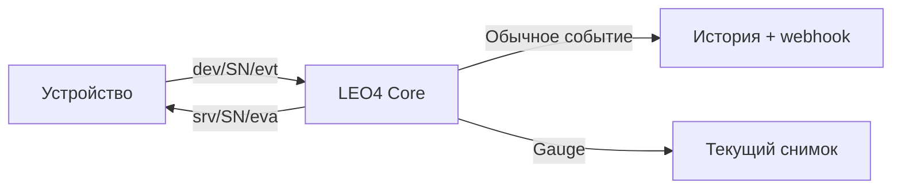

# 📨 MQTT 5 · События устройств

> Дискретные факты, пользовательские действия и телеметрия вне RPC-цикла.

[← Документация](README.md) · [Типы событий](event-types-reference.md) · [Теги](event-property-tags.md) · [REST истории](2-events-api-format-description.md)

## 🧭 Путь события



SN определяется сертификатом и топиком. Устройство публикует в `dev/<SN>/evt`, QoS 1, без retain. Обычные события используют MQTT 5 User Properties; JSON-теги не подменяют transport headers.

## 📦 Payload и метаданные

| JSON-тег | Тип | Смысл |
| :--- | :--- | :--- |
| `101` | integer | ID события на устройстве |
| `102` | string | Время события ISO 8601, с `Z` или явным смещением |
| `200` | integer | Тип события |
| `300` | array of objects | Параметры с числовыми тегами |

Пример открытия ячейки:

```json
{
  "101": 20338,
  "102": "2026-10-09T08:00:00Z",
  "200": 13,
  "300": [{"304": 5}]
}
```

Transport envelope для этого сообщения:

```text
Topic: dev/<SN>/evt
QoS: 1
Retain: false
Correlation Data: UTF-8 UUID этой публикации
User Properties:
  event_type_code = 13
  dev_event_id = 20338
  dev_timestamp = 2026-10-09T08:00:00Z
```

Все User Properties передаются строками. `dev_timestamp` принимает Unix seconds или ISO 8601; при отсутствии/неразбираемом значении сервер использует текущее время. Для устойчивой дедупликации повторяйте исходное время, ID, корреляцию и payload.

`event_type_code` и `dev_event_id` сервер берёт из User Properties, по умолчанию `0`. Одного `"200":13` или `"101":20338` в JSON недостаточно для классификации и EVA. Заполняйте headers согласованно с JSON.

> 📌 Используйте `Z` или `+03:00`. `ZMSK` не является корректным ISO 8601 смещением и не подходит для новых сообщений.

## 💾 История, повторы и EVA

Для обычных событий с `dev_event_id != 0` дедупликация выполняется по `(device_id, dev_event_id, dev_timestamp)`. Tenant принадлежность фиксируется сервером при записи; payload не может назначить организацию.

| Ситуация | История | Новый webhook | EVA |
| :--- | :--- | :--- | :--- |
| Новое обычное событие | Новая запись | Да, при активной подписке | Если выполняются условия ниже |
| Дубликат | Повторная запись не создаётся | Нет | Повторяется |
| Gauge | Обновление текущего снимка | Нет | Нет |
| Ошибка сохранения | Успешная запись не подтверждена | Нет | `error`, если требуется EVA |

EVA отправляется, если `event_type_code != 0`, код не относится к configured gauges и `dev_event_id != 0`. Для событий создавайте отдельный ненулевой UUID и сохраняйте его при retry.

```text
Topic: srv/<SN>/eva
Correlation Data: UUID исходного EVT, если доступен
User Properties:
  event_type_code = 13
  dev_event_id = 20338
  correlationData = UUID исходного EVT, если доступен
Payload: {"status":"success"}
```

`success` подтверждает сохранение либо распознанный дубликат; `error` сообщает об ошибке сохранения. Broker expiration EVA — 180 секунд. Отсутствие EVA не доказывает потерю события: подтверждение может не дойти. Producer повторяет событие с теми же идентификаторами; история позволяет сверить факт сохранения.

## 📊 Телеметрия и служебные события

| Группа | Поведение |
| :--- | :--- |
| `44` · HealthCheck | Gauge по умолчанию: текущий снимок вместо истории; без webhook и EVA. Список gauge-кодов конфигурируемый |
| `13/14` · Датчики двери | Наблюдаемое открытие/закрытие; сопоставляйте устройство, ячейку и время |
| `70` · UI-каталог | Итог обновления `l4-hmi`; тег `409` связывает с RPC |
| `73` · Siplite accepted | Локальное принятие команды, без доказательства исполнения |
| `75` · Инвентаризация | Сертификат и установленное ПО L4 Tools; обычные storage/dedup/webhook/EVA, без evt/activity billing |
| `76` · Обновление L4 Tools | Объект операции в `300[0]["449"]`; обычная история и EVA, без evt/activity billing |
| `900–999` · Пользовательские | Смысл задаёт сценарий; текст `446`, код `447`, внешняя корреляция `448` |

UUID публикации события и UUID операции — разные значения. В event76 `operation_id` находится внутри тега `449`; в пользовательских событиях внешняя корреляция — в `448`. Они не заменяют transport Correlation Data и не предоставляют доступ к данным.

Полные форматы — [реестр типов](event-types-reference.md) и [реестр тегов](event-property-tags.md). События `75/76` не являются gauges и не имеют абсолютной гарантии доставки.

## 🧪 Проверка транспорта

[Channel Probe](channel-probe.md) использует отдельную маркированную ветку `iot_probe=1` на `evt/eva`. Она обходит обычное хранение, webhook и billing и допускает подтверждение для кода `0` по собственным правилам. Проверка канала не проверяет запись обычного события в БД. В обычных событиях marker должен отсутствовать.

**Реализация:** [collector](../app-service/core/services/device_events_collect.py) · [хранение](../app-service/core/crud/dev_events_repo.py) · [EVA](../app-service/core/services/device_task_processing.py) · [dispatch](../app-service/core/topologys/fs_queues.py). Сверено с `master` на 09.10.2026.
