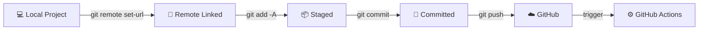

# 🐙 Connect Your Local Project to GitHub

## 🔗 Step 1 — Link Local Project to Remote Repository

Link your local project to the GitHub repository you just created by running the following command from your project root:

```bash
git remote add origin https://github.com/{your-username}/{your-repository-name}.git
```

If `origin` already exists, use:

```bash
git remote set-url origin https://github.com/{your-username}/{your-repository-name}.git
```

To confirm that your local project is correctly connected to the remote GitHub repository, run:

```bash
git remote -v
```

Expected output:

```
origin  https://github.com/{your-username}/{your-repository-name}.git (fetch)
origin  https://github.com/{your-username}/{your-repository-name}.git (push)
```

> ✅ This confirms that your local repository is properly linked and ready to push your source code to GitHub.

---

## 🚀 Step 2 — Push Your Source Code to GitHub

Follow these steps to commit and push your local project to your GitHub repository:

### 📦 Stage all files for commit

```bash
git add -A
```

> Stages all changes — including new, modified, and deleted files — preparing them for commit.

### 💾 Commit your changes

```bash
git commit -m "Initial commit"
```

> Creates a commit that snapshots the staged changes with a descriptive message.

### ☁️ Push the code to the master branch

```bash
git push -u origin master
```

> Pushes your local commits to the `master` branch of the remote GitHub repository and sets the upstream tracking branch.

Once completed, your code will be available on GitHub, and any GitHub Actions workflow you've configured will run automatically. 🎉

---

## 🔄 Workflow Overview



---

## 🛡️ Step 3 — Enable Branch Protection Rules

> [!NOTE]
> To maintain code quality and prevent accidental direct pushes, enable branch protection rules.

**Navigate to:** `Your GitHub repo` → ⚙️ `Settings` → `Branches` → `Add rule`

Set **Branch name pattern** to `master` and enable the following options:

| Option | Purpose |
|---|---|
| ✅ Require a pull request before merging | Ensures all changes are peer-reviewed |
| ✅ Require status checks to pass before merging | Ensures CI passes before merge |
| ✅ Require branches to be up to date before merging | Prevents stale merges |
| ✅ Include administrators | Applies rules to everyone uniformly |

> 🔒 This ensures that only tested and reviewed code is merged into the `master` branch.

---

📖 **Reference:** [Configure GitHub Actions — Docker Docs](https://docs.docker.com/guides/reactjs/configure-github-actions/)
