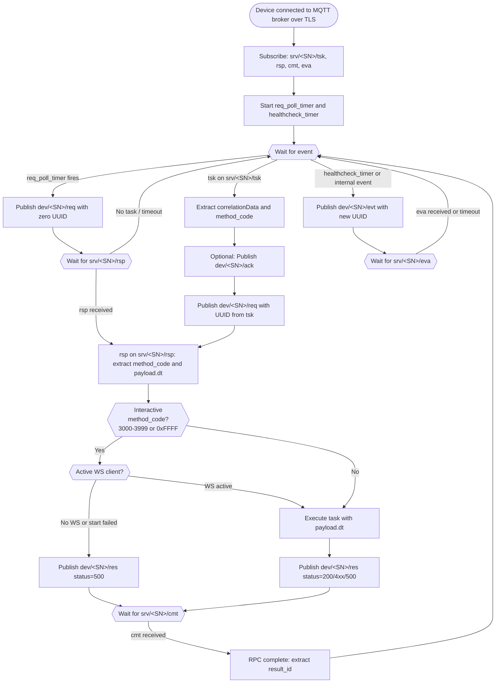
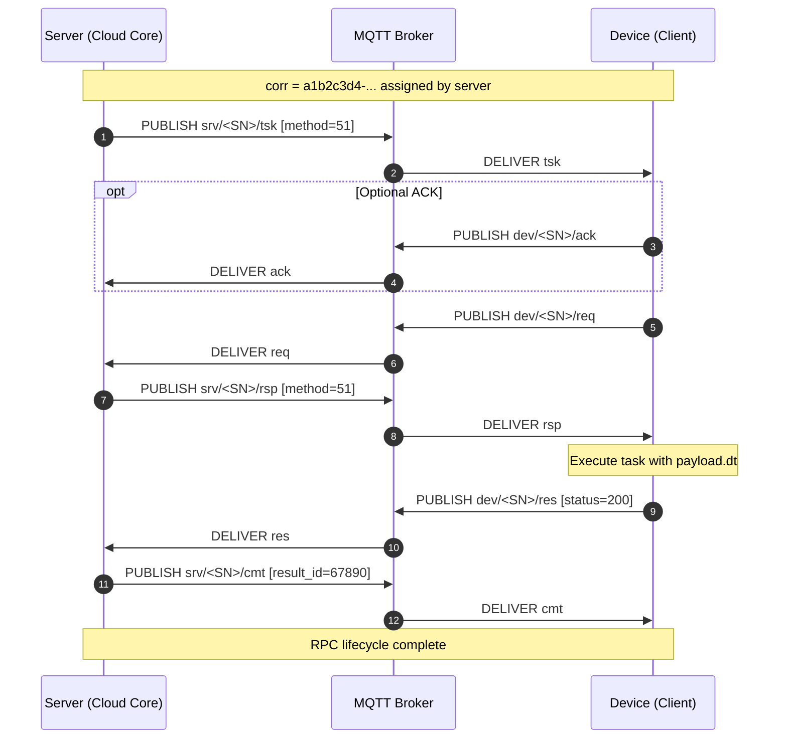
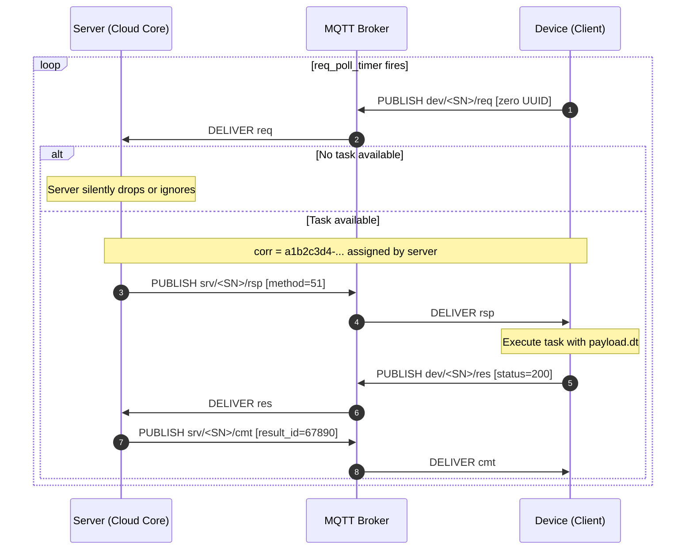
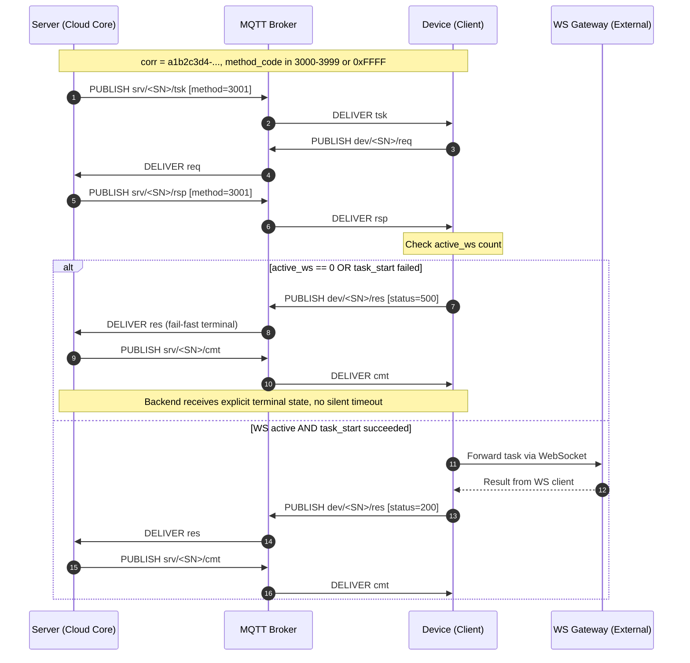
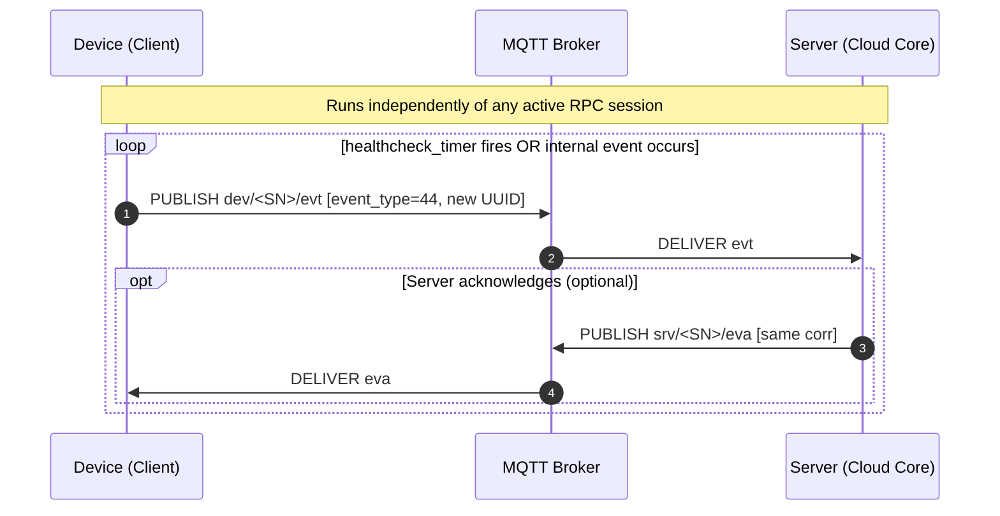
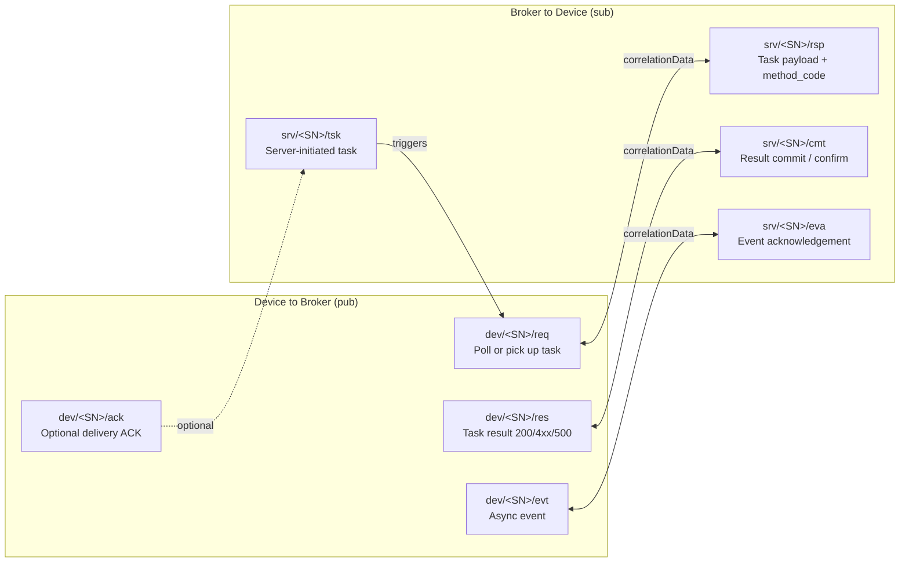
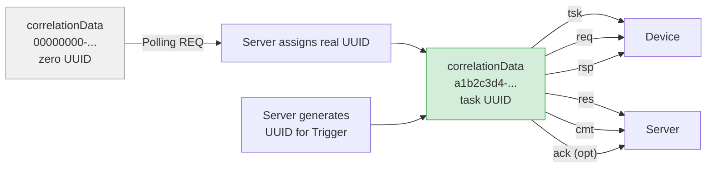

# MQTT RPC Client Flow — Mermaid Diagrams

> **File:** `docs/mqtt-rpc-client-flow.md`
> **Version:** 1.1
> **Date:** 2026
> **See also:** [`mqtt-rpc-protocol.md`](mqtt-rpc-protocol.md), [`correlation-data-guide.md`](correlation-data-guide.md), [`event-property-tags.md`](event-property-tags.md)

> ⚠️ **Статус документа:** этот файл является **графической репликой** основного протокола [`mqtt-rpc-protocol.md`](./mqtt-rpc-protocol.md). Все диаграммы должны актуализироваться при изменении протокола. Текстовые описания правил и алгоритмов намеренно вынесены в профильные документы — в данном файле приведены только ссылки.

---

## 1. Device-Side Client Logic (Flowchart)

High-level decision flow executed by the MQTT client on the device for every incoming message.

---

## 2. Trigger Flow — Server-Initiated RPC (Sequence)

The server announces a task directly; the device picks it up and executes it.

---

## 3. Polling Flow — Device-Initiated RPC (Sequence)

The device polls for pending tasks using a zero-UUID `req`. The server assigns a real UUID when it has work.

> 📖 Polling selection rules (priority / TTL / created_at order): see [`mqtt-rpc-protocol.md §Polling`](./mqtt-rpc-protocol.md) and [`TTL.md`](./TTL.md).

---

## 4. Fail-Fast Flow — Interactive Task Without Active WS (Sequence)

For `method_code` in range `3000..3999` or `0xFFFF`, the device **must** publish an immediate terminal `res` (status 500) if no active WebSocket client is available, preventing silent timeouts on the backend.

---

## 5. Async Event Flow — Device-to-Server (Sequence)

Events are independent of RPC. The device emits them at any time (timer-driven or internally triggered).

**Server-side processing:**
- Events are deduplicated by `(device_id, dev_event_id, dev_timestamp)` where `dev_event_id != 0`
- `dev_timestamp` accepts both **Unix epoch** (int/str) and **ISO 8601** strings
- EVA (acknowledgment) is sent for both new events and idempotent duplicates
- EVA payload: `{"status": "success"}` or `{"status": "error"}`
- EVA is sent only when `event_type_code != 0`, `dev_event_id != 0`, and event is not a gauge type

---

## 6. Topic Summary

---

## 7. correlationData Lifecycle

