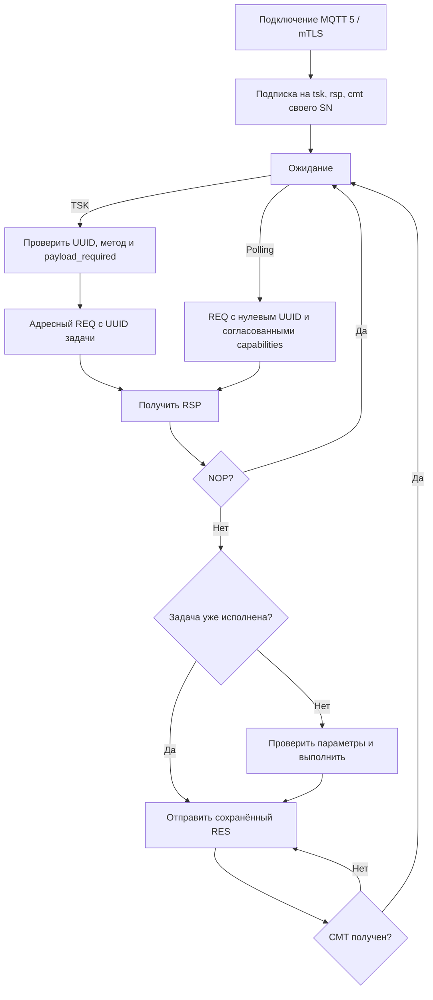
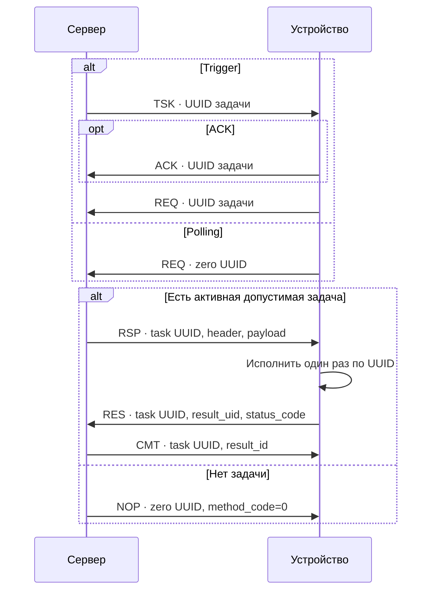

# 🔄 RPC · Поток клиента устройства

> Диаграммы текущего транспортного контракта. Поля сообщений описаны в [MQTT RPC](mqtt-rpc-protocol.md).

[← Документация](README.md) · [Методы](method-codes-reference.md) · [TTL](TTL.md)

## 🧭 Обработка команды

```mermaid
flowchart TD
    A["Подключение MQTT 5 / mTLS"] --> B["Подписка на tsk, rsp, cmt своего SN"]
    B --> W["Ожидание"]
    W -->|"TSK"| T["Проверить UUID, метод и payload_required"]
    T --> R["Адресный REQ с UUID задачи"]
    W -->|"Polling"| P["REQ с нулевым UUID и согласованными capabilities"]
    R --> S["Получить RSP"]
    P --> S
    S --> N{"NOP?"}
    N -->|"Да"| W
    N -->|"Нет"| U{"Задача уже исполнена?"}
    U -->|"Да"| E["Отправить сохранённый RES"]
    U -->|"Нет"| X["Проверить параметры и выполнить"]
    X --> E
    E --> C{"CMT получен?"}
    C -->|"Нет"| E
    C -->|"Да"| W
```

ACK после TSK необязателен. Retry RES ограничивается политикой агента и сохраняет task UUID, `result_uid` и содержимое. Если раннее выполнение разрешено `payload_required=false` для поддерживаемых пустых `7002/7003`, RSP не должен вызывать повторное действие.

## 📡 Trigger и Polling

```mermaid
sequenceDiagram
    participant S as Сервер
    participant D as Устройство
    alt Trigger
        S->>D: TSK · UUID задачи
        opt ACK
            D->>S: ACK · UUID задачи
        end
        D->>S: REQ · UUID задачи
    else Polling
        D->>S: REQ · zero UUID
    end
    alt Есть активная допустимая задача
        S->>D: RSP · task UUID, header, payload
        D->>D: Исполнить один раз по UUID
        D->>S: RES · task UUID, result_uid, status_code
        S->>D: CMT · task UUID, result_id
    else Нет задачи
        S->>D: NOP · zero UUID, method_code=0
    end
```

Срок действия проверяет сервер. `LOCK` не исключает повторной выдачи; защита от повторного действия нужна на устройстве. `status_code` отправляется User Property, не только внутри JSON.

## 🛟 Ошибка исполнения

Если клиент не может выполнить поддерживаемый контракт, он возвращает результат с корректным transport status и описанием ошибки. Для интерактивных команд `3000–3999` отсутствие локального WS-потребителя не должно оставлять RPC без завершения. Успех и ошибка сохраняются сервером как результаты; `FAILED` зарезервирован.

## 📨 Отдельный поток событий

EVT/EVA не закрывает задачу RPC. Устройство публикует событие с собственными event ID, временем и UUID; при retry сохраняет их. Gauge не требует EVA. [Контракт событий](event-protocol-mqtt.md).

Сверено с `master` на 09.10.2026. Политики timer/backoff конкретного агента задаются его собственным контрактом.
