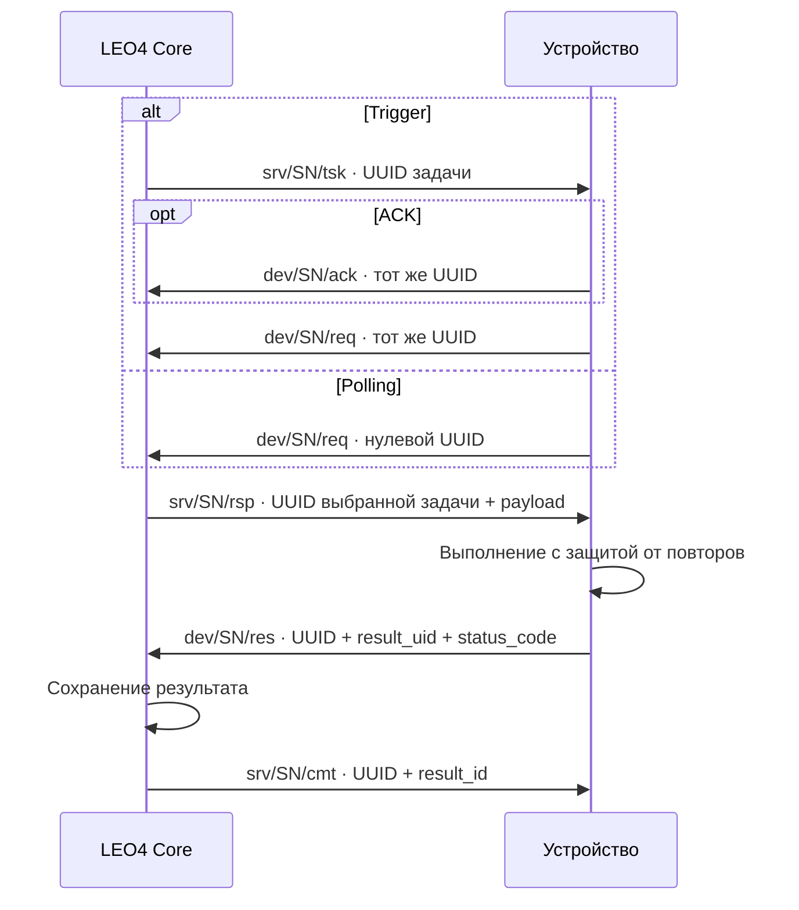

# 📡 MQTT 5 · RPC-протокол

> Асинхронные команды с очередью, сроком действия и подтверждением сохранения результата.

[← Документация](README.md) · [Методы](method-codes-reference.md) · [Клиентский поток](mqtt-rpc-client-flow.md) · [REST задач](1-task-workflow-doc.md)

## 🧭 Модель обмена

**TSK анонсирует → REQ выбирает → RSP передаёт параметры → RES возвращает результат → CMT подтверждает сохранение.**

Устройство подключается по MQTT 5 с mTLS. `<SN>` в топике — CN клиентского сертификата; брокер ограничивает доступ топиками этого устройства. Используйте тот же SN как MQTT client ID.

| Сообщение | Направление и топик | Содержимое |
| :--- | :--- | :--- |
| 🔔 `tsk` | Сервер → `srv/<SN>/tsk` | JSON-анонс `id`, `created_at`, `header`, `payload_required`; без параметров задачи |
| ✅ `ack` | Устройство → `dev/<SN>/ack` | Необязательное подтверждение получения анонса |
| 🔎 `req` | Устройство → `dev/<SN>/req` | UUID задачи для адресной выборки или нулевой UUID для polling |
| 📥 `rsp` | Сервер → `srv/<SN>/rsp` | Полный конверт задачи с `header` и `payload`; либо NOP |
| 📤 `res` | Устройство → `dev/<SN>/res` | Результат с transport User Properties |
| 💾 `cmt` | Сервер → `srv/<SN>/cmt` | `{"message":"committed"}`, ID сохранённого результата |

Задачи и результаты отправляются без retain. Для публикаций устройства используйте QoS 1. Подтверждение MQTT PUBACK и прикладной CMT имеют разное назначение: только CMT сообщает о сохранении результата ядром.

## 🔄 Trigger и Polling



Адресный REQ выбирает только задачу указанного устройства, активную и ещё не просроченную. Обычный polling выбирает активную задачу с положительным начальным TTL: приоритет по убыванию, оставшиеся минуты по возрастанию, затем время создания по возрастанию. `LOCK` не исключает повторной выдачи.

Без capability header polling ограничен `method_code <= 2999`; при `slave_ws > 0` — `<= 3999`. Адресный Trigger допускает методы до `7099`.

### 🧩 Capability polling

Нулевой REQ может передать User Property `rpc_methods`: список через запятую, без пробелов, длиной до 64 символов. Допустимо непустое подмножество:

`7001,7002,7003,7011,7021,7023,7030,7031,7032,7033`

Сервер выбирает только указанные методы. Отсутствующий или невалидный header оставляет обычные ограничения polling. Это позволяет служебному consumer не выбирать команды основного приложения. Наличие кода в списке не подтверждает поддержку конкретной версией агента.

### 💤 Когда задачи нет

```json
{"method_code": 0}
```

NOP приходит в RSP с нулевым UUID `00000000-0000-0000-0000-000000000000` и User Property `method_code=0`. На NOP не отправляют RES. Ответ на уже завершённую адресную задачу тоже может быть NOP; он не является подтверждением свежести канала.

## 📦 Конверты доставки

Пример TSK; UUID условный, но валидный:

```json
{
  "id": "5c75b4ed-2488-4769-b23a-2afae64ea22d",
  "created_at": 1791532800,
  "header": {
    "ext_task_id": "open-cell-5",
    "device_id": 4619,
    "method_code": 51,
    "priority": 1,
    "ttl": 5
  },
  "payload_required": true
}
```

RSP содержит `id`, `created_at`, `header`, `status`, `pending_at`, `locked_at` и `payload`. Параметры команды находятся именно в `payload.dt`, например:

```json
{
  "id": "5c75b4ed-2488-4769-b23a-2afae64ea22d",
  "created_at": 1791532800,
  "header": {
    "ext_task_id": "open-cell-5",
    "device_id": 4619,
    "method_code": 51,
    "priority": 1,
    "ttl": 5
  },
  "status": 1,
  "pending_at": 1791532801,
  "locked_at": null,
  "payload": {"dt": [{"cl": 5}]}
}
```

`status` в RSP — снимок, прочитанный перед установкой LOCK; он не доказывает начало действия на устройстве. Полный список полей — [схемы задач](../app-service/core/schemas/device_tasks.py).

### 🚦 Когда можно действовать по TSK

В TSK есть `payload_required`, продублированный User Property `1`/`0`. По умолчанию он `true`; отсутствующий флаг означает ожидание RSP. `false` выставляется только для канонически пустых `7002` и `7003` с `{"dt":[]}`. Consumer, поддерживающий раннее выполнение такой команды, завершает обычный lifecycle и не выполняет её повторно при RSP. Адресный Cancel, Exec и renewal `7011` всегда ждут параметры RSP.

## 🏷️ Transport User Properties

| Поле | Сообщения | Правило |
| :--- | :--- | :--- |
| `correlationData` | `tsk/rsp/cmt` и входящие сообщения | UUID задачи; сервер дублирует native correlation через header |
| `method_code` | `tsk/rsp` | Строковое представление кода команды |
| `payload_required` | `tsk` | `1` или `0` |
| `status_code` | `res` | Числовой статус результата в строке; JSON-поле его не заменяет |
| `ext_id` | `res/cmt` | Числовой ID результата на устройстве, по умолчанию `0` |
| `result_uid` | `res/cmt` | UUID логического результата; обязателен для новых клиентов, неизменен при retry |
| `result_id` | `cmt` | ID сохранённого результата в IoT |

`ext_task_id` REST и `ext_id` RES — разные идентификаторы. UUID задачи назначает сервер. Для polling нужен нулевой UUID, а для RES — UUID из полученного RSP. [Форматы и fallback](correlation-data-guide.md) · [Матрица сообщений](mqtt-rpc-correlation-matrix.md).

## 💾 Сохранение и повторная доставка

Сервер сохраняет RES и переводит активную задачу в `DONE`, включая результаты с ошибкой устройства. Отсутствующий или невалидный `status_code` получает `501`: такой RES может сохраниться и закрыть задачу. Поэтому всегда передавайте корректный статус в User Properties.

При повторе `result_uid` возвращается исходный `result_id`, без новой записи и webhook. Если UID повторён с другим содержимым, сохраняется первый результат и фиксируется конфликт. Для legacy без валидного UID дедупликация использует задачу, `ext_id`, transport status и нормализованный JSON-результат.

RES без валидной ненулевой корреляции или для неизвестной задачи этого SN не сохраняется и не получает обычный CMT. Retry результата должен сохранять UUID задачи, UID результата, метаданные и содержимое. Устройство отдельно защищает **выполнение** от повторной доставки задачи.

> 📌 `DONE` подтверждает сохранение RPC-результата. Физический результат подтверждается соответствующим событием, например `13/14` для датчика двери.

Поздние RES для EXPIRED/DELETED также сохраняются и подтверждаются, не меняя терминальный статус. Правила срока и webhook — [TTL](TTL.md).

## 🛠️ Специализированные контракты

| Возможность | Транспорт и документация |
| :--- | :--- |
| Диагностика и live logs | RPC `7000–7002`, вывод `dev/<SN>/out`: [Remote Diagnostics](remote-diagnostics-protocol.md) |
| Ping и renewal | `7003`, `7011`: [Реестр методов](method-codes-reference.md) |
| Файловый менеджер v2 | `7021/7023`, управление `fmc/fmr`: [L4FM v2](file-manager-v2.md); `7020/7022` retired |
| Обновления L4 Tools | Capability polling `7030–7033`, результаты обновления — [событие 76](event-types-reference.md) |
| Удалённый ввод | Отдельный `ctl`: [Remote Input](remote-input-protocol.md) |
| Проверка канала | Маркированная ветка `iot_probe=1`: [Channel Probe](channel-probe.md), без задач, событий в БД и billing |

Probe использует существующие `req/rsp/evt/eva`, но имеет собственный контракт и fresh UUID. Обычные сообщения RPC и событий не должны иметь `iot_probe`.

**Реализация:** [обработка задач](../app-service/core/services/device_tasks.py) · [публикация](../app-service/core/services/device_task_processing.py) · [хранение](../app-service/core/crud/dev_tasks_repo.py). Сверено с `master` на 09.10.2026.
