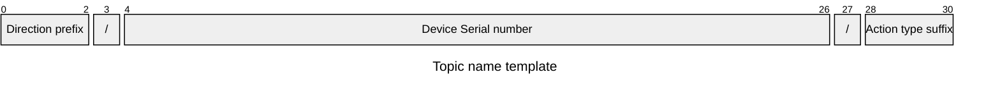

# 📡 MQTT Topic Rules

> **Файл:** `docs/mqtt_topic_rules.md`

---

## ⚠️ Важно

Правила именования топиков являются обязательными. Определения RabbitMQ накладывают ограничения на доступ устройств к топикам на основе серийных номеров устройств. Серийный номер встроен в сертификат x509 (поле `CN`).

---

## 🏗️ Шаблон имени топика

### Пример

```
MQTT topic:         dev/a3b0000000c10221d290825/req
RabbitMQ routing-key: dev.a3b0000000c10221d290825.req
```

> Символы `/` в MQTT-топике транслируются в `.` при передаче в RabbitMQ routing-key.

### Структура



| Поле | Длина | Описание |
|------|:-----:|---------|
| `Direction prefix` | 3 | Направление сообщения: `srv` или `dev` |
| `/` | 1 | Разделитель |
| `Device Serial Number` | 23 | Уникальный серийный номер устройства из CN сертификата |
| `/` | 1 | Разделитель |
| `Action type suffix` | 3 | Тип сообщения/действия |

---

## 🔼 Префиксы направления

| Префикс | Направление | Описание |
|---------|:-----------:|---------|
| `dev` | Device → Server | Сообщения от **устройства** к серверу |
| `srv` | Server → Device | Сообщения от **сервера** к устройству |

---

## 📨 Суффиксы действий

### Device → Server (`dev/<SN>/...`)

| Суффикс | Топик | Описание |
|---------|-------|---------|
| `evt` | `dev/<SN>/evt` | 📢 Событие от устройства (вне RPC-цикла) |
| `ack` | `dev/<SN>/ack` | ✅ Подтверждение получения команды от устройства (опционально) |
| `req` | `dev/<SN>/req` | 🔍 Запрос устройства на получение задачи из очереди |
| `res` | `dev/<SN>/res` | 📤 Отправка результата после выполнения задачи |

### Server → Device (`srv/<SN>/...`)

| Суффикс | Топик | Описание |
|---------|-------|---------|
| `tsk` | `srv/<SN>/tsk` | 🔔 Мгновенное уведомление устройства о новой задаче (без payload) |
| `rsp` | `srv/<SN>/rsp` | 📥 Ответ сервера с параметрами задачи (payload) |
| `eva` | `srv/<SN>/eva` | 🔁 Опциональное подтверждение сервером получения события (`evt`) |

---

## 📚 Связанные документы

| Файл | Назначение |
| :-- | :-- |
| [`mqtt-rpc-protocol.md`](./mqtt-rpc-protocol.md) | Полная спецификация RPC-протокола на базе MQTT v5 |
| [`mqtt-rpc-client-flow.md`](./mqtt-rpc-client-flow.md) | 📊 Mermaid-диаграммы: Polling, Trigger, Fail-fast |
| [`event-protocol-mqtt.md`](./event-protocol-mqtt.md) | Протокол асинхронных событий: топики `evt`/`eva` |