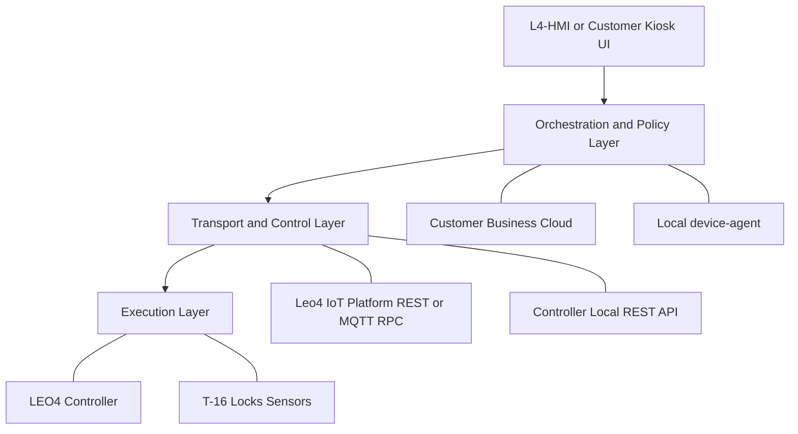
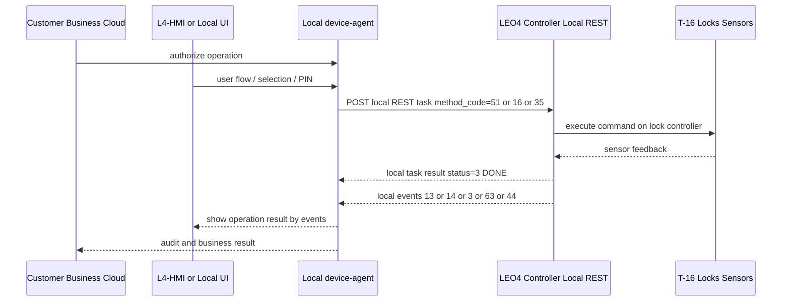
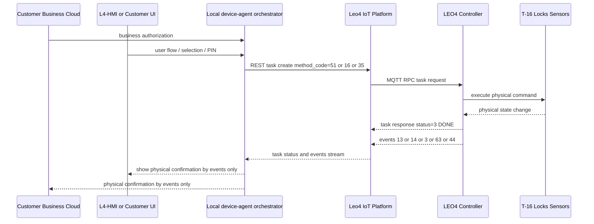
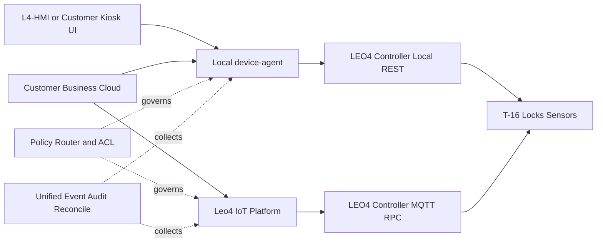
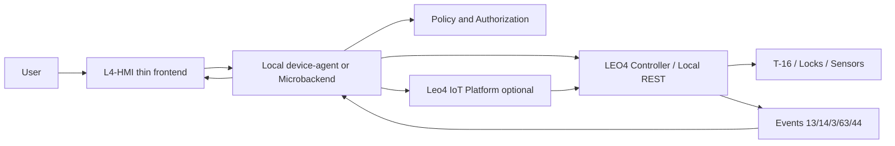

# LEO4 как vendor execution layer для постаматов и ячеек: три архитектурных режима

## Executive summary

LEO4 может использоваться как **vendor execution layer** для управления контроллерами, замками и событиями, при этом бизнес-логика (пользователи, заказы, оплаты, тарифы, подтверждения) остаётся в системе клиента.

Для пресейла фиксируются **ровно три допустимых архитектурных режима**:

1. **Local-only mode** — без Leo4 IoT Platform, локальный `Local device-agent` работает как микробэкенд рядом с контроллером.
2. **Cloud-orchestrated mode** — контроллер подключён только через Leo4 IoT Platform, оркестрация идёт через облачный контур.
3. **Hybrid mode** — часть команд идёт через облако, часть локально; граница определяется проектной policy.

> [!IMPORTANT]
> Подтверждено текущими docs: RPC/REST task-flow, event-flow, MQTT topic model, correlation data, webhooks, TTL, идемпотентность и подтверждение физики через события.
>
> Не фиксируем неподтверждённые обещания в этом документе: SLA/licensing, точные offline buffer limits, коммерческие условия.

## Голос клиента: ключевые цитаты из заявки

> «Нам интересен продукт Виоланты / LEO4 как технический слой управления оборудованием: контроллеры, замки, события, online/offline, безопасность, API и поддержка.»

> «Бизнес-логика остается в нашей системе.»

> «Нам нужно понять, можно ли использовать LEO4 как vendor execution layer, подключенный к нашему локальному device-agent.»

> «Может ли LEO4 открыть ячейку без участия нашего device-agent?»

> «Можно ли настроить схему так, чтобы все команды открытия проходили только через наш device-agent / наш adapter?»

> «Если используется облачный LEO4, может ли ваше облако отправить команду открытия напрямую в контроллер, минуя наш device-agent?»

> «Offline нужен только для уже разрешенных операций.»

> «Мы хотим использовать собственный интерфейс на экране устройства.»

## Позиционирование решения

- **LEO4 Controller Layer (локально):** hardware execution — команды замкам, чтение датчиков, статусы каналов.
- **Local `device-agent` (опционально):** локальный orchestration/enforcement слой клиента.
- **Customer Business Cloud:** master-система бизнес-правил, авторизации и аудита клиента.
- **Leo4 IoT Platform (опционально, зависит от режима):** REST + MQTT RPC + Events API + Webhooks + история событий.
- **L4-HMI (опционально):** флагманский thin frontend/HMI слой для self-service устройств, если клиенту нужен современный экранный интерфейс на устройстве.

Ключевая мысль для клиента: LEO4 остаётся техническим execution/event слоем, а бизнес-решения и policy ownership могут оставаться у клиента во всех трёх режимах.

## Трёхуровневая архитектура

Логические уровни одинаковы, но включаются по-разному в каждом режиме:

1. **Orchestration/policy layer** — customer cloud и/или local device-agent.
2. **Transport/control layer** — Leo4 IoT Platform (в cloud- и hybrid-режиме) и/или локальный REST контроллера (в local/hybrid).
3. **Execution layer** — LEO4 controller + Т-16 + locks/sensors.
4. **Presentation layer (optional)** — L4-HMI или клиентский kiosk UI поверх локального adapter/runtime.

## Ответ на главный security-вопрос: можно ли исключить обход device-agent?

Да, но ответ зависит от выбранного режима:

- **Local-only:** обход cloud-контура исключён архитектурно (облако Leo4 не используется).
- **Cloud-orchestrated:** обязательный путь через Leo4 IoT Platform; запрет обхода задаётся cloud ACL/policy и маршрутизацией.
- **Hybrid:** обход исключается только при чётком контракте маршрутизации классов команд + строгом ACL/policy + едином audit/reconcile.

Во всех режимах критичные unlock-capable команды должны быть управляемы policy:
`51`, `16`, `35`, `47/26`, `18/42/48`, `49/50` (см. [`../method-codes-reference.md`](../method-codes-reference.md)).

## Три жёстких архитектурных кейса

### 1) Local-only mode (без Leo4 IoT Platform)

**Что это:** Leo4 IoT Platform не используется. `Local device-agent` выступает полноценным микробэкендом рядом с контроллером LEO4.

**Интеграция:** `Local device-agent` ↔ `LEO4 Controller` через локальный REST API (endpoint'ы подняты на контроллере).

**Ориентир по локальному web-flow:** `OlegLebedevRU/siplite` (смежный референсный ESP32-проект из той же инженерной экосистемы) показывает практическую локальную модель:
- `esp_start_webserver()` регистрирует `/gate` (WebSocket), `/event`, `/task`, `/nvs`;
- поток `leo4_web.c -> /task -> /event -> /nvs` описан в `docs/event_web_architecture_analysis.md`;
- `/task` и `/event` несут task/result/event семантику, `/gate` работает как gateway/live-channel.

Следствие для пресейла: если в локальном REST не хватает отдельных RPC-режимов, они могут быть добавлены локально как новые REST endpoints/handlers по аналогии с этим web-flow, **без обязательного подключения Leo4 IoT Platform**.

### 2) Cloud-orchestrated mode (через Leo4 IoT Platform)

**Что это:** LEO4 controller подключён только через Leo4 IoT Platform. `Local device-agent`, если используется как оркестратор клиента, подключается архитектурно через cloud, а не напрямую к REST контроллера.

**Command path (обязательный):**
Customer Business Cloud / Local device-agent-orchestrator → Leo4 IoT Platform → MQTT RPC → LEO4 Controller → T-16/locks/sensors.

Cloud здесь является обязательным control-plane/data-plane посредником для команд и событий.

### 3) Hybrid mode (cloud + local orchestration)

**Что это:** часть оркестрации выполняется у клиента через cloud + Leo4 IoT Platform, часть — локально через `Local device-agent` и REST API контроллера LEO4.

**Обязательная граница:** классы команд, идущие через cloud и локально, фиксируются проектным контрактом/policy.

**Жёсткое правило Hybrid:** в рамках одного deployment-проекта и конкретного device profile каждый method code назначается только в один маршрут (cloud-path **или** local-path), без двойной трактовки.

Типовой пример разделения **именно для Hybrid mode** (иллюстративно, финализируется контрактом):
- **Cloud path:** удалённые операции, межсайтовая оркестрация, централизованный аудит, массовые обновления (`16`, `47/26`, а также `49/50` для централизованной конфигурации и rollout-изменений).
- **Local path:** latency-sensitive операции на точке, pre-authorized offline-процедуры, локальные fallback-сценарии (`51`, `35`, а также `18/42/48` только для заранее разрешённых low-level операций по локальному ACL).
- В **Local-only mode** необходимые method codes (включая `16`/`35`) обслуживаются локальным REST-контуром по локальной policy; это отдельный режим и не конфликтует с hybrid-разделением выше.

Hybrid требует:
- строгой маршрутизации команд (no-ambiguity routing);
- ACL/policy для всех unlock-capable method codes;
- единого event/audit/reconcile подхода, чтобы исключить bypass и расхождения состояний.

## Deployment-модели

### Сравнительная таблица трёх режимов

| Режим | Где исполняется orchestration | Используется ли Leo4 IoT Platform | Command path | Где живёт security boundary | Как доставляются/собираются events | Offline-возможности | Основной риск/условие |
|---|---|---|---|---|---|---|---|
| **Local-only** | У клиента в `Local device-agent` (локальный микробэкенд) | Нет | `Customer Cloud (optional) or Local UI -> Local device-agent -> Local REST Controller -> T-16/locks` | Локально: agent + controller ACL | Локальные event endpoints/каналы + клиентский сбор/аудит | Максимальные для pre-authorized и локальных сценариев | Требуется явная поддержка необходимых RPC-режимов в локальном REST API |
| **Cloud-orchestrated** | В customer cloud orchestration + Leo4 IoT Platform control plane | Да, обязательно | `Customer Cloud or Local orchestrator -> Leo4 Platform -> MQTT RPC -> Controller -> T-16/locks` | Cloud routing + ACL/policy + onboarding endpoint rules | Events API, webhooks, MQTT `evt/eva`, history в platform | Только заранее согласованные pre-authorized сценарии с последующим reconcile | Риск зависимости от cloud connectivity и требования к cloud governance |
| **Hybrid** | Разделено между cloud и local по policy | Да, частично (для cloud-класса команд) | `cloud-path` и `local-path` по контракту | `policy-router` + ACL на каждом пути | Единый event/audit/reconcile для cloud и local источников | Высокие для локально разрешённых классов команд | Риск рассинхронизации и bypass; нужен строгий policy-контракт |

## Контроль method codes по policy

Ниже — какие команды обязательно должны попадать в policy-контур (во всех трёх режимах):

- **Direct open:** `51`.
- **PIN/access:** `16`, `35`, `47`, `26`.
- **Raw/control-sensitive:** `18`, `42`, `48`.
- **NVS/config:** `49`, `50`.

Практическое правило для пресейла: даже если команда не открывает ячейку напрямую, она должна классифицироваться как unlock-capable, если может изменить доступ, ввод, поведение портов или конфигурацию.

## События, статусы и подтверждение физического результата

- `status=3 (DONE)` = завершение task/RPC-цикла, **не** физическое подтверждение выполнения.
- Физическое открытие подтверждается `event_type_code=13` (`CellOpenEvent`).
- Физическое закрытие подтверждается `event_type_code=14`.
- Ввод идентификатора/PIN/RFID: `event_type_code=3`.
- Full state: `event_type_code=63`.
- Keep-alive/status: `event_type_code=44`.

> [!WARNING]
> Для бизнес-процесса «успех операции» подтверждение должно опираться на события, а не только на DONE-статус: открытие — `13`, закрытие — `14`, ввод/идентификация — `3`.

## Надёжность доставки, идемпотентность и replay

- Для MQTT `evt`: рекомендуемый QoS 1.
- Серверное подтверждение при обработке события: `srv/<SN>/eva`.
- Dedupe: `(device_id, dev_event_id, dev_timestamp)`.
- Incremental replay/polling: через `last_event_id`.
- Webhook retry: по стратегии из профильной документации.

## Offline-сценарий

Рекомендуемый контур (без фиксации неподтверждённых лимитов):

1. Pre-authorized доступы загружаются заранее (`16` и связанные команды policy).
2. Local allow-list применяется в разрешённом policy-контуре.
3. При потере внешней связи выполняются только заранее разрешённые операции.
4. Технические события буферизуются локально/промежуточно по выбранной архитектуре.
5. После восстановления связи выполняется sync + dedupe + reconcile + webhook/API доставка.

> [!NOTE]
> Конкретные offline buffer limits и conflict-resolution policy фиксируются отдельным техконтрактом.
> Обычно отдельно подтверждаются: максимальный размер буфера, срок хранения backlog, окно retry/replay, таймаут reconcile и политика обработки конфликтов.

## Kiosk UI и флагманский HMI-слой L4-HMI

Клиент может использовать **собственный kiosk UI**, но для проектов, где требуется готовый современный экранный слой, LEO4-экосистема может дополняться флагманским решением **L4-HMI**.

**L4-HMI** — это тонкий frontend-слой для self-service устройств, который отделяет пользовательский интерфейс от конкретной механики, контроллеров и backend-систем. Он подходит для вендинга, постаматов/locker-систем, терминалов, киосков самообслуживания и специализированных выдачных устройств.

Ключевое позиционирование L4-HMI:

- **Тонкий UI-слой:** интерфейс не становится тяжёлой учётной системой или монолитом управления всем аппаратом.
- **Единая витрина:** один подход к экранам, каталогам, статусам, ошибкам и сервисным сценариям для разных аппаратных форм-факторов.
- **Отделение от механики:** физика устройства скрыта за local runtime / adapter / transport слоями.
- **Интеграционная гибкость:** L4-HMI может работать с локальным микробэкендом, Leo4 IoT Platform или customer backend в зависимости от выбранного режима.
- **Headless-compatible LEO4:** LEO4 может оставаться execution/event слоем, а L4-HMI — presentation layer поверх локального или гибридного контура.
- **Embedded UI:** целевая аппаратная конфигурация ориентирована на 10,1" HMI-панель 1280×800 на ESP32-P4 с LVGL, JD9365/MIPI-DSI и touch-контуром.

В архитектуре vendor execution layer L4-HMI не меняет ownership бизнес-логики: авторизация, policy, платежи и аудит остаются у клиента или в согласованном orchestration layer. L4-HMI отображает сценарий, принимает пользовательский выбор/PIN/действие и передаёт его в local device-agent, микробэкенд или cloud orchestration по выбранной схеме.

### Иллюстрации L4-HMI

### Что это значит для пресейла

- Если клиент хочет **собственный экран**, LEO4 остаётся headless execution/event слоем, а клиентский UI подключается через local/cloud adapter.
- Если клиент хочет **готовый флагманский UI**, предлагается L4-HMI как presentation layer поверх тех же трёх режимов: Local-only, Cloud-orchestrated, Hybrid.
- Для постаматов/locker-flow L4-HMI покрывает выбор ячейки или заказа, авторизацию, отображение открытия/закрытия, ошибки и сервисные экраны.
- Для вендинга L4-HMI покрывает каталог, выбор товара, статус выдачи, ошибки, сервисные экраны и связку с inventory/runtime.
- Физический успех операции всё равно подтверждается events, а не UI-фактом нажатия кнопки и не `DONE` статусом.

## Минимальный тестовый стенд

- LEO4 controller (У-1).
- Плата Т-16.
- 1 физический замок.
- 1 датчик/концевик открытия-закрытия.
- Питание.
- API-доступ (REST/MQTT по договорённости).
- `device_id` / `SN` / сертификатная идентичность.
- Опционально mini-PC с `Local device-agent`.
- Опционально L4-HMI панель или клиентский kiosk UI для проверки экранного сценария.

## Тест-план (по трём режимам)

1. Проверка выбранного режима (Local-only / Cloud-orchestrated / Hybrid) и документированной маршрутизации.
2. Direct open (`51`) по разрешённому пути.
3. PIN-flow (`16`, `35`, `47/26`) по policy.
4. Проверка `DONE` vs физическое подтверждение по `event_type_code=13/14`.
5. Проверка `event_type_code=3/63/44` для audit/state/health.
6. Error/timeout и retry сценарии.
7. Offline/reconnect для разрешённых операций.
8. Проверка, что запрещённый путь (bypass) блокируется ACL/policy.
9. Для Hybrid — проверка reconcile и отсутствия рассинхронизации между cloud/local event sources.
10. Если используется L4-HMI — проверка, что экранный результат строится по event-confirmation, а не только по `DONE`/нажатию пользователя.

## Матрица соответствия требованиям клиента

| Пункт заявки | Что требуется | Ответ |
|---|---|---|
| 1 | Command path / bypass risk | Поддерживаются три жёстких режима; запрет bypass достигается архитектурой + ACL/policy |
| 2 | LEO4 как technical layer без бизнес-логики | Да, бизнес-логика остаётся у клиента во всех трёх режимах |
| 3 | События и статусы | Поддерживаются события открытия/закрытия/input/full state/health + API/webhooks |
| 4 | Offline только для разрешённых операций | Реализуемо через pre-authorized доступы и policy-контур |
| 5 | Deployment-варианты | Формально фиксированы Local-only, Cloud-orchestrated, Hybrid |
| 6 | Собственный kiosk UI | Да, возможна headless-модель LEO4 + клиентский UI; также доступен флагманский L4-HMI |
| 7 | API и документация | Есть REST/MQTT/event/webhook документы; credentials и стенд — по согласованной процедуре |
| 8 | Минимальный стенд | У-1 + Т-16 + lock + sensor + power + API доступ + опциональный local agent/L4-HMI |
| 9 | Что проверить на тесте | Сформирован тест-план под три режима, policy/bypass и UI event-confirmation проверки |
| 10 | Коммерческая модель | SLA/licensing/support финализируются на пресейл/контрактном этапе |
| 11 | Критичные условия безопасности | Контролируемые method codes + `DONE != physical execution` + event-based confirmation |
| 12 | Желаемый результат | Есть ясная архитектурная карта из трёх режимов и список решений для техзвонка |

## Что нужно финализировать на техническом звонке

1. Какой из трёх режимов фиксируется для проекта (Local-only, Cloud-orchestrated, Hybrid).
2. Для Hybrid: формальный boundary командных классов между cloud-path и local-path.
3. Матрица ACL/policy по method codes (`51`, `16`, `35`, `47/26`, `18/42/48`, `49/50`).
4. Правила reconcile/event-audit для hybrid-маршрутизации.
5. Детали PIN overwrite и lifecycle access-данных.
6. Offline buffer limits и conflict resolution policy после reconnect.
7. SLA/licensing/support модель.
8. Выдача тестовых credentials/device-профиля.
9. Единый критерий «команда доставлена» vs «физическое действие подтверждено» (`DONE` vs events).
10. UI-стратегия: собственный kiosk UI клиента или L4-HMI как флагманский frontend-слой.
11. Если выбран L4-HMI: контракты между HMI, local device-agent/microbackend, Leo4 IoT Platform и customer backend.

## Рекомендованная формулировка ответа клиенту

> Мы подтверждаем, что LEO4 может использоваться как vendor execution layer для контроллеров/замков/событий без переноса вашей бизнес-логики в LEO4.  
> Для проекта доступны три архитектурных режима: **Local-only**, **Cloud-orchestrated**, **Hybrid**.  
> В Local-only режиме Leo4 IoT Platform не требуется: локальный `Local device-agent` работает как микробэкенд и взаимодействует с контроллером через локальный REST API.  
> В Cloud-orchestrated режиме команды и события идут через Leo4 IoT Platform как обязательный control-plane/data-plane.  
> В Hybrid режиме маршрутизация команд делится между cloud и local по заранее согласованной policy, с обязательными ACL и единым event/audit/reconcile контуром.  
> В качестве экранного слоя можно использовать ваш собственный kiosk UI либо флагманское решение **L4-HMI** — тонкий frontend для self-service устройств, который работает поверх local/cloud adapter слоя и не забирает бизнес-логику у вашей системы.  
> Во всех режимах `status=3 (DONE)` трактуется как завершение task/RPC цикла, а физическое выполнение подтверждается только событиями (`event_type_code=13/14`, плюс `3/63/44` для контекста).

## Контроллерный контур Leo4/T-16 (смежные материалы)

С учётом материалов из внешнего репозитория `docs_mirror/controllers`:

- Leo4 ПАК включает У-1, Т-16, И-4/И-7 и опциональные ридеры/QR/замки/БП.
- Т-16: 16 каналов управления замками с датчиками.
- Несколько Т-16 объединяются по RS-485 до массива 256 замков.
- Т-16 исполняет команду открытия от У-1 по RS-485.
- Есть команда «запрос статуса», ответ возвращает битовые поля датчиков каналов.
- Для У-1 задокументированы режимы MQTT(S)-client, WS/Web server и режим с персистентной очередью событий.

> ⚠️ Эти пункты основаны на смежных controller docs (`docs_mirror`) и должны быть финально зафиксированы в проектном контракте поставки/интеграции.

## Ссылки на документацию

### Внутренние документы репозитория

- [`../mqtt-rpc-protocol.md`](../mqtt-rpc-protocol.md)
- [`../1-task-workflow-doc.md`](../1-task-workflow-doc.md)
- [`../task_states.md`](../task_states.md)
- [`../event-protocol-mqtt.md`](../event-protocol-mqtt.md)
- [`../2-events-api-format-description.md`](../2-events-api-format-description.md)
- [`../3-webhooks.md`](../3-webhooks.md)
- [`../method-codes-reference.md`](../method-codes-reference.md)
- [`../event-types-reference.md`](../event-types-reference.md)
- [`../event-property-tags.md`](../event-property-tags.md)
- [`../correlation-data-guide.md`](../correlation-data-guide.md)
- [`../mqtt_topic_rules.md`](../mqtt_topic_rules.md)
- [`../TTL.md`](../TTL.md)
- [`../server-integration-guide.md`](../server-integration-guide.md)

### Смежные материалы по L4-HMI

- [`OlegLebedevRU/l4-hmi/docs/L4-HMI-SELF-SERVICE-FRONTEND.md`](https://github.com/OlegLebedevRU/l4-hmi/blob/main/docs/L4-HMI-SELF-SERVICE-FRONTEND.md)
- [`OlegLebedevRU/l4-hmi/docs/l4-hmi-1-640.jpg`](https://github.com/OlegLebedevRU/l4-hmi/blob/main/docs/l4-hmi-1-640.jpg)
- [`OlegLebedevRU/l4-hmi/docs/l4-hmi-2-640.jpg`](https://github.com/OlegLebedevRU/l4-hmi/blob/main/docs/l4-hmi-2-640.jpg)
- [`OlegLebedevRU/l4-hmi/docs/L4-HMI-VENDING-INVENTORY-ONBOARDING.md`](https://github.com/OlegLebedevRU/l4-hmi/blob/main/docs/L4-HMI-VENDING-INVENTORY-ONBOARDING.md)
- [`OlegLebedevRU/l4-hmi/docs/L4-HMI-VENDING-LOCAL-FLOW.md`](https://github.com/OlegLebedevRU/l4-hmi/blob/main/docs/L4-HMI-VENDING-LOCAL-FLOW.md)

### Смежные материалы по локальному web-flow (siplite)

- [`OlegLebedevRU/siplite/main/leo4_web.c`](https://github.com/OlegLebedevRU/siplite/blob/master/main/leo4_web.c)
- [`OlegLebedevRU/siplite/docs/event_web_architecture_analysis.md`](https://github.com/OlegLebedevRU/siplite/blob/master/docs/event_web_architecture_analysis.md)
- [`OlegLebedevRU/siplite/docs/api.md`](https://github.com/OlegLebedevRU/siplite/blob/master/docs/api.md)
- [`OlegLebedevRU/siplite/docs/dashboard-developer-guide.md`](https://github.com/OlegLebedevRU/siplite/blob/master/docs/dashboard-developer-guide.md)

### Смежные материалы по контроллерам

- [`OlegLebedevRU/docs_mirror/controllers/Leo4-controllers-description.md`](https://github.com/OlegLebedevRU/docs_mirror/blob/master/controllers/Leo4-controllers-description.md)
- [`OlegLebedevRU/docs_mirror/controllers/Description_Leo4_T-16.md`](https://github.com/OlegLebedevRU/docs_mirror/blob/master/controllers/Description_Leo4_T-16.md)
