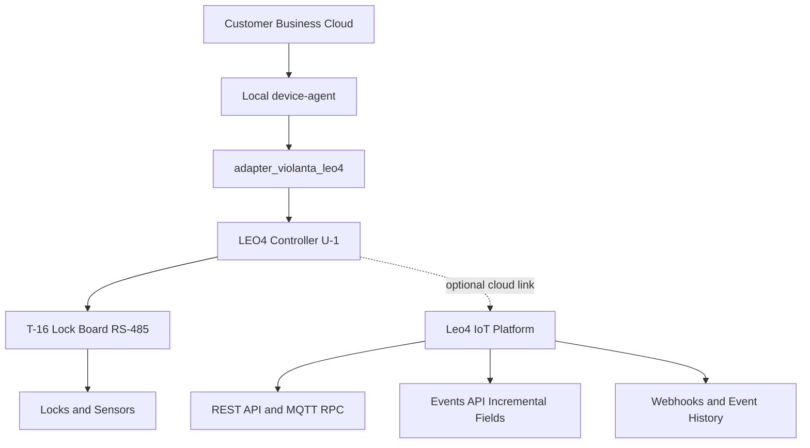
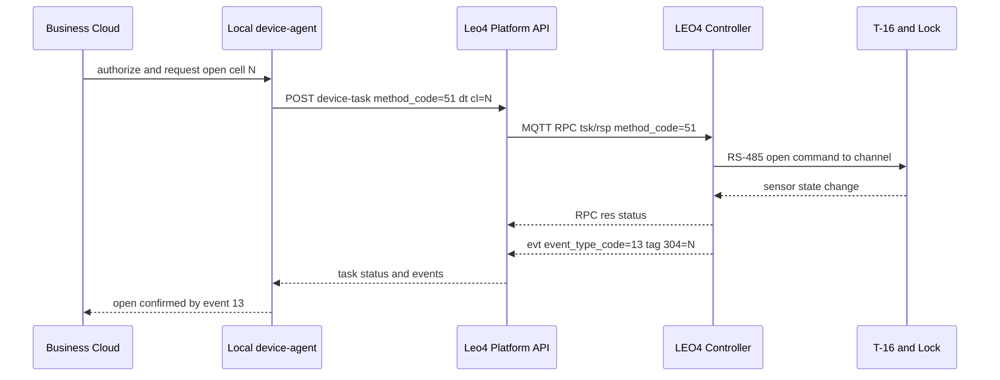
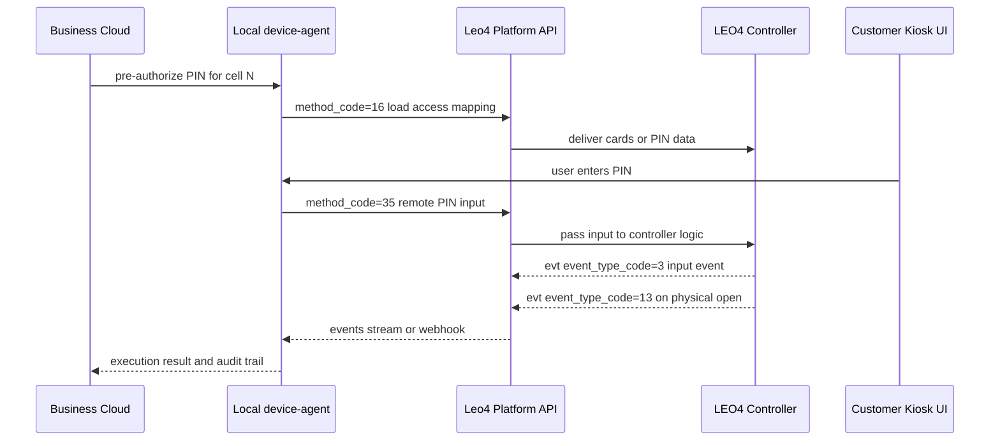
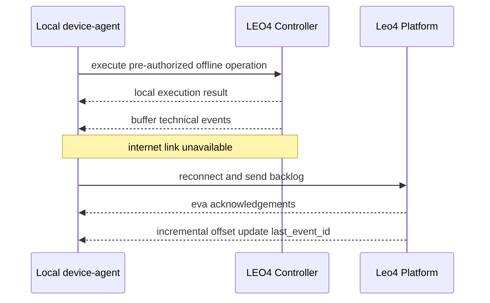

# LEO4 как безопасный vendor execution layer для постаматов и ячеек

## Executive summary

LEO4 можно использовать как **vendor execution layer** для управления контроллерами, замками и событиями, при этом бизнес-логика (пользователи, заказы, оплаты, тарифы, поддержка) остаётся в системе клиента.

> [!IMPORTANT]
> **Подтверждено текущими docs:** RPC/REST task-flow, event-flow, MQTT topic model, correlation data, webhooks, TTL, idempotency и подтверждение физического открытия через события.
>
> **Архитектурная рекомендация:** strict security-модель с обязательным прохождением всех unlock-capable команд через customer-owned `device-agent`/`adapter_violanta_leo4`.
>
> **Требует финального подтверждения/контракта:** лимиты offline-буфера, детальная PIN overwrite/delete семантика, SLA/licensing и итоговый deployment-режим.

## Голос клиента: ключевые цитаты из заявки

> «Нам интересен продукт Виоланты / LEO4 как технический слой управления оборудованием: контроллеры, замки, события, online/offline, безопасность, API и поддержка.»

> «Бизнес-логика остается в нашей системе.»

> «Нам нужно понять, можно ли использовать LEO4 как vendor execution layer, подключенный к нашему локальному device-agent.»

> «Может ли LEO4 открыть ячейку без участия нашего device-agent?»

> «Можно ли настроить схему так, чтобы все команды открытия проходили только через наш device-agent / наш adapter?»

> «Если используется облачный LEO4, может ли ваше облако отправить команду открытия напрямую в контроллер, минуя наш device-agent?»

> «Offline нужен только для уже разрешенных операций.»

> «Мы хотим использовать собственный интерфейс на экране устройства.»

> «Нам достаточно минимального стенда: контроллер LEO4; плата управления замками, например T-16; 1 замок; датчик / концевик открытия-закрытия; питание; API-доступ...»

## Позиционирование решения

- **LEO4 Controller Layer (локально):** hardware execution (команды замкам, чтение датчиков, статусы каналов).
- **Customer Business Cloud:** master-система бизнес-правил и авторизации.
- **Customer local `device-agent` / `adapter_violanta_leo4`:** security boundary и policy-enforcement рядом с железом.
- **Leo4 IoT Platform (cloud):** сильная, но опциональная модель cloud telemetry/control (REST + MQTT RPC + webhooks + event history).

> ✅ Подтверждено docs: LEO4 API и MQTT RPC предоставляют технические команды/события, без обязательной передачи бизнес-логики клиента в LEO4.

## Трёхуровневая архитектура

1. **Customer business cloud** — авторизация, оркестрация, бизнес-решения.
2. **Local `device-agent` / `adapter_violanta_leo4`** — доверенный локальный enforcement-слой.
3. **LEO4 controller + Т-16 + locks/sensors** — физическое исполнение.
4. **Leo4 IoT Platform (optional)** — облачная телеметрия/история/интеграции.

### Архитектура (GitHub-safe Mermaid)

## Ответ на главный security-вопрос: можно ли исключить обход device-agent?

### Режим A: direct cloud-addressed controller mode

- Если физический контроллер зарегистрирован как напрямую cloud-addressable endpoint, теоретически возможен прямой path cloud → controller.
- Это подходит для моделей, где клиент осознанно принимает shared-control.

### Режим B: customer-controlled execution mode (рекомендуемый для strict security)

- Физические контроллеры **не адресуются напрямую** из cloud как unlock endpoints.
- Команды идут только в trusted local `device-agent`/adapter, который сам решает, что отправлять в LEO4/controller.
- Нужно контролировать не только `method_code=51`, но также unlock-capable и behavior-changing команды: `16`, `35`, `47`, `26`, а также `18`, `42`, `48`, `49`, `50`.

> [!WARNING]
> Для строгой модели запрета обхода device-agent security boundary фиксируется **архитектурой маршрутизации + ACL/policy + onboarding-правилами endpoint-адресации**.

## Два пути открытия ячейки

### 1) Прямой путь: `method_code=51` (`CMD_OPERATE_CELL`)

- Команда адресного открытия ячейки (`payload.dt[].cl`).
- Быстрый и прозрачный путь для online-операций.

### 2) Косвенный путь: PIN-flow

- `method_code=16` — загрузка PIN/доступов.
- `method_code=35` — удалённый ввод PIN/API-code.
- `method_code=47` / `26` — удаление отдельных/всех доступов (где применимо).
- Возможны сценарии замены PIN и резервных PIN через policy в business cloud + local agent.

### Direct open sequence

### PIN-flow sequence

## Почему PIN-flow важен для offline

- Позволяет заранее подготовить локально разрешённые доступы.
- При потере внешней связи new-order/new-payment не создаются, но pre-authorized доступы продолжают работать локально.
- После восстановления связи события синхронизируются в cloud.

## События, статусы и подтверждение физического результата

- `status=3 (DONE)` = завершение task/RPC цикла, **не** физическое подтверждение открытия.
- Физическое открытие подтверждается `event_type_code=13` (`CellOpenEvent`), ключевой тег ячейки `304`.
- Закрытие: `event_type_code=14`.
- Ввод идентификатора/PIN/RFID: `event_type_code=3`.
- Full state: `event_type_code=63`.
- Keep-alive/status: `event_type_code=44`.
- Доступны REST events API (`list`, `incremental`, `fields`) + webhooks.

## Надёжность доставки, идемпотентность и replay

- Рекомендованный MQTT для `evt`: **QoS 1**.
- Серверное подтверждение при обработке события: `srv/<SN>/eva`.
- Dedupe: составной ключ `(device_id, dev_event_id, dev_timestamp)`.
- Incremental replay/polling: через `last_event_id`.
- Webhook retry: экспоненциальная стратегия повторов согласно docs.

### Offline/replay sequence (опционально)

## Offline-сценарий

Рекомендуемый контур:

1. Pre-authorized PIN/доступ загружается заранее.
2. Local allow-list хранится и применяется на стороне `device-agent`/controller layer.
3. Локальная валидация выполняется без обращения к внешнему cloud.
4. Технические события буферизуются локально.
5. После восстановления связи выполняется sync + dedupe + webhook/API-доставка.

> [!NOTE]
> Лимиты буфера, политика конфликтов и приоритеты reconcile должны быть закреплены отдельным техконтрактом.

## Kiosk UI

- Клиент может использовать **собственный kiosk UI**.
- LEO4 может работать в headless-модели как технический слой управления.
- LEO4 HMI (`И-4` / `И-7`, UI-catalog сценарии) — опционально.

## Deployment-модели

| Модель | Где исполняются команды открытия | Зависит ли открытие от внешнего облака | Кто владеет событиями/логами | Security boundary |
|---|---|---|---|---|
| Cloud Leo4 | Leo4 cloud orchestration + controller | Может зависеть от connectivity | По умолчанию в Leo4, экспорт в customer | Shared boundary |
| Cloud Leo4 + customer local agent | Local agent + controller, cloud как backend | Для offline pre-authorized операций — нет | Customer получает stream/webhooks + Leo4 history | Strong customer boundary |
| Dedicated Leo4 | Выделенный Leo4 instance (single tenant) | Зависит от выбранной сети и routing | По контракту (обычно customer-controlled) | Controlled dedicated boundary |
| Local/on-prem Leo4 | On-prem контур клиента | Нет, при локальной связности | У клиента | Full customer perimeter |
| Локальный LEO4-компонент на mini-PC/controller | Локальный execution path | Нет для локального path | Локально + sync в cloud при наличии | Max local control |

## Минимальный тестовый стенд

- LEO4 controller (У-1).
- Плата Т-16.
- 1 физический замок.
- 1 датчик/концевик открытия-закрытия.
- Питание.
- API-доступ (REST/MQTT по договорённости).
- `device_id` / `SN` / сертификатная идентичность.
- Опционально mini-PC с `device-agent`.
- Тестовые сценарии PIN-flow.

## Тест-план

1. REST auth (`x-api-key`/политики доступа).
2. Получение списка устройств/ячеек.
3. Direct open (`method_code=51`).
4. Получение task status.
5. Проверка `event_type_code=13` (open).
6. Проверка `event_type_code=14` (close).
7. Error/timeout сценарии.
8. Online/offline переключение канала связи.
9. Event sync после reconnect.
10. Сравнение API/webhook/MQTT event path.
11. PIN bind (`16`).
12. Remote PIN input (`35`).
13. PIN replacement policy.
14. Reserve PIN сценарии.
15. Invalidate old PIN (`47/26` где применимо).
16. Bypass prevention test (попытка unlock в обход local agent должна блокироваться policy).

## Матрица соответствия требованиям клиента

| Пункт заявки | Что требуется | Ответ |
|---|---|---|
| 1 | Command path / bypass risk | Поддерживаются оба режима; для strict security рекомендуется customer-controlled path только через local agent |
| 2 | LEO4 как technical layer без бизнес-логики | Да, модель technical command + technical events подтверждается текущими docs |
| 3 | События и статусы | Поддерживаются события открытия/закрытия/input/full state/health + API/webhooks |
| 4 | Offline только для разрешённых операций | Реализуемо через pre-authorized доступы и local allow-list |
| 5 | Deployment-варианты | Доступны cloud/dedicated/on-prem/local execution варианты (финализируются контрактом) |
| 6 | Собственный kiosk UI | Да, возможна headless-модель LEO4 + клиентский UI |
| 7 | API и документация | Есть REST/MQTT/event/webhook документы; credentials и стенд — по согласованной процедуре |
| 8 | Минимальный стенд | У-1 + Т-16 + lock + sensor + power + API доступ + опциональный mini-PC agent |
| 9 | Что проверить на тесте | Сформирован полный тест-план (direct open, events, offline/reconnect, PIN flow) |
| 10 | Коммерческая модель | Оборудование, лицензия, deployment, SLA/support — определяется на пресейл/контрактном этапе |
| 11 | Критичные условия безопасности | Выполнимо при фиксации security boundary и запрете direct cloud addressing контроллеров |
| 12 | Желаемый результат | Готова рекомендованная схема, стенд и список вопросов к техзвонку |

## Что нужно финализировать на техническом звонке

1. Точная deployment-модель (cloud/dedicated/on-prem/local-hybrid).
2. Будет ли у контроллера прямой cloud endpoint.
3. Детальная семантика PIN overwrite.
4. Формат удаления отдельных PIN (`47`) и массового удаления (`26`).
5. Offline buffer limits.
6. Conflict resolution policy после reconnect.
7. SLA/licensing/support модель.
8. Выдача тестовых credentials/device-профиля.

## Рекомендованная формулировка ответа клиенту

> Мы подтверждаем, что LEO4 может использоваться как vendor execution layer для контроллеров/замков/событий без переноса вашей бизнес-логики в LEO4. Для строгой security-модели мы рекомендуем customer-controlled execution path: все команды, которые потенциально могут привести к открытию или изменению поведения устройства, проходят только через ваш локальный `device-agent`/`adapter_violanta_leo4`; физические контроллеры при этом не регистрируются как напрямую cloud-addressable unlock endpoints. В этой схеме Leo4 IoT Platform остаётся сильной опцией для телеметрии, RPC, истории событий, webhooks и интеграций, а offline используется только для заранее разрешённых операций с последующей синхронизацией событий после восстановления связи.

## Контроллерный контур Leo4/T-16 (смежные материалы)

С учётом `docs_mirror/controllers`:

- Leo4 ПАК включает У-1, Т-16, И-4/И-7 и опциональные ридеры/QR/замки/БП.
- Т-16: 16 каналов управления замками с датчиками.
- Несколько Т-16 объединяются по RS-485 до массива 256 замков.
- Т-16 исполняет команду открытия от У-1 по RS-485.
- Есть команда «запрос статуса», ответ возвращает битовые поля датчиков каналов.
- Для У-1 задокументированы режимы MQTT(S)-client, WS/Web server и режим с персистентной очередью событий.

> ⚠️ Эти пункты основаны на смежных controller docs (`docs_mirror`) и должны быть финально зафиксированы в проектном контракте поставки/интеграции.

## Ссылки на документацию

### Внутренние документы репозитория

- [`../mqtt-rpc-protocol.md`](../mqtt-rpc-protocol.md)
- [`../1-task-workflow-doc.md`](../1-task-workflow-doc.md)
- [`../task_states.md`](../task_states.md)
- [`../event-protocol-mqtt.md`](../event-protocol-mqtt.md)
- [`../2-events-api-format-description.md`](../2-events-api-format-description.md)
- [`../3-webhooks.md`](../3-webhooks.md)
- [`../method-codes-reference.md`](../method-codes-reference.md)
- [`../event-types-reference.md`](../event-types-reference.md)
- [`../event-property-tags.md`](../event-property-tags.md)
- [`../correlation-data-guide.md`](../correlation-data-guide.md)
- [`../mqtt_topic_rules.md`](../mqtt_topic_rules.md)
- [`../TTL.md`](../TTL.md)
- [`../server-integration-guide.md`](../server-integration-guide.md)

### Смежные материалы по контроллерам

- [`OlegLebedevRU/docs_mirror/controllers/Leo4-controllers-description.md`](https://github.com/OlegLebedevRU/docs_mirror/blob/master/controllers/Leo4-controllers-description.md)
- [`OlegLebedevRU/docs_mirror/controllers/Description_Leo4_T-16.md`](https://github.com/OlegLebedevRU/docs_mirror/blob/master/controllers/Description_Leo4_T-16.md)
