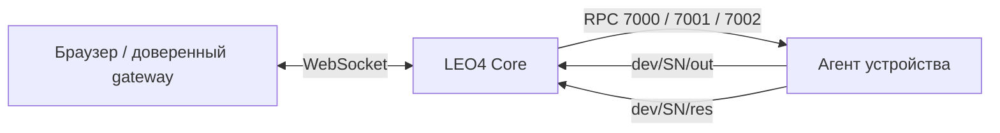

# 🖥️ Remote Diagnostics · RPC и потоковый вывод

> Live logs, диагностические команды и console output через RPC и volatile-канал `out`.

[← Документация](README.md) · [RPC](mqtt-rpc-protocol.md) · [Удалённые сеансы](remote-input-protocol.md) · [Методы](method-codes-reference.md)

## 🧭 Архитектура



Команды используют `tsk/req/rsp/res/cmt`. `out` передаёт chunks и не заменяет финальный RES. Поток не сохраняется как DeviceEvent, не участвует в event dedup и не получает EVA.

## 📡 Методы и параметры

Task payload содержит только `dt`. `7000/7001` требуют один объект; `7002` допускает один адресный объект или пустой массив для отмены текущей монопольной команды.

| Метод | Назначение | Поля `dt[0]` |
| :--- | :--- | :--- |
| `7000` | Start/stop output stream | `action`, `session_id`, `stream`; параметры start: `level`, `ttl_sec`, `max_rate_bps`, `topic` |
| `7001` | Diagnostic Exec | `session_id`, `command_id`, `args`, `ttl_sec`, `max_output_bytes`, `topic`; console: `command_line`, `shell` |
| `7002` | Cancel | `session_id`, необязательный `reason`; либо `{"dt":[]}` |

```json
{
  "dt": [
    {
      "session_id": "8baf0d49-3e35-4210-87a8-111111111111",
      "command_id": "system_info",
      "args": {},
      "ttl_sec": 60,
      "max_output_bytes": 1048576,
      "topic": "dev/<SN>/out"
    }
  ]
}
```

Подставьте фактический SN. `session_id` диагностики отличается от task UUID. Неизвестные поля запрещены. Для Exec: session TTL `1..3600` секунд, command line до 4096 символов, output limit не менее 1 байта.

Backend знает predefined command IDs и raw aliases, включая `raw_cmd/raw_command`. Текущий console-контракт допускает `command_line` и `shell`; разрешение конкретного действия определяет агент. [Перечень backend IDs](../app-service/core/diagnostics/commands.py).

Пустой 7002 получает `payload_required=false` в TSK. Адресный Cancel и Exec ждут RSP. Финальный RES содержит metadata и transport `status_code/result_uid`, большой вывод идёт через `out`.

## 📦 Output envelope

```json
{
  "v": 1,
  "session_id": "8baf0d49-3e35-4210-87a8-111111111111",
  "seq": 1,
  "ts": "2026-10-09T08:00:00Z",
  "kind": "stdout",
  "stream": "stdout",
  "encoding": "utf-8",
  "data": "diagnostic output",
  "eof": false,
  "exit_code": null,
  "truncated": false
}
```

`seq` — неотрицательный номер chunk. `kind`: log/stdout/stderr/status/result/error; encoding: utf-8/base64. EOF и exit code сообщают о завершении, truncated — об ограничении вывода. Legacy envelope без kind адаптируется по stream/eof/exit_code. Маршрутизация использует routing SN + session_id; без активной сессии chunk не доставляется браузеру.

## 🔌 WebSocket control plane

Текущий backend endpoint: `/api/internal/v1/diagnostics/ws/devices/{sn}`. Он скрыт из публичной OpenAPI-схемы. Browser URL, JWT validation и rewrite задаёт внешний доверенный gateway, управляемый отдельно. Браузер не должен назначать доверенные org/role/user headers.

Backend проверяет роль superuser или l4desk_owner, effective org и принадлежность SN. Явная lease проверяется по активности, SN, tenant, scope=console, владельцу и session. l4desk_owner требует явную lease; конфигурация может разрешать implicit lease для superuser.

| Browser message | Действие |
| :--- | :--- |
| `start_log` | Создать session и RPC7000 start |
| `stop_log` | RPC7000 stop |
| `exec` | Создать session и RPC7001 |
| `cancel` | RPC7002 для session |

Ответы backend: output/status/error; при implicit acquire — lease с её UUID. Lease errors закрывают WS с 4409. Неподходящие org/device/role отклоняются до работы с сессией.

## ⏱️ Срок, остановка и доставка вывода

Console использует общую монопольную lease с stream/input/view/files. [Ownership и сроки](remote-input-protocol.md) · [Files lease](file-manager-v2.md).

После Cancel forwarder сохраняется до terminal EOF либо исходного срока session. WS отправка ограничена пятью секундами или оставшимся временем. При disconnect backend отмечает lease disconnected, отменяет локальные forwarders и закрывает диагностические сессии; grace и cleanup применяются по модели lease.

Registry использует Redis-backed metadata и локальные очереди сессий. Уже переданные chunks не являются архивом, произвольный reconnect между workers с replay не гарантируется. [Redis topology](redis/redis-integration-guide.md).

RPC-логи и история рекурсивно маскируют секретные поля, включая чувствительные command lines; delivery payload остаётся исходным.

**Реализация:** [WS](../app-service/api/internal_v1/diagnostics.py) · [схемы](../app-service/core/diagnostics/schemas.py) · [service](../app-service/core/diagnostics/service.py) · [registry](../app-service/core/diagnostics/sessions.py). Сверено с master на 09.10.2026.

