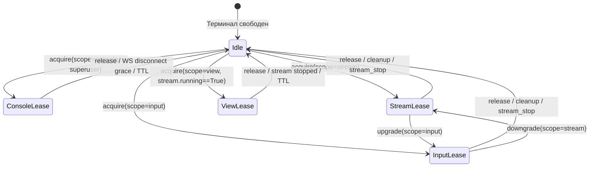

# 🎮 Remote Input & Stream Control Plane Protocol (`ctl`, `l4desk`)

> **Файл:** `docs/remote-input-protocol.md`  
> **Версия протокола:** 1 (v1)  
> **Статус:** Active (Unified Lease Model, Control-Plane Extension, Single Worker)  
> **Компоненты:** `iot-rpc-rest-app` (FastAPI/FastStream backend), `menubuilder-backend` (BFF/UI), терминальный агент `l4desk.exe`.

---

## 1. Архитектурная схема плоскостей (Plane Separation)

Удалённое управление терминалом разделено на две независимые плоскости:

```text
┌────────────────────────────────────────────────────────────────────────┐
│                        Плоскость видео (Media Plane)                   │
│  Терминал (FFmpeg) ─────── SRT / WebRTC / l4media ───────> Браузер     │
└────────────────────────────────────────────────────────────────────────┘

┌────────────────────────────────────────────────────────────────────────┐
│                     Плоскость управления (Control Plane)               │
│                                                                        │
│  Браузер / MenuBuilder (BFF)                                           │
│       │                                                                │
│       │ REST (lease, stream, inventory) / WS (input, stream_state)     │
│       ▼                                                                │
│  iot-rpc-rest-app (app1)                                               │
│       │                                                                │
│       ├── AMQP srv.<SN>.ctl (expiration, QoS 1, non-retained)          │
│       │   ──────> RabbitMQ (amq.topic) ──────> MQTT srv/<SN>/ctl       │
│       │                                                 │              │
│       │                                                 ▼              │
│       │                                          Терминал (l4desk.exe) │
│       │                                                 │              │
│       │   <────── RabbitMQ (q_ctl) <─────────── MQTT dev/<SN>/ctl      │
│       └── AMQP dev.<SN>.ctl (ack, nack, presence,       │              │
│                              stream_event)              │              │
│                                                                        │
└────────────────────────────────────────────────────────────────────────┘
```

### Принципы изоляции:
1. **Никакого смешивания с RPC**: Remote Input и Stream Control **не** используют очереди и топики `tsk`, `req`, `rsp`, `res`, `cmt`, `rac`.
2. **Никакого сохранения в БД**: События движения мыши, кликов, ввода клавиш, стриминга и присутствия **не** сохраняются в PostgreSQL и **не** генерируют записи `DeviceEvent` или `DeviceTask`.
3. **Единая монопольная аренда (Unified Lease)**: В один момент времени с терминалом может работать ровно один контекст: либо Console (диагностика), либо Stream/Input (удалённое управление), либо View (видеонаблюдение).
4. **Безопасная адресация источников**: Сервер оперирует исключительно логическими идентификаторами `source_id` (`disp:...` или `cam:...`), профилями `profile` и серверным `stream_instance_id` (UUID4). Аргументы командной строки FFmpeg, прямые пути и системные параметры с сервера на терминал не передаются.

---

## 2. MQTT Топики и QoS

| Тип сообщения | Топик MQTT | Routing Key AMQP | Направление | QoS агента | Retain | TTL сервера (`expiration`) |
|---|---|---|---|:---:|:---:|:---:|
| `pointer_move` | `srv/<SN>/ctl` | `srv.<SN>.ctl` | Server → Terminal | 0 | Нет | 2000 мс (`move_ttl_ms`) |
| `mouse_click` | `srv/<SN>/ctl` | `srv.<SN>.ctl` | Server → Terminal | 1 | Нет | 5000 мс (`click_ttl_ms`) |
| `key_event` | `srv/<SN>/ctl` | `srv.<SN>.ctl` | Server → Terminal | 1 | Нет | 5000 мс (`click_ttl_ms`) |
| `inventory_get`| `srv/<SN>/ctl` | `srv.<SN>.ctl` | Server → Terminal | 1 | Нет | 5000 мс (`inventory_timeout_sec`) |
| `stream_start` | `srv/<SN>/ctl` | `srv.<SN>.ctl` | Server → Terminal | 1 | Нет | 15000 мс (`stream_start_timeout_sec`) |
| `stream_stop`  | `srv/<SN>/ctl` | `srv.<SN>.ctl` | Server → Terminal | 1 | Нет | 5000 мс |
| `ack` / `nack` | `dev/<SN>/ctl` | `dev.<SN>.ctl` | Terminal → Server | 1 | Нет | — |
| `presence`     | `dev/<SN>/ctl` | `dev.<SN>.ctl` | Terminal → Server | 1 | **Да** (retained + LWT) | — |
| `stream_event` | `dev/<SN>/ctl` | `dev.<SN>.ctl` | Terminal → Server | 1 | Нет | — |

---

## 3. Единая модель аренды (Unified Exclusive Lease Model)

### 3.1. Области действия (Scope)
- `console`: Диагностическая сессия консоли (`/api/internal/v1/diagnostics/ws/devices/{sn}`). Доступна **только** роли `superuser`. Взаимно исключает `stream`, `input` и `view`.
- `view`: Только просмотр активной видеотрансляции (для роли `viewer` с правом «Видеонаблюдение»). Выдаётся **только**, если `presence.stream.state == "running"`, иначе `409 stream_not_running`. Ввод команд мыши/клавиатуры заблокирован.
- `stream`: Управление видеотрансляцией (`stream/start`, `stream/stop`), получение инвентаря. Ввод заблокирован.
- `input`: Полный доступ к видеотрансляции и интерактивному вводу (`pointer_move`, `mouse_click`, `key_event`). По умолчанию при `POST /devices/{sn}/lease` без указания scope для обратной совместимости.

### 3.2. Правила LeaseRegistry
1. **Одна активная аренда на SN**: Любая попытка захватить терминал при наличии активной аренды другого пользователя или другой браузерной сессии приводит к `409 Conflict` со структурированным телом `LeaseConflictError`:
   ```json
   {
     "code": "lease_taken",
     "owner_role": "admin",
     "owner_user_id_masked": "us***42",
     "scope": "input",
     "expires_at": "2026-09-09T18:00:00+00:00"
   }
   ```
2. **Идемпотентность**: Повторный вызов `acquire` тем же пользователем (`X-User-Id`) и из той же браузерной сессии (`X-Session-Id`) возвращает текущую активную аренду и продлевает её срок действия.
3. **Смена scope**: Владелец аренды может изменить уровень доступа вызовом `POST /lease/{lease_id}/scope` (`upgrade/downgrade`).
4. **Grace-период при разрыве WS (`ws_disconnect_grace_sec = 10`)**: При временном обрыве WebSocket соединение не аннулируется мгновенно. Если в течение 10 секунд клиент не восстановил WS, фоновая задача `cleanup_expired` отзывает аренду (`reason: ws_disconnect_timeout`).
5. **Сайд-эффекты отзыва аренды (`revoke`)**:
   - При отзыве аренды со scope `stream` или `input`, если на терминале запущен поток (`stream_instance_id is not None`), сервер автоматически отправляет команду `stream_stop` (best-effort с таймаутом 5с).
   - При отзыве аренды со scope `console` сервер принудительно завершает диагностические сессии в `DiagnosticsSessionRegistry` и закрывает WebSocket с кодом `4409`.
6. **Выход пользователя (`DELETE /leases/by-owner`)**: BFF при логауте пользователя освобождает все принадлежащие ему активные аренды.

### 3.3. Диаграмма состояний аренды (State Diagram)



---

## 4. Контракт конвертов v1 (Envelope Specification)

Все сообщения передаются в UTF-8 JSON с полем версии `"v": 1`.

### 4.1. Server → Terminal (`srv/<SN>/ctl`)

#### `inventory_get`:
```json
{
  "v": 1,
  "type": "inventory_get",
  "command_id": "9b0f49c0-621b-4171-a477-96a8be4ff984",
  "lease_id": "52857e4e-2895-46c0-b2be-5f80b27feea7",
  "sn": "a4b0000773c82116d210826",
  "issued_at_ms": 1788805978123,
  "expires_at_ms": 1788805983123
}
```

#### `stream_start`:
```json
{
  "v": 1,
  "type": "stream_start",
  "command_id": "018f2195-20d0-4bf6-b51c-8b89412f84b1",
  "lease_id": "52857e4e-2895-46c0-b2be-5f80b27feea7",
  "sn": "a4b0000773c82116d210826",
  "mode": "desktop",
  "source_id": "disp:hex1",
  "profile": "default",
  "stream_instance_id": "426bc0b9-5df1-4ff2-8d75-beae2f1cae5e",
  "issued_at_ms": 1788805978123,
  "expires_at_ms": 1788805993123
}
```

#### `stream_stop`:
```json
{
  "v": 1,
  "type": "stream_stop",
  "command_id": "31b0a884-bb9e-4a6c-9c96-189f38fbf381",
  "lease_id": "52857e4e-2895-46c0-b2be-5f80b27feea7",
  "sn": "a4b0000773c82116d210826",
  "stream_instance_id": "426bc0b9-5df1-4ff2-8d75-beae2f1cae5e",
  "issued_at_ms": 1788805978123,
  "expires_at_ms": 1788805983123
}
```

#### `pointer_move`:
```json
{
  "v": 1,
  "type": "pointer_move",
  "command_id": "426bc0b9-5df1-4ff2-8d75-beae2f1cae5e",
  "lease_id": "52857e4e-2895-46c0-b2be-5f80b27feea7",
  "sn": "a4b0000773c82116d210826",
  "desktop_id": "disp:hex1",
  "stream_instance_id": "426bc0b9-5df1-4ff2-8d75-beae2f1cae5e",
  "x": 32768,
  "y": 16384,
  "issued_at_ms": 1788805978123,
  "expires_at_ms": 1788805980123
}
```

#### `mouse_click`:
```json
{
  "v": 1,
  "type": "mouse_click",
  "command_id": "8bb3eb62-8176-46b5-93fa-1a293be46b52",
  "lease_id": "52857e4e-2895-46c0-b2be-5f80b27feea7",
  "sn": "a4b0000773c82116d210826",
  "desktop_id": "disp:hex1",
  "stream_instance_id": "426bc0b9-5df1-4ff2-8d75-beae2f1cae5e",
  "x": 32768,
  "y": 16384,
  "button": "left",
  "issued_at_ms": 1788805978123,
  "expires_at_ms": 1788805983123
}
```

#### `key_event`:
```json
{
  "v": 1,
  "type": "key_event",
  "command_id": "2d94cf10-21a4-4a4b-8fa2-68c92a95c732",
  "lease_id": "52857e4e-2895-46c0-b2be-5f80b27feea7",
  "sn": "a4b0000773c82116d210826",
  "desktop_id": "disp:hex1",
  "stream_instance_id": "426bc0b9-5df1-4ff2-8d75-beae2f1cae5e",
  "kind": "down|up|press",
  "vk": 13,
  "text": "Enter",
  "issued_at_ms": 1788805978123,
  "expires_at_ms": 1788805983123
}
```

**Белый список Virtual Key (`vk`):**
- `0x08`: Backspace
- `0x09`: Tab
- `0x0D`: Enter
- `0x1B`: Escape
- `0x20`: Space
- `0x25..0x28`: Стрелки (Left, Up, Right, Down)
- `0x2E`: Delete
- `0x30..0x39`: Цифры `0`–`9`
- `0x41..0x5A`: Латинские буквы `A`–`Z`
- `0x70..0x7B`: Функциональные клавиши `F1`–`F12`

---

### 4.2. Terminal → Server (`dev/<SN>/ctl`)

#### `presence`:
```json
{
  "v": 1,
  "type": "presence",
  "agent": "l4desk",
  "status": "online",
  "desktop_available": true,
  "session_id": 1,
  "timestamp": "2026-09-09T18:00:00Z",
  "screen": {
    "virtual_x": 0,
    "virtual_y": 0,
    "virtual_width": 1920,
    "virtual_height": 1080
  },
  "inventory": {
    "displays": [
      {
        "desktop_id": "disp:hex1",
        "name": "\\\\.\\DISPLAY1",
        "primary": true,
        "x": 0,
        "y": 0,
        "width": 1920,
        "height": 1080,
        "session_id": 1,
        "policy": "input"
      }
    ],
    "cameras": [
      {
        "camera_id": "cam:hex1",
        "name": "USB Camera",
        "available": true
      }
    ]
  },
  "stream": {
    "state": "running",
    "mode": "desktop",
    "source_id": "disp:hex1",
    "stream_instance_id": "426bc0b9-5df1-4ff2-8d75-beae2f1cae5e",
    "profile": "default",
    "reason": null,
    "ffmpeg_pid": 1234,
    "started_at": "2026-09-09T18:00:00Z",
    "restart_count": 0
  }
}
```

#### `ack`:
```json
{
  "v": 1,
  "type": "ack",
  "command_id": "018f2195-20d0-4bf6-b51c-8b89412f84b1",
  "lease_id": "52857e4e-2895-46c0-b2be-5f80b27feea7",
  "sn": "a4b0000773c82116d210826",
  "result": "started",
  "stream_instance_id": "426bc0b9-5df1-4ff2-8d75-beae2f1cae5e",
  "state": "running",
  "terminal_time_ms": 1788805978301
}
```

Допустимые значения `result`: `"injected"`, `"started"`, `"already_running"`, `"switched"`, `"stopped"`, `"already_stopped"`.

#### `nack`:
```json
{
  "v": 1,
  "type": "nack",
  "command_id": "8bb3eb62-8176-46b5-93fa-1a293be46b52",
  "lease_id": "52857e4e-2895-46c0-b2be-5f80b27feea7",
  "sn": "a4b0000773c82116d210826",
  "code": "lease_mismatch",
  "message": "Lease mismatch or not found",
  "terminal_time_ms": 1788805978301
}
```

**Полный перечень кодов NACK:**
- `interactive_desktop_unavailable` — сессия Winlogon/UAC/экран заблокирован.
- `lease_invalid` — `lease_id` устарел или не существует.
- `expired` — время команды истекло на стороне терминала.
- `duplicate` — повторная команда с тем же `command_id`.
- `invalid_sn` — несовпадение SN в теле с сертификатом терминала.
- `invalid_payload` — нарушение структуры JSON конверта.
- `unsupported` — неподдерживаемая команда.
- `inject_failed` — сбой API Windows `SendInput`.
- `lease_mismatch` — несовпадение `lease_id` с активным.
- `desktop_mismatch` — несовпадение `desktop_id` с транслируемым.
- `stream_mismatch` — несовпадение `stream_instance_id`.
- `source_not_allowed` — политика display/camera запрещает доступ.
- `source_unavailable` — источник отключён или недоступен.
- `session_unavailable` — сессия Windows пользователя не найдена.
- `busy_transition` — терминал находится в процессе переключения потока.
- `ffmpeg_missing` — исполняемый файл FFmpeg не обнаружен.
- `ffmpeg_integrity` — ошибка проверки контрольной суммы / целостности FFmpeg.
- `input_not_allowed_in_camera_mode` — ввод заблокирован в режиме камеры.
- `invalid_profile` — запрошен несуществующий профиль кодирования.

#### `stream_event` (асинхронный односторонний статус):
```json
{
  "v": 1,
  "type": "stream_event",
  "stream_instance_id": "426bc0b9-5df1-4ff2-8d75-beae2f1cae5e",
  "state": "stopped",
  "reason": "ffmpeg_terminated",
  "timestamp": "2026-09-09T18:05:00Z"
}
```

---

## 5. Внутренний API (`/api/internal/v1/remote-input`)

### 5.1. Заголовки авторизации
- `X-Internal-Service-Key` или `Authorization: Bearer <token>`
- `X-Org-Id`
- `X-User-Id`
- `X-Role` / `X-Role-Id` (`superuser`, `admin`, `user`, `viewer`)
- **`X-Session-Id`** — обязательный идентификатор браузерной сессии оператора (для WS — заголовок или query `session_id`).

### 5.2. Маршруты REST

| Метод | Путь | Назначение |
|---|---|---|
| `GET` | `/devices/{sn}/status` | Получить статус терминала, инвентарь, состояние потока и аренды |
| `POST`| `/devices/{sn}/lease` | Захват аренды (`scope`, `ttl_sec`) |
| `POST`| `/lease/{lease_id}/scope` | Смена scope владельцем (`console`, `view`, `stream`, `input`) |
| `POST`| `/lease/{lease_id}/keepalive` | Продление аренды |
| `DELETE`| `/lease/{lease_id}` | Освобождение аренды |
| `DELETE`| `/leases/by-owner` | Массовое освобождение аренд пользователя при логауте (`user_id`, `session_id`) |
| `GET` | `/devices/{sn}/inventory?refresh=0\|1` | Инвентарь дисплеев и камер (при `refresh=1` запрашивает терминал через `inventory_get`) |
| `POST`| `/lease/{lease_id}/stream/start` | Запуск трансляции (`mode`, `source_id`, `profile`) |
| `POST`| `/lease/{lease_id}/stream/stop` | Остановка трансляции |
| `POST`| `/lease/{lease_id}/pointer/move` | Перемещение курсора |
| `POST`| `/lease/{lease_id}/mouse/click` | Клик мыши |
| `POST`| `/lease/{lease_id}/key` | Ввод клавиши (`kind`, `vk`, `text`) |
| `WS`  | `/ws/lease/{lease_id}` | Двусторонний WebSocket ввода и подписки на события |

---

## 6. Таблица обратной совместимости

| Компонент / Клиент | Поведение | Совместимость |
|---|---|:---:|
| Старый `l4desk.exe` (без новых полей) | Публикует legacy `presence` (без `inventory`/`stream`) и базовый `ack` (`result: injected`). Сервер валидирует их без ошибок. | ✅ 100% |
| Старый `MenuBuilder` (без `scope` в `POST lease`) | Поле `scope` по умолчанию принимает значение `"input"`, `stream_mode` инициализируется как `"desktop"`. Существующее дистанционное управление работает без сбоев. | ✅ 100% |
| Существующие URL `/pointer-move` и `/mouse-click` | Сохранены как алиасы на `/pointer/move` и `/mouse/click`. | ✅ 100% |
| Диагностика (Console) без указания `lease_id` | При `settings.diagnostics.implicit_console_lease = true` автоматически неявно захватывает console lease для superuser и сообщает `lease_id` первым WS-сообщением. | ✅ 100% |
