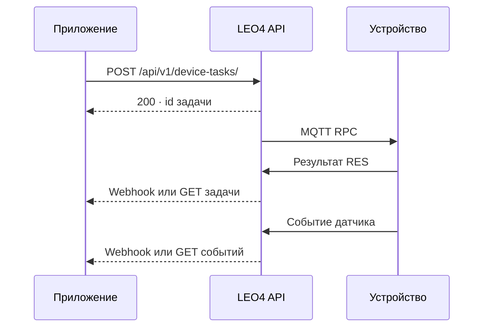

# 🔌 REST API LEO4

> HTTPS + JSON для приложений и серверных интеграций. Базовый путь публичного API: `{base_url}/api/v1`.

[← Документация](README.md) · [Задачи](1-task-workflow-doc.md) · [События](2-events-api-format-description.md) · [Webhooks](3-webhooks.md)

## 🧭 Карта интерфейса

| Ресурс | Методы и пути | Назначение |
| :--- | :--- | :--- |
| 📋 Задачи | `POST /device-tasks/`, `GET /device-tasks/`, `GET /device-tasks/{id}`, `DELETE /device-tasks/{id}` | Создать команду, получить результат, найти задачи устройства, выполнить soft delete |
| 📨 События | `GET /device-events/`, `GET /device-events/incremental`, `GET /device-events/fields/` | История событий, новые записи и значения тегов |
| 📟 Устройства | `GET /devices/`, `PUT /devices/{device_id}` | Список и состояние устройств; добавление/обновление тега |
| 📊 Телеметрия | `GET /gauges/` | Текущие снимки gauges, фильтры `device_id` и `type` |
| 🔔 Подписки | `GET /webhooks/`, `PUT /webhooks/{event_type}`, `DELETE /webhooks/{event_type}` | Настройка уведомлений организации |

Все пути таблицы относительны `/api/v1`. Интерактивная схема сервиса доступна на `{base_url}/docs`, OpenAPI — на `{base_url}/openapi.json` при стандартной конфигурации приложения.

## 🔑 Авторизация

Передавайте **исходный ключ организации**, без префикса `ApiKey`, в заголовке:

```http
x-api-key: <organization-api-key>
Accept: application/json
```

Допускается альтернативный заголовок `Authorization: ApiKey <organization-api-key>`. Публичный backend также принимает API-ключ через `Bearer`, если строка не похожа на JWT. JWT не является API-ключом публичного `/api/v1`.

Организация определяется по ключу. Не передавайте произвольный `org_id` вместо авторизации: доступ к устройствам и данным проверяет сервер.

## ⚡ Первый сценарий



HTTP-ответ на создание подтверждает постановку задачи. `status=3` означает сохранение результата RPC; его успех определяется `results[].status_code` и содержимым результата. Наблюдаемый физический эффект подтверждает соответствующее событие устройства.

## 📟 Список устройств и телеметрия

`GET /devices/` принимает `page` (от 1), `size` (1–100, по умолчанию 20), `q`, `status`, `device_id`, `sort_by` (по умолчанию `device_id`) и `sort_order` (по умолчанию `asc`). Допустимые значения фильтров и формат тегов сверяйте со схемой сервиса.

`GET /gauges/?device_id=4619&type=44` возвращает пагинированные текущие снимки телеметрии. Gauge обновляется на месте; для истории дискретных событий используйте `/device-events/`.

## 🛡️ Публичный и межсервисный API

| Интерфейс | Доступ | Контракт |
| :--- | :--- | :--- |
| `/api/v1/*` | Ключ организации | Пять публичных групп ресурсов выше |
| `/api/internal/v1/*` | Доверенная межсервисная интеграция | [Internal API v1](internal-api-contract-v1.md) |

Удалённые сеансы, диагностика, файловый менеджер, provisioning и административные операции относятся к internal control plane. Их нельзя считать публичными ресурсами `/api/v1`. Конфигурация внешнего proxy управляется отдельно от этого репозитория.

## 💬 Ответы и ошибки

| Код | Значение |
| :--- | :--- |
| `200` | Успешный ответ методов, описанных выше |
| `400` | Некорректная операция, например неподдерживаемый тип webhook |
| `401` | Отсутствующий, неактивный или неверный публичный API-ключ |
| `404` | Ресурс не найден или недоступен в соответствующей операции |
| `422` | Ошибка проверки полей, UUID или query-параметров |
| `503` | Задачу не удалось сохранить |

Пустая выдача списка событий также может возвращаться как `[]` или пустая страница. Точный ответ зависит от операции.

**Основа описания:** [публичные роутеры](../app-service/api/api_v1/__init__.py), [авторизация](../app-service/api/api_v1/api_depends.py), [конфигурация путей](../app-service/core/config.py). Сверено с `master` на 09.10.2026.
