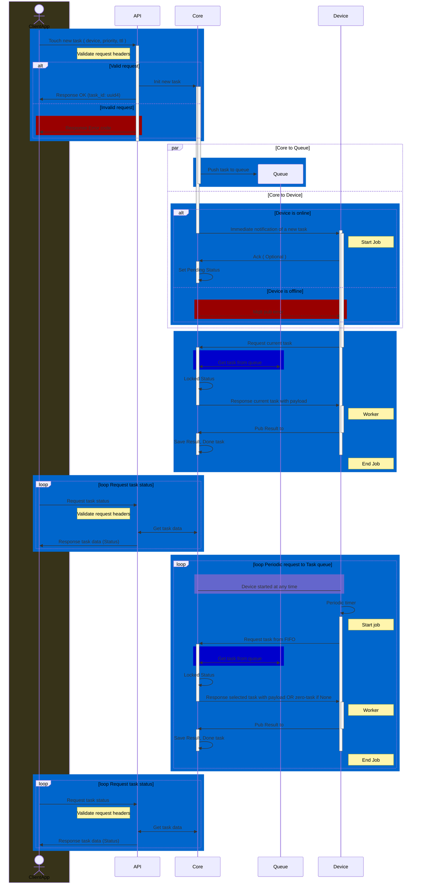

```mermaid
sequenceDiagram
    box  rgb(55, 51, 25)
    actor ClientApp
    end
    participant API  
    participant Core


    rect rgb(0, 102, 204)
    ClientApp->>+API: Touch new task ( device, priority, ttl )
    Note left of API: Validate request headers
    
    alt Valid request
        
        API->>+Core: Init new task
        activate Core
        API->>ClientApp: Response OK (task_id: uuid4)
       
    else Invalid request
        rect rgb(153, 0, 0)
        API->>ClientApp: Response Error code
        end

    end
    end 

    deactivate API
    
    par Core to Queue       
        rect rgb(0, 102, 204)
        
        create participant Queue
        
        Core->>-Queue:Push task to queue
        end
    and Core to Device
        rect rgb(0, 102, 204)
        alt Device is online
            Core->>+Device:Immediate notification of a new task
            activate Device
            deactivate Core
       
            Note right of Device: Start Job
            Device->>+Core:Ack ( Optional )
            Core->>-Core: Set Pending Status
        
        else Device is offline
            rect rgb(153, 0, 0)
            Core--xDevice:Mqtt pub error
            end
        end
        end        
    end
    rect rgb(0, 102, 204)
    Device->>+Core: Request current task
    deactivate Device
    rect rgb(0, 0, 204)
    Queue<<->>Core: Get task from queue
    end
    Core->>Core: Locked Status
    Core->>-Device: Response current task with payload
    activate Device
    Note right of Device: Worker
    Device->>-Core: Pub Result to 
    activate Core
    Core->>Core: Save Result, Done task    
    deactivate Device
    deactivate Core
    Note right of Device: End Job
    end
    rect rgb(0, 102, 204)
    Loop loop Request task status
   
    ClientApp->>API: Request task status
    Note left of API: Validate request headers
    API<<->>Core: Get task data
    API->>ClientApp: Response task data (Status)
    end
    end
    rect rgb(0, 102, 204)
    Loop loop Periodic request to Task queue
    rect rgb(100, 102, 204)
    Core->Device:Device started at any time
    end
    
    
    Device->>+Device: Periodic timer
    Note right of Device: Start job
    Device->>+Core: Request task from FIFO
    rect rgb(0, 0, 204)
    Queue<<->>Core: Get task from queue
    end
    Core->>Core: Locked Status
    Core->>-Device: Response selected task with payload OR zero-task if None
    activate Device
    Note right of Device: Worker
    Device->>-Core: Pub Result to 
    activate Core
    Core->>Core: Save Result, Done task    
    deactivate Device
    deactivate Core
    Note right of Device: End Job
    end
    end
    rect rgb(0, 102, 204)
    Loop loop Request task status
   
    ClientApp->>API: Request task status
    Note left of API: Validate request headers
    API<<->>Core: Get task data
    API->>ClientApp: Response task data (Status)
    end
    end
    
```