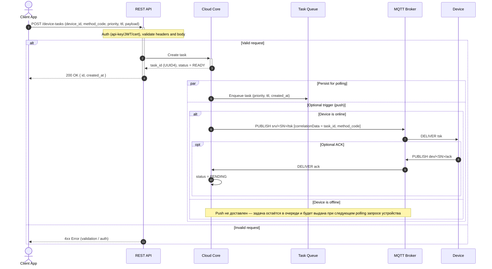
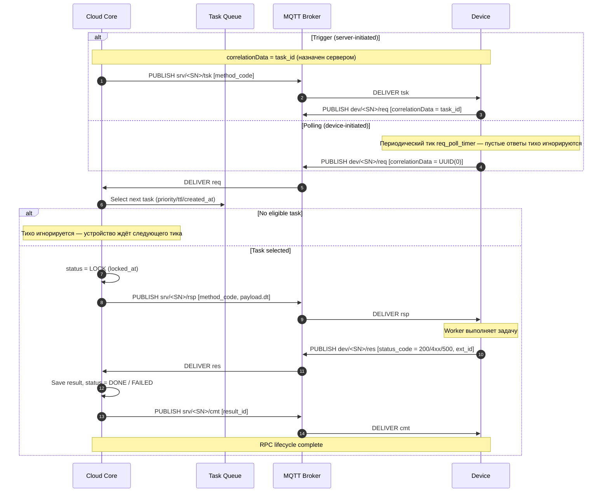
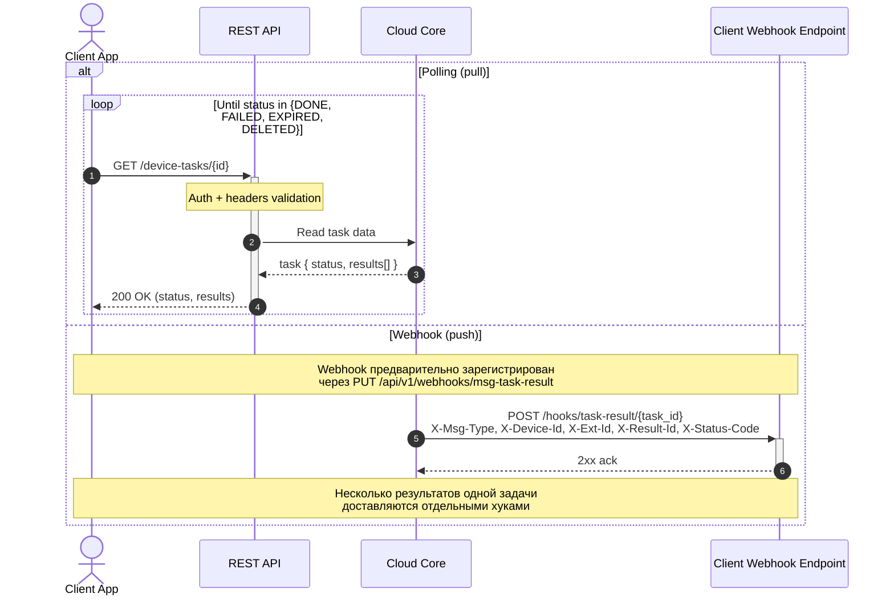
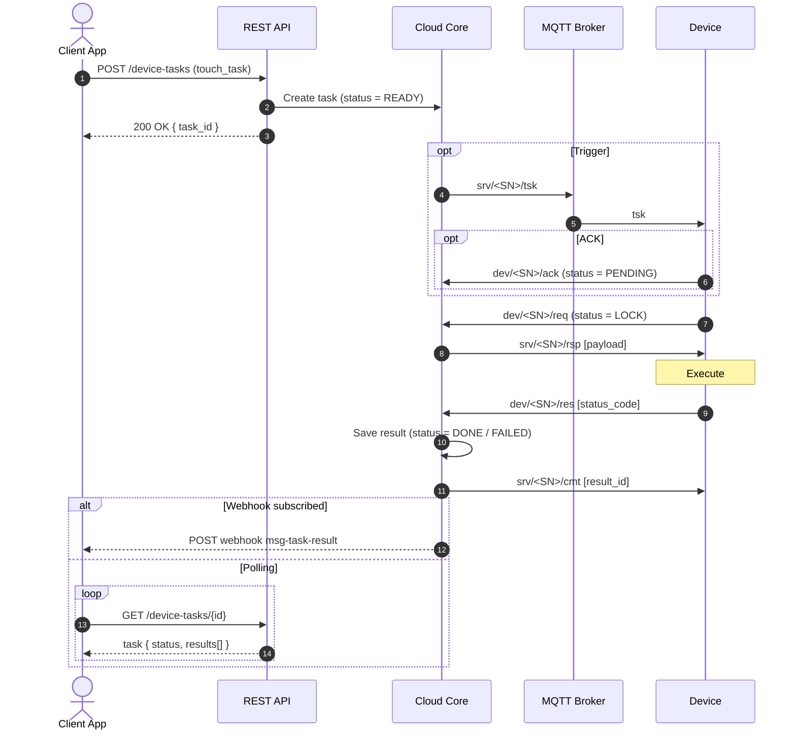

# Сценарии взаимодействия (Sequence)

> **Файл:** `docs/sequence.md`
> **Версия:** 2.0
> **Дата:** 2026
> **См. также:** [`1-task-workflow-doc.md`](./1-task-workflow-doc.md), [`mqtt-rpc-protocol.md`](./mqtt-rpc-protocol.md), [`mqtt-rpc-client-flow.md`](./mqtt-rpc-client-flow.md), [`task_states.md`](./task_states.md), [`TTL.md`](./TTL.md)

Диаграммы ниже отражают полный жизненный цикл задачи устройства: от REST-инициации клиентом до доставки результата (через polling или webhook). Используются реальные имена топиков и этапов RPC по MQTT v5: `tsk`, `ack`, `req`, `rsp`, `res`, `cmt`, а также статусы задач из [`task_states.md`](./task_states.md).

> **Замечание о цвете.** Эти диаграммы намеренно не используют `box`/`rect rgb(...)` с произвольной заливкой: на GitHub текст внутри Mermaid использует цвет темы (тёмный в светлой / светлый в тёмной), и плотные RGB-фоны делают подписи нечитаемыми хотя бы в одной из тем. Поэтому для группировки используются нейтральные конструкции `alt`/`opt`/`par`/`loop` и `Note`, которые корректно отрисовываются в обеих темах GitHub.

---

## 1. Создание задачи через REST API (touch_task)

Клиентское приложение создаёт задачу по `POST /api/v1/device-tasks/`. API валидирует запрос, Core сохраняет задачу в статусе `READY`, затем параллельно ставит её в очередь устройства и (опционально) триггерит устройство по MQTT.

---

## 2. Выполнение задачи устройством (RPC по MQTT v5)

Устройство забирает задачу одним из двух способов: **Trigger** (после `tsk` от сервера) или **Polling** (периодический `req` с нулевым UUID). Дальнейший конвейер `req → rsp → res → cmt` идентичен.

Стратегия выбора задачи при polling-запросе с `correlationData = UUID(0)` (см. [`1-task-workflow-doc.md`](./1-task-workflow-doc.md)):

1. участвуют только задачи устройства со `status < DONE`
2. задачи с `ttl = 0` исключаются из выборки
3. сортировка: `priority DESC` → `ttl ASC` (положительный) → `created_at ASC`

> Истечение TTL обрабатывается отдельно: задача с истёкшим сроком переводится в `EXPIRED` и больше не выдаётся устройству. Подробнее — [`TTL.md`](./TTL.md), [`task_states.md`](./task_states.md).

---

## 3. Получение результата клиентом: polling vs webhook

Клиент может либо периодически опрашивать статус задачи через REST, либо подписаться на webhook `msg-task-result` и получать результат push-нотификацией (рекомендуется для нагруженных систем).

---

## 4. Сводный сценарий end-to-end

Связка всех трёх диаграмм в одном потоке для удобства: `touch_task` → доставка устройству → выполнение → доставка результата клиенту.

