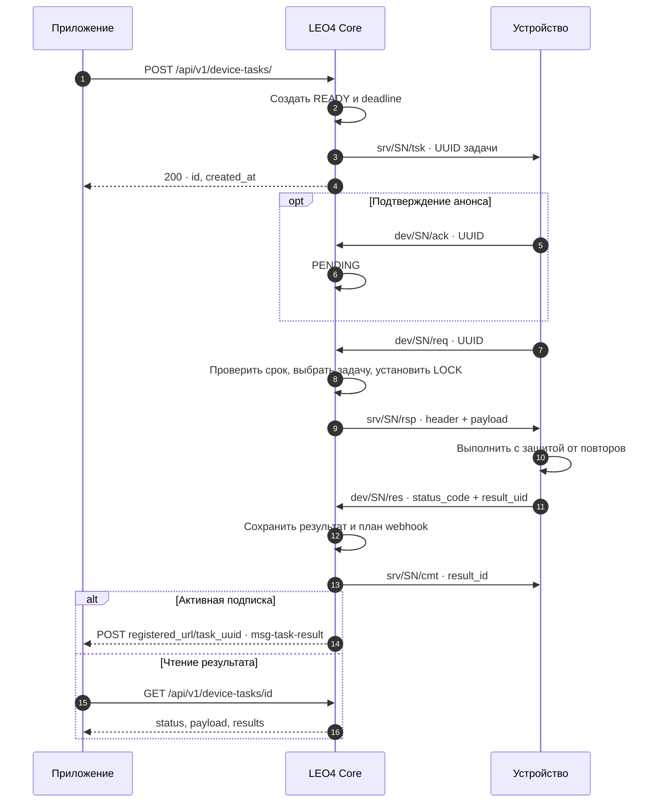
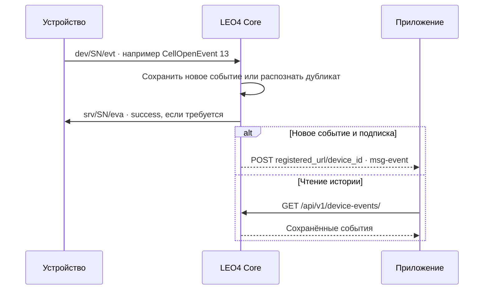

# 🔀 Сквозной сценарий · От команды к факту

[← Документация](README.md) · [REST задач](1-task-workflow-doc.md) · [RPC](mqtt-rpc-protocol.md) · [События](event-protocol-mqtt.md)

## ⚡ Команда и результат

```mermaid
sequenceDiagram
    autonumber
    participant A as Приложение
    participant C as LEO4 Core
    participant D as Устройство
    A->>C: POST /api/v1/device-tasks/
    C->>C: Создать READY и deadline
    C->>D: srv/SN/tsk · UUID задачи
    C-->>A: 200 · id, created_at
    opt Подтверждение анонса
        D->>C: dev/SN/ack · UUID
        C->>C: PENDING
    end
    D->>C: dev/SN/req · UUID
    C->>C: Проверить срок, выбрать задачу, установить LOCK
    C->>D: srv/SN/rsp · header + payload
    D->>D: Выполнить с защитой от повторов
    D->>C: dev/SN/res · status_code + result_uid
    C->>C: Сохранить результат и план webhook
    C->>D: srv/SN/cmt · result_id
    alt Активная подписка
        C-->>A: POST registered_url/task_uuid · msg-task-result
    else Чтение результата
        A->>C: GET /api/v1/device-tasks/id
        C-->>A: status, payload, results
    end
```

Активная задача с результатом до deadline становится DONE, включая результат с ошибкой. Просроченная остаётся/становится EXPIRED. Поздний CMT и webhook регулируются [TTL](TTL.md).

## 📨 Наблюдаемый эффект

```mermaid
sequenceDiagram
    participant D as Устройство
    participant C as LEO4 Core
    participant A as Приложение
    D->>C: dev/SN/evt · например CellOpenEvent 13
    C->>C: Сохранить новое событие или распознать дубликат
    C->>D: srv/SN/eva · success, если требуется
    alt Новое событие и подписка
        C-->>A: POST registered_url/device_id · msg-event
    else Чтение истории
        A->>C: GET /api/v1/device-events/
        C-->>A: Сохранённые события
    end
```

Порядок прихода RES и события не фиксирован. Прикладной сценарий проверяет успешность результата и соответствующий свежий факт. Без correlation исходной операции в событии привязка по устройству/ячейке/времени не является строгим доказательством причинности.

## 🔄 Восстановление связи

После reconnect устройство может выполнить polling REQ с нулевым UUID. Сервер выдаёт допустимую непросроченную задачу либо NOP. Выполненная ранее задача не исполняется второй раз: клиент возвращает сохранённый результат с прежним UID.

Сверено с `master` на 09.10.2026.
