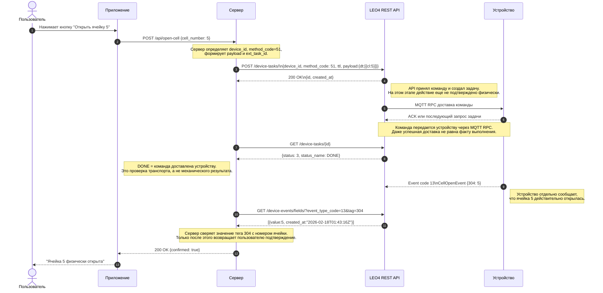

# Практическое руководство: Интеграция серверного приложения с LEO4 API (Kotlin + Spring Boot)

> **Версия:** 1.0  
> **Дата:** 2026-04-06  
> **Платформа:** dev.leo4.ru  
> **Контакты:** info@platerra.ru | https://platerra.ru

---

## Введение

Данное руководство описывает, как подключить серверное приложение к REST API платформы LEO4 для управления IoT-устройствами из пользовательского приложения.

> ⚠️ **Важно:** Task status = 3 (DONE) означает только **доставку** команды на устройство. Для подтверждения **физического исполнения** (например, открытия ячейки) необходимо отследить событие `CellOpenEvent` (код 13) с номером ячейки в теге `304` через polling-запрос `GET /device-events/fields/` или вебхук `msg-event`.

**Итоговый сценарий:**

```
Пользователь нажимает кнопку "Открыть ячейку 5" в приложении

① Приложение → Сервер: POST /api/open-cell {cell_number: 5}
② Сервер → POST /device-tasks/ {method_code: 51, payload: {dt: [{cl: 5}]}}
③ Сервер → GET /device-tasks/{id}          → status: 3 (DONE) — команда доставлена
④ Сервер → GET /device-events/fields/      → event_type_code: 13, tag: 304, value: 5 — ячейка физически открыта
⑤ Сервер → Приложение: "Ячейка 5 физически открыта ✅"
```

### Общая схема потока данных



---

## Быстрый старт (чек-лист)

1. **Определите `device_id`** целевого устройства
2. **Настройте серверное приложение** для вызова LEO4 REST API
3. **Проверьте связь** — отправьте hello-запрос (см. раздел ниже)
4. **Реализуйте серверный endpoint** для вызова из приложения
5. **Проверьте события** — после открытия ячейки убедитесь, что через `GET /device-events/fields/` приходит значение тега `304` для `CellOpenEvent` (`event_type_code=13`)
6. **Для продакшена** — настройте вебхуки вместо polling (см. раздел «Получение результата: Polling vs Webhook»)

---

## Проверка связи (curl)

```bash
curl -X POST https://dev.leo4.ru/api/v1/device-tasks/ \
  -H "x-api-key: ApiKey ВАШ_КЛЮЧ" \
  -H "Content-Type: application/json" \
  -d '{
    "ext_task_id": "test-hello-001",
    "device_id": 4619,
    "method_code": 20,
    "ttl": 5,
    "payload": {"dt": [{"mt": 0}]}
  }'
```

**Ожидаемый ответ:**

```json
{
  "id": "a1b2c3d4-e5f6-7890-g1h2-i3j4k5l6m7n8",
  "created_at": 1712345678
}
```

---

## Структура HTTP-запроса к LEO4 API

### Эндпоинт

```
POST https://dev.leo4.ru/api/v1/device-tasks/
```

### Заголовки

| Заголовок | Значение | Описание |
|-----------|----------|----------|
| `Content-Type` | `application/json` | Формат тела запроса |
| `x-api-key` | `ApiKey ваш-секретный-ключ` | Ключ доступа серверного приложения |

> ⚠️ Без заголовка `x-api-key` сервер вернёт `401 Unauthorized`.

### Поля тела запроса

| Поле | Тип | Обязательное | По умолчанию | Описание |
|------|-----|:---:|:---:|----------|
| `ext_task_id` | string | ✅ | — | Ваш внешний идентификатор (для идемпотентности) |
| `device_id` | int | ✅ | — | ID устройства в системе LEO4 |
| `method_code` | int (0–65534) | ✅ | 20 | Код команды |
| `priority` | int (0–9) | — | 0 | Приоритет задачи в очереди |
| `ttl` | int (0–44639) | — | 1 | Время жизни задачи в минутах |
| `payload` | object | — | null | Параметры команды в формате `{"dt": [...]}` |

### Основные коды команд (method_code)

| Код | Команда | Пример payload |
|-----|---------|----------------|
| 20 | Короткая команда (hello) | `{"dt": [{"mt": 0}]}` |
| 20 | Список ячеек | `{"dt": [{"mt": 4}]}` |
| 21 | Перезагрузка | `{"dt": [{"mt": 0}]}` |
| 51 | Открыть ячейку N | `{"dt": [{"cl": N}]}` |
| 16 | Привязка карты/пинкода | `{"dt": [{"cl": N, "cd": "..."}]}` |
| 49 | Запись в NVS | `{"dt": [{"ns": "...", "k": "...", "v": "...", "t": "..."}]}` |
| 50 | Чтение NVS | `{"dt": [{"ns": "...", "k": "..."}]}` |

### Статусы задач

| Код | Состояние | Описание |
|-----|-----------|----------|
| 0 | READY | Задача создана, ожидает устройство |
| 1 | PENDING | Устройство подтвердило получение |
| 2 | LOCK | Устройство выполняет задачу |
| 3 | DONE | Команда доставлена на устройство; физический результат подтверждайте отдельным событием |
| 4 | EXPIRED | TTL истёк |
| 5 | DELETED | Удалена через API |
| 6 | FAILED | Ошибка выполнения |

---

## 1. Полный пример серверного приложения (Kotlin + Spring Boot)

Зависимости:

```kotlin
implementation("org.springframework.boot:spring-boot-starter-web")
implementation("org.springframework.boot:spring-boot-starter-validation")
implementation("com.fasterxml.jackson.module:jackson-module-kotlin")
implementation("org.jetbrains.kotlin:kotlin-reflect")
```

### Код сервера

```kotlin
import com.fasterxml.jackson.annotation.JsonProperty
import jakarta.validation.Valid
import jakarta.validation.constraints.Max
import jakarta.validation.constraints.Min
import org.springframework.boot.autoconfigure.SpringBootApplication
import org.springframework.boot.runApplication
import org.springframework.http.HttpHeaders
import org.springframework.http.HttpStatus
import org.springframework.http.MediaType
import org.springframework.http.ResponseEntity
import org.springframework.stereotype.Service
import org.springframework.validation.annotation.Validated
import org.springframework.web.bind.annotation.ExceptionHandler
import org.springframework.web.bind.annotation.GetMapping
import org.springframework.web.bind.annotation.PostMapping
import org.springframework.web.bind.annotation.RequestBody
import org.springframework.web.bind.annotation.RequestHeader
import org.springframework.web.bind.annotation.RequestMapping
import org.springframework.web.bind.annotation.RestController
import org.springframework.web.client.RestClient
import org.springframework.web.client.RestClientResponseException
import org.springframework.web.server.ResponseStatusException
import java.time.Instant
import java.util.UUID

private const val LEO4_API_URL = "https://dev.leo4.ru/api/v1"
private const val LEO4_API_KEY = "ApiKey ВАШ_КЛЮЧ"
private const val DEVICE_ID = 4619

@SpringBootApplication
class ServerExampleApplication

fun main(args: Array<String>) {
    runApplication<ServerExampleApplication>(*args)
}

data class OpenCellRequest(
    @field:JsonProperty("cell_number")
    @field:Min(1)
    val cellNumber: Int,
    @field:Min(1)
    @field:Max(60)
    val ttl: Int = 5,
)

data class CreateTaskRequest(
    @JsonProperty("ext_task_id")
    val extTaskId: String,
    @JsonProperty("device_id")
    val deviceId: Int,
    @JsonProperty("method_code")
    val methodCode: Int,
    val priority: Int = 1,
    val ttl: Int,
    val payload: Map<String, Any>,
)

data class TaskCreateResponse(
    val id: String,
    @JsonProperty("created_at")
    val createdAt: Long? = null,
)

data class TaskStatusResponse(
    val id: String,
    val status: Int,
    @JsonProperty("status_name")
    val statusName: String? = null,
)

data class DeviceEventRow(
    @JsonProperty("created_at")
    val createdAt: Instant? = null,
    val value: Int? = null,
    @JsonProperty("interval_sec")
    val intervalSec: Int? = null,
)

data class OpenCellResponse(
    val confirmed: Boolean,
    val message: String,
    @JsonProperty("task_id")
    val taskId: String,
    @JsonProperty("task_status")
    val taskStatus: Int,
    val event: DeviceEventRow,
)

@Service
class Leo4Service {
    val restClient: RestClient = RestClient.builder()
        .baseUrl(LEO4_API_URL)
        .defaultHeader(HttpHeaders.CONTENT_TYPE, MediaType.APPLICATION_JSON_VALUE)
        .defaultHeader("x-api-key", LEO4_API_KEY)
        .build()

    fun createDeviceTask(methodCode: Int, payload: Map<String, Any>, ttl: Int): TaskCreateResponse =
        restClient.post()
            .uri("/device-tasks/")
            .body(
                CreateTaskRequest(
                    extTaskId = "server-$methodCode-${UUID.randomUUID()}",
                    deviceId = DEVICE_ID,
                    methodCode = methodCode,
                    ttl = ttl,
                    payload = payload,
                )
            )
            .retrieve()
            .body(TaskCreateResponse::class.java)
            ?: error("Пустой ответ от LEO4 API")

    fun getTaskStatus(taskId: String): TaskStatusResponse =
        restClient.get()
            .uri("/device-tasks/{taskId}", taskId)
            .retrieve()
            .body(TaskStatusResponse::class.java)
            ?: error("Пустой ответ по задаче $taskId")

    fun waitForTaskDelivery(taskId: String, timeoutSeconds: Long = 30): TaskStatusResponse {
        val deadline = System.currentTimeMillis() + timeoutSeconds * 1000

        while (System.currentTimeMillis() < deadline) {
            val task = getTaskStatus(taskId)
            if (task.status >= 3) {
                return task
            }
            Thread.sleep(2_000)
        }

        throw ResponseStatusException(
            HttpStatus.GATEWAY_TIMEOUT,
            "Задача $taskId не дошла до финального статуса за ${timeoutSeconds}с"
        )
    }

    fun waitForCellOpenEvent(
        cellNumber: Int,
        intervalMinutes: Int = 5,
        timeoutSeconds: Long = 30,
    ): DeviceEventRow {
        val deadline = System.currentTimeMillis() + timeoutSeconds * 1000

        while (System.currentTimeMillis() < deadline) {
            val rows = restClient.get()
                .uri { builder ->
                    builder.path("/device-events/fields/")
                        .queryParam("device_id", DEVICE_ID)
                        .queryParam("event_type_code", 13)
                        .queryParam("tag", 304)
                        .queryParam("interval_m", intervalMinutes)
                        .queryParam("limit", 10)
                        .build()
                }
                .retrieve()
                .body(Array<DeviceEventRow>::class.java)
                ?.toList()
                .orEmpty()

            rows.firstOrNull { it.value == cellNumber }?.let { return it }
            Thread.sleep(2_000)
        }

        throw ResponseStatusException(
            HttpStatus.GATEWAY_TIMEOUT,
            "CellOpenEvent для ячейки $cellNumber не пришёл за ${timeoutSeconds}с"
        )
    }
}

@RestController
@Validated
@RequestMapping("/api")
class DeviceController(private val leo4Service: Leo4Service) {
    @PostMapping("/open-cell")
    fun openCell(@Valid @RequestBody request: OpenCellRequest): OpenCellResponse {
        val task = leo4Service.createDeviceTask(
            methodCode = 51,
            payload = mapOf("dt" to listOf(mapOf("cl" to request.cellNumber))),
            ttl = request.ttl,
        )

        val delivery = leo4Service.waitForTaskDelivery(task.id)
        if (delivery.status != 3) {
            throw ResponseStatusException(
                HttpStatus.BAD_GATEWAY,
                "Команда не была успешно доставлена устройству"
            )
        }

        val event = leo4Service.waitForCellOpenEvent(cellNumber = request.cellNumber)
        return OpenCellResponse(
            confirmed = true,
            message = "Ячейка ${request.cellNumber} физически открыта",
            taskId = task.id,
            taskStatus = delivery.status,
            event = event,
        )
    }

    @GetMapping("/health")
    fun health(): Map<String, Boolean> = mapOf("ok" to true)

    @ExceptionHandler(RestClientResponseException::class)
    fun handleLeo4Error(ex: RestClientResponseException): ResponseEntity<Map<String, String>> =
        ResponseEntity.status(HttpStatus.BAD_GATEWAY).body(
            mapOf("detail" to "Ошибка вызова LEO4 API: ${ex.statusCode} ${ex.responseBodyAsString}")
        )
}
```

### Пример вызова из приложения

```http
POST /api/open-cell
Content-Type: application/json

{
  "cell_number": 5,
  "ttl": 5
}
```

### Пример ответа сервера

```json
{
  "confirmed": true,
  "message": "Ячейка 5 физически открыта",
  "task_id": "a1b2c3d4-...",
  "task_status": 3,
  "event": {
    "created_at": "2026-02-18T01:43:16Z",
    "value": 5,
    "interval_sec": 12
  }
}
```

---

## 2. Получение результата: Polling vs Webhook

### Вариант A — Polling (простой)

Подходит для отладки и простых сценариев, но помните: `status=3 (DONE)` подтверждает только доставку команды.

Пример HTTP-запроса для polling события:

```bash
curl -X 'GET' \
  'https://dev.leo4.ru/api/v1/device-events/fields/?device_id=4619&event_type_code=13&tag=304&interval_m=5&limit=10' \
  -H 'accept: application/json' \
  -H 'x-api-key: ApiKey <key>'
```

```kotlin
fun waitForTaskDelivery(taskId: String, timeoutSeconds: Long = 30): TaskStatusResponse {
    val deadline = System.currentTimeMillis() + timeoutSeconds * 1000

    while (System.currentTimeMillis() < deadline) {
        val task = leo4Service.getTaskStatus(taskId)
        if (task.status >= 3) {
            return task
        }
        Thread.sleep(2_000)
    }

    error("Задача $taskId не завершилась за ${timeoutSeconds}с")
}

fun waitForCellOpenEvent(
    deviceId: Int,
    cellNumber: Int,
    intervalMinutes: Int = 5,
    timeoutSeconds: Long = 30,
): DeviceEventRow {
    val deadline = System.currentTimeMillis() + timeoutSeconds * 1000

    while (System.currentTimeMillis() < deadline) {
        val rows = leo4Service.restClient.get()
            .uri { builder ->
                builder.path("/device-events/fields/")
                    .queryParam("device_id", deviceId)
                    .queryParam("event_type_code", 13)
                    .queryParam("tag", 304)
                    .queryParam("interval_m", intervalMinutes)
                    .queryParam("limit", 10)
                    .build()
            }
            .retrieve()
            .body(Array<DeviceEventRow>::class.java)
            ?.toList()
            .orEmpty()

        rows.firstOrNull { it.value == cellNumber }?.let { return it }
        Thread.sleep(2_000)
    }

    error("CellOpenEvent для ячейки $cellNumber не пришёл за ${timeoutSeconds}с")
}
```

### Вариант B — Webhook (рекомендуется для продакшена)

Для полного 3-шагового цикла удобно подписаться сразу на два вебхука: `msg-task-result` и `msg-event`.

#### Шаг 1: Регистрация вебхуков (один раз)

```kotlin
val webhookHeaders = HttpHeaders().apply {
    contentType = MediaType.APPLICATION_JSON
    set("x-api-key", "ApiKey ВАШ_КЛЮЧ")
}

val authPayload = mapOf(
    "headers" to mapOf("Authorization" to "Bearer ваш-токен"),
    "is_active" to true,
)

leo4Service.restClient.put()
    .uri("/webhooks/msg-task-result")
    .headers { it.addAll(webhookHeaders) }
    .body(
        mapOf("url" to "https://your-server.example.com/hooks/task-result") + authPayload
    )
    .retrieve()
    .toBodilessEntity()

leo4Service.restClient.put()
    .uri("/webhooks/msg-event")
    .headers { it.addAll(webhookHeaders) }
    .body(
        mapOf("url" to "https://your-server.example.com/hooks/device-event") + authPayload
    )
    .retrieve()
    .toBodilessEntity()
```

#### Шаг 2: Приём вебхуков на стороне сервера

```kotlin
@RestController
@RequestMapping("/hooks")
class Leo4WebhookController {
    @PostMapping("/task-result")
    fun handleTaskResult(
        @RequestHeader("x-device-id", required = false) deviceId: String?,
        @RequestHeader("x-status-code", required = false) statusCode: String?,
        @RequestHeader("x-ext-id", required = false) extId: String?,
        @RequestBody body: Map<String, Any>,
    ): Map<String, Boolean> {
        println("Устройство $deviceId: status_code=$statusCode, ext_id=$extId")
        println("Результат задачи: $body")
        return mapOf("ok" to true)
    }

    @PostMapping("/device-event")
    fun handleDeviceEvent(
        @RequestHeader("x-device-id", required = false) deviceId: String?,
        @RequestBody body: Map<String, Any>,
    ): Map<String, Boolean> {
        val eventType = (body["event_type_code"] ?: body["200"])?.toString()?.toIntOrNull()
        val payload = body["payload"] as? Map<*, *> ?: body

        if (eventType == 13) {
            val rows = payload["300"] as? List<Map<String, Any?>> ?: emptyList()
            rows.forEach { row ->
                row["304"]?.let { cell ->
                    println(
                        "Устройство $deviceId: ячейка $cell подтверждена событием CellOpenEvent"
                    )
                }
            }
        }

        return mapOf("ok" to true)
    }
}
```

#### Как интерпретировать вебхуки

| Тип события | Что подтверждает |
|------------|------------------|
| `msg-task-result` | Доставка команды и результат выполнения на уровне task/result |
| `msg-event` | Физическое событие устройства, например `CellOpenEvent` с тегом `304` |

> ⚠️ Для команды открытия ячейки ответ в приложение стоит возвращать после получения `msg-event` с `event_type_code = 13`.

---

## 3. Продвинутые сценарии

### Каскадная серверная обработка (Closed-Loop)

Сервер получает событие через вебхук и автоматически реагирует по бизнес-правилам:

```kotlin
@PostMapping("/hooks/device-event")
fun handleDeviceEvent(@RequestBody body: Map<String, Any>): Map<String, Boolean> {
    val eventCode = body["200"]?.toString()?.toIntOrNull()
    val params = body["300"] as? List<Map<String, Any?>> ?: emptyList()

    if (eventCode == 44) {
        val temperature = extractTemperature(params)
        if (temperature != null && temperature > 85) {
            leo4Service.createDeviceTask(
                methodCode = 20,
                payload = mapOf("dt" to listOf(mapOf("mt" to 7))),
                ttl = 2,
            )
            notifyOperator("⚠️ Температура ${temperature}°C — команда отправлена")
        }
    }

    return mapOf("ok" to true)
}
```

### Параллельная массовая активация

Отправка команд на множество устройств одновременно:

```kotlin
fun massActivate(
    deviceIds: List<Int>,
    methodCode: Int,
    payload: Map<String, Any>,
): List<Result<TaskCreateResponse>> {
    val results = deviceIds.map { deviceId ->
        runCatching {
            leo4Service.restClient.post()
                .uri("/device-tasks/")
                .body(
                    CreateTaskRequest(
                        extTaskId = "mass-$deviceId-$methodCode",
                        deviceId = deviceId,
                        methodCode = methodCode,
                        ttl = 5,
                        payload = payload,
                    )
                )
                .retrieve()
                .body(TaskCreateResponse::class.java)
                ?: error("Пустой ответ для устройства $deviceId")
        }
    }

    val success = results.count { it.isSuccess }
    val failed = results.size - success
    println("Отправлено: ${results.size}, Успешно: $success, Ошибок: $failed")
    return results
}
```

---

## 4. Безопасность

- Все запросы требуют заголовок `x-api-key: ApiKey <ключ>`
- `org_id` извлекается из API-ключа автоматически — данные изолированы по организации
- HTTPS обязательно для всех вызовов
- Webhook-запросы могут содержать кастомные `headers` для авторизации на вашей стороне
- Каждый API-ключ даёт доступ только к устройствам своей организации

---

## Связанные документы

- [Презентация решения LEO4](./solution-presentation.md)
- [Workflow задач (Task Workflow)](./1-task-workflow-doc.md)
- [Документация по вебхукам](./3-webhooks.md)
- [Формат событий устройств](./2-events-api-format-description.md)

---

> © 2026 Leo4 / Platerra. Все права защищены.  
> Контакты: info@platerra.ru | +7 (916) 206-71-24 | https://platerra.ru
