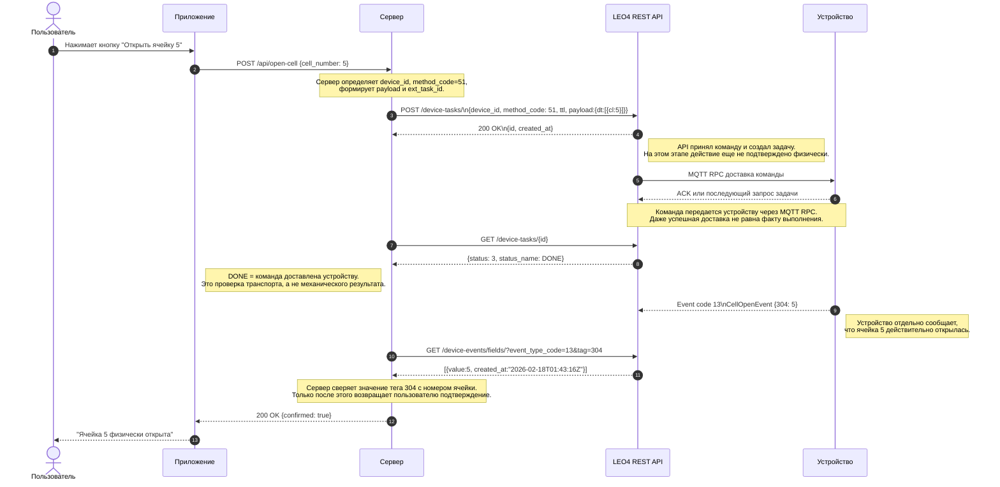

# Практическое руководство: Интеграция серверного приложения с LEO4 API

> **Версия:** 1.0  
> **Дата:** 2026-04-06  
> **Платформа:** dev.leo4.ru  
> **Контакты:** info@platerra.ru | https://platerra.ru

---

## Введение

Данное руководство описывает, как подключить серверное приложение к REST API платформы LEO4 для управления IoT-устройствами из пользовательского приложения.

> ⚠️ **Важно:** Task status = 3 (DONE) означает только **доставку** команды на устройство. Для подтверждения **физического исполнения** (например, открытия ячейки) необходимо отследить событие `CellOpenEvent` (код 13) с номером ячейки в теге `304` через polling-запрос `GET /device-events/fields/` или вебхук `msg-event`.

**Итоговый сценарий:**

```
Пользователь нажимает кнопку "Открыть ячейку 5" в приложении

① Приложение → Сервер: POST /api/open-cell {cell_number: 5}
② Сервер → POST /device-tasks/ {method_code: 51, payload: {dt: [{cl: 5}]}}
③ Сервер → GET /device-tasks/{id}          → status: 3 (DONE) — команда доставлена
④ Сервер → GET /device-events/fields/      → event_type_code: 13, tag: 304, value: 5 — ячейка физически открыта
⑤ Сервер → Приложение: "Ячейка 5 физически открыта ✅"
```

### Общая схема потока данных



---

## Быстрый старт (чек-лист)

1. **Определите `device_id`** целевого устройства
2. **Настройте серверное приложение** для вызова LEO4 REST API
3. **Проверьте связь** — отправьте hello-запрос (см. раздел ниже)
4. **Реализуйте серверный endpoint** для вызова из приложения
5. **Проверьте события** — после открытия ячейки убедитесь, что через `GET /device-events/fields/` приходит значение тега `304` для `CellOpenEvent` (`event_type_code=13`)
6. **Для продакшена** — настройте вебхуки вместо polling (см. раздел «Получение результата: Polling vs Webhook»)

---

## Проверка связи (curl)

```bash
curl -X POST https://dev.leo4.ru/api/v1/device-tasks/ \
  -H "x-api-key: ApiKey ВАШ_КЛЮЧ" \
  -H "Content-Type: application/json" \
  -d '{
    "ext_task_id": "test-hello-001",
    "device_id": 4619,
    "method_code": 20,
    "ttl": 5,
    "payload": {"dt": [{"mt": 0}]}
  }'
```

**Ожидаемый ответ:**

```json
{
  "id": "a1b2c3d4-e5f6-7890-g1h2-i3j4k5l6m7n8",
  "created_at": 1712345678
}
```

---

## Структура HTTP-запроса к LEO4 API

### Эндпоинт

```
POST https://dev.leo4.ru/api/v1/device-tasks/
```

### Заголовки

| Заголовок | Значение | Описание |
|-----------|----------|----------|
| `Content-Type` | `application/json` | Формат тела запроса |
| `x-api-key` | `ApiKey ваш-секретный-ключ` | Ключ доступа серверного приложения |

> ⚠️ Без заголовка `x-api-key` сервер вернёт `401 Unauthorized`.

### Поля тела запроса

| Поле | Тип | Обязательное | По умолчанию | Описание |
|------|-----|:---:|:---:|----------|
| `ext_task_id` | string | ✅ | — | Ваш внешний идентификатор (для идемпотентности) |
| `device_id` | int | ✅ | — | ID устройства в системе LEO4 |
| `method_code` | int (0–65534) | ✅ | 20 | Код команды |
| `priority` | int (0–9) | — | 0 | Приоритет задачи в очереди |
| `ttl` | int (0–44639) | — | 1 | Время жизни задачи в минутах |
| `payload` | object | — | null | Параметры команды в формате `{"dt": [...]}` |

### Основные коды команд (method_code)

| Код | Команда | Пример payload |
|-----|---------|----------------|
| 20 | Короткая команда (hello) | `{"dt": [{"mt": 0}]}` |
| 20 | Список ячеек | `{"dt": [{"mt": 4}]}` |
| 21 | Перезагрузка | `{"dt": [{"mt": 0}]}` |
| 51 | Открыть ячейку N | `{"dt": [{"cl": N}]}` |
| 16 | Привязка карты/пинкода | `{"dt": [{"cl": N, "cd": "..."}]}` |
| 49 | Запись в NVS | `{"dt": [{"ns": "...", "k": "...", "v": "...", "t": "..."}]}` |
| 50 | Чтение NVS | `{"dt": [{"ns": "...", "k": "..."}]}` |

### Статусы задач

| Код | Состояние | Описание |
|-----|-----------|----------|
| 0 | READY | Задача создана, ожидает устройство |
| 1 | PENDING | Устройство подтвердило получение |
| 2 | LOCK | Устройство выполняет задачу |
| 3 | DONE | Команда доставлена на устройство; физический результат подтверждайте отдельным событием |
| 4 | EXPIRED | TTL истёк |
| 5 | DELETED | Удалена через API |
| 6 | FAILED | Ошибка выполнения |

---

## 1. Полный пример серверного приложения (Python)

Зависимости:

```bash
pip install fastapi uvicorn httpx
```

### Код сервера

```python
import time
from uuid import uuid4

import httpx
from fastapi import FastAPI, HTTPException
from pydantic import BaseModel, Field

LEO4_API_URL = "https://dev.leo4.ru/api/v1"
LEO4_API_KEY = "ApiKey ВАШ_КЛЮЧ"
DEVICE_ID = 4619

app = FastAPI()


class OpenCellRequest(BaseModel):
    cell_number: int = Field(..., ge=1, description="Номер ячейки")
    ttl: int = Field(default=5, ge=1, le=60, description="TTL задачи в минутах")


def create_device_task(method_code: int, payload: dict, ttl: int = 5) -> dict:
    with httpx.Client(timeout=15) as http:
        response = http.post(
            f"{LEO4_API_URL}/device-tasks/",
            headers={
                "Content-Type": "application/json",
                "x-api-key": LEO4_API_KEY,
            },
            json={
                "ext_task_id": f"server-{method_code}-{uuid4()}",
                "device_id": DEVICE_ID,
                "method_code": method_code,
                "priority": 1,
                "ttl": ttl,
                "payload": payload,
            },
        )
        response.raise_for_status()
        return response.json()


def get_task_status(task_id: str) -> dict:
    with httpx.Client(timeout=15) as http:
        response = http.get(
            f"{LEO4_API_URL}/device-tasks/{task_id}",
            headers={"x-api-key": LEO4_API_KEY},
        )
        response.raise_for_status()
        return response.json()


def wait_for_task_delivery(task_id: str, timeout_s: int = 30) -> dict:
    deadline = time.time() + timeout_s

    while time.time() < deadline:
        task = get_task_status(task_id)
        if task["status"] >= 3:
            return task
        time.sleep(2)

    raise TimeoutError(f"Задача {task_id} не дошла до финального статуса за {timeout_s}с")


def wait_for_cell_open_event(
    cell_number: int,
    interval_m: int = 5,
    timeout_s: int = 30,
) -> dict:
    deadline = time.time() + timeout_s

    with httpx.Client(timeout=15) as http:
        while time.time() < deadline:
            response = http.get(
                f"{LEO4_API_URL}/device-events/fields/",
                headers={"x-api-key": LEO4_API_KEY},
                params={
                    "device_id": DEVICE_ID,
                    "event_type_code": 13,
                    "tag": 304,
                    "interval_m": interval_m,
                    "limit": 10,
                },
            )
            response.raise_for_status()
            rows = response.json()

            for row in rows:
                if row.get("value") == cell_number:
                    return row

            time.sleep(2)

    raise TimeoutError(
        f"CellOpenEvent для ячейки {cell_number} не пришёл за {timeout_s}с"
    )


@app.post("/api/open-cell")
def open_cell(request: OpenCellRequest):
    try:
        task = create_device_task(
            method_code=51,
            payload={"dt": [{"cl": request.cell_number}]},
            ttl=request.ttl,
        )
        delivery = wait_for_task_delivery(task["id"])

        if delivery["status"] != 3:
            raise HTTPException(
                status_code=502,
                detail={
                    "message": "Команда не была успешно доставлена устройству",
                    "task": delivery,
                },
            )

        event = wait_for_cell_open_event(cell_number=request.cell_number)
        return {
            "confirmed": True,
            "message": f"Ячейка {request.cell_number} физически открыта",
            "task_id": task["id"],
            "task_status": delivery["status"],
            "event": event,
        }

    except TimeoutError as exc:
        raise HTTPException(status_code=504, detail=str(exc)) from exc
    except httpx.HTTPError as exc:
        raise HTTPException(status_code=502, detail=f"Ошибка вызова LEO4 API: {exc}") from exc


@app.get("/health")
def health():
    return {"ok": True}
```

### Пример вызова из приложения

```http
POST /api/open-cell
Content-Type: application/json

{
  "cell_number": 5,
  "ttl": 5
}
```

### Пример ответа сервера

```json
{
  "confirmed": true,
  "message": "Ячейка 5 физически открыта",
  "task_id": "a1b2c3d4-...",
  "task_status": 3,
  "event": {
    "created_at": "2026-02-18T01:43:16Z",
    "value": 5,
    "interval_sec": 12
  }
}
```

---

## 2. Получение результата: Polling vs Webhook

### Вариант A — Polling (простой)

Подходит для отладки и простых сценариев, но помните: `status=3 (DONE)` подтверждает только доставку команды.

Пример HTTP-запроса для polling события:

```bash
curl -X 'GET' \
  'https://dev.leo4.ru/api/v1/device-events/fields/?device_id=4619&event_type_code=13&tag=304&interval_m=5&limit=10' \
  -H 'accept: application/json' \
  -H 'x-api-key: ApiKey <key>'
```

```python
def wait_for_task_delivery(task_id: str, timeout: int = 30) -> dict:
    headers = {"x-api-key": "ApiKey ВАШ_КЛЮЧ"}
    deadline = time.time() + timeout

    while time.time() < deadline:
        resp = httpx.get(
            f"https://dev.leo4.ru/api/v1/device-tasks/{task_id}",
            headers=headers,
        )
        data = resp.json()
        if data["status"] >= 3:
            return data
        time.sleep(2)

    raise TimeoutError(f"Задача {task_id} не завершилась за {timeout}с")


def wait_for_cell_open_event(
    device_id: int,
    cell_number: int,
    interval_m: int = 5,
    timeout: int = 30,
) -> dict:
    headers = {"x-api-key": "ApiKey ВАШ_КЛЮЧ"}
    deadline = time.time() + timeout

    while time.time() < deadline:
        resp = httpx.get(
            "https://dev.leo4.ru/api/v1/device-events/fields/",
            headers=headers,
            params={
                "device_id": device_id,
                "event_type_code": 13,
                "tag": 304,
                "interval_m": interval_m,
                "limit": 10,
            },
        )
        rows = resp.json()

        for row in rows:
            if row.get("value") == cell_number:
                return row

        time.sleep(2)

    raise TimeoutError(f"CellOpenEvent для ячейки {cell_number} не пришёл за {timeout}с")
```

### Вариант B — Webhook (рекомендуется для продакшена)

Для полного 3-шагового цикла удобно подписаться сразу на два вебхука: `msg-task-result` и `msg-event`.

#### Шаг 1: Регистрация вебхуков (один раз)

```python
import httpx

headers = {
    "x-api-key": "ApiKey ВАШ_КЛЮЧ",
    "Content-Type": "application/json",
}

auth_payload = {
    "headers": {"Authorization": "Bearer ваш-токен"},
    "is_active": True,
}

httpx.put(
    "https://dev.leo4.ru/api/v1/webhooks/msg-task-result",
    headers=headers,
    json={
        "url": "https://your-server.example.com/hooks/task-result",
        **auth_payload,
    },
)

httpx.put(
    "https://dev.leo4.ru/api/v1/webhooks/msg-event",
    headers=headers,
    json={
        "url": "https://your-server.example.com/hooks/device-event",
        **auth_payload,
    },
)
```

#### Шаг 2: Приём вебхуков на стороне сервера

```python
from fastapi import FastAPI, Request

app = FastAPI()


@app.post("/hooks/task-result")
async def handle_task_result(request: Request):
    device_id = request.headers.get("x-device-id")
    status_code = request.headers.get("x-status-code")
    ext_id = request.headers.get("x-ext-id")
    body = await request.json()

    print(f"Устройство {device_id}: status_code={status_code}, ext_id={ext_id}")
    print(f"Результат задачи: {body}")
    return {"ok": True}


@app.post("/hooks/device-event")
async def handle_device_event(request: Request):
    device_id = request.headers.get("x-device-id")
    body = await request.json()

    event_type = body.get("event_type_code") or body.get("200")
    payload = body.get("payload", body)

    if event_type == 13:
        for row in payload.get("300", []):
            if "304" in row:
                print(
                    f"Устройство {device_id}: ячейка {row['304']} подтверждена событием CellOpenEvent"
                )

    return {"ok": True}
```

#### Как интерпретировать вебхуки

| Тип события | Что подтверждает |
|------------|------------------|
| `msg-task-result` | Доставка команды и результат выполнения на уровне task/result |
| `msg-event` | Физическое событие устройства, например `CellOpenEvent` с тегом `304` |

> ⚠️ Для команды открытия ячейки ответ в приложение стоит возвращать после получения `msg-event` с `event_type_code = 13`.

---

## 3. Продвинутые сценарии

### Каскадная серверная обработка (Closed-Loop)

Сервер получает событие через вебхук и автоматически реагирует по бизнес-правилам:

```python
@app.post("/hooks/device-event")
async def handle_device_event(request: Request):
    body = await request.json()
    event_code = body.get("200")
    params = body.get("300", [])

    if event_code == 44:
        temperature = extract_temperature(params)
        if temperature and temperature > 85:
            create_device_task(
                method_code=20,
                payload={"dt": [{"mt": 7}]},
                ttl=2,
            )
            notify_operator(
                f"⚠️ Температура {temperature}°C — команда отправлена"
            )

    return {"ok": True}
```

### Параллельная массовая активация

Отправка команд на множество устройств одновременно:

```python
import asyncio
import httpx


async def mass_activate(
    device_ids: list[int],
    method_code: int,
    payload: dict,
):
    async with httpx.AsyncClient() as http:
        tasks = [
            http.post(
                f"{LEO4_API_URL}/device-tasks/",
                headers={
                    "Content-Type": "application/json",
                    "x-api-key": LEO4_API_KEY,
                },
                json={
                    "ext_task_id": f"mass-{device_id}-{method_code}",
                    "device_id": device_id,
                    "method_code": method_code,
                    "priority": 1,
                    "ttl": 5,
                    "payload": payload,
                },
            )
            for device_id in device_ids
        ]
        results = await asyncio.gather(*tasks, return_exceptions=True)

    success = sum(
        1 for r in results
        if not isinstance(r, Exception) and r.status_code == 200
    )
    failed = len(device_ids) - success
    print(f"Отправлено: {len(device_ids)}, Успешно: {success}, Ошибок: {failed}")
    return results
```

---

## 4. Безопасность

- Все запросы требуют заголовок `x-api-key: ApiKey <ключ>`
- `org_id` извлекается из API-ключа автоматически — данные изолированы по организации
- HTTPS обязательно для всех вызовов
- Webhook-запросы могут содержать кастомные `headers` для авторизации на вашей стороне
- Каждый API-ключ даёт доступ только к устройствам своей организации

---

## Связанные документы

- [Презентация решения LEO4](./solution-presentation.md)
- [Workflow задач (Task Workflow)](./1-task-workflow-doc.md)
- [Документация по вебхукам](./3-webhooks.md)
- [Формат событий устройств](./2-events-api-format-description.md)

---

> © 2026 Leo4 / Platerra. Все права защищены.  
> Контакты: info@platerra.ru | +7 (916) 206-71-24 | https://platerra.ru
