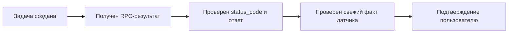

# 🖥️ Серверная интеграция с LEO4

> Практический маршрут: подключить организацию, создать команду и обработать результат и события.

[← Документация](README.md) · [REST API](rest-api.md) · [Webhooks](3-webhooks.md) · [Kotlin / Spring](server-integration-guide-kotlin-spring.md)

## 🧭 Пять шагов

| Шаг | Действие | Полученный результат |
| :--- | :--- | :--- |
| 🔑 1 | Настроить server-side API-ключ | Доступ к данным своей организации |
| 📟 2 | Прочитать `GET /api/v1/devices/` | ID устройства и его состояние |
| 📋 3 | Создать `POST /api/v1/device-tasks/` | UUID новой задачи |
| 📤 4 | Принять result webhook либо прочитать GET задачи | Сохранённый ответ устройства |
| 📨 5 | Принять событие либо проверить историю | Наблюдаемый эффект для прикладного сценария |

Храните ключ на сервере. Авторизация публичного API: `x-api-key: <organization-api-key>`, без префикса `ApiKey` в этом header. Базовый URL задаётся конфигурацией вашей интеграции.

## ⚡ Пример: открыть ячейку

```http
POST /api/v1/device-tasks/
x-api-key: <organization-api-key>
Content-Type: application/json
```

```json
{
  "ext_task_id": "open-cell-5",
  "device_id": 4619,
  "method_code": 51,
  "priority": 1,
  "ttl": 5,
  "payload": {"dt": [{"cl": 5}]}
}
```

Сохраните UUID из ответа. POST не является идемпотентным по `ext_task_id`: при потере HTTP-ответа не повторяйте действие без сверки истории и прикладной защиты от дублей.

## 🔄 Что считать завершением


```mermaid
flowchart LR
    C["Задача создана"] --> R["Получен RPC-результат"]
    R --> V["Проверен status_code и ответ"]
    V --> E["Проверен свежий факт датчика"]
    E --> A["Подтверждение пользователю"]
```

`DONE (3)` означает сохранение результата, а не только доставку и не обязательно успех. Проверяйте `results[].status_code` и содержимое ответа. Для физического открытия ячейки нужна запись `CellOpenEvent (13)` с `304=5`, тем же устройством и временем после начала сценария.

Событие может прийти раньше RES. Без ID исходной операции в payload датчика совпадение по ячейке и времени является наблюдением, а не строгой причинной привязкой. Приложение должно отдельно обрабатывать успех RPC, факт устройства и timeout ожидания.

## 🔔 Push и восстановление

Настройте `msg-task-result` и `msg-event` через [API webhooks](3-webhooks.md). Result webhook содержит один результат; task UUID находится в URL, result ID — в header. Event webhook содержит исходный JSON устройства.

Идемпотентно сохраняйте входящие уведомления и отвечайте `2xx`. При пропусках сверяйтесь с GET задачи и историей событий. Для независимых читателей incremental используйте собственный явный `last_event_id`; серверный offset устройства общий.

## ⏱️ Ошибки и сроки

| Ситуация | Действие интегратора |
| :--- | :--- |
| `401` | Проверить активный ключ организации |
| `404` | Проверить ID, принадлежность устройства и отсутствие soft delete |
| `422` | Сверить поля с текущей схемой и контрактом метода |
| Результат с ошибкой | Показать/обработать причину из result, не трактовать DONE как успех |
| EXPIRED | Завершить ожидание по своей политике; поздний результат ещё возможен |
| Нет физического события | Не обещать эффект только по успешному RES |

[TTL](TTL.md) измеряется в минутах; DELETE скрывает задачу, но не отменяет уже начатое действие на устройстве.

## 🛡️ Межсервисные операции

Если вашей интеграции нужны remote sessions, provisioning, файловый менеджер или администрирование, используйте согласованный [Internal API v1](internal-api-contract-v1.md) в доверенном контуре. JWT внешнего приложения не заменяет API-ключ публичного backend.

Сверено с `master` на 09.10.2026; форматы полей — в [REST задач](1-task-workflow-doc.md) и [REST событий](2-events-api-format-description.md).
