# LEO4 IoT Platform — Презентация решения

> **Версия:** 1.0  
> **Дата:** 2026-04-04  
> **Платформа:** dev.leo4.ru  
> **Контакты:** info@platerra.ru | https://platerra.ru

---

## 1. Обзор платформы

**LEO4** — транспортный фреймворк для создания защищённых систем управления и телеметрии распределённой, слабосвязанной сети кроссплатформенных IoT-устройств.

```
[Личный кабинет] ←→ [REST API + Core] ←→ [Рой устройств]
```

### Ключевые принципы

- **Loose Coupling** — устройства слабо связаны, событийная модель
- **Сквозная адресация** — на базе x509-сертификатов (PKI)
- **Асинхронный RPC** — очередь задач с приоритетами и TTL
- **Двойная стратегия доставки** — Push (триггер) + Pull (поллинг) для работы в условиях нестабильной связи
- **Безопасность** — mutual TLS, JWT, API-ключи, сертификаты устройств

---

## 2. Архитектура системы

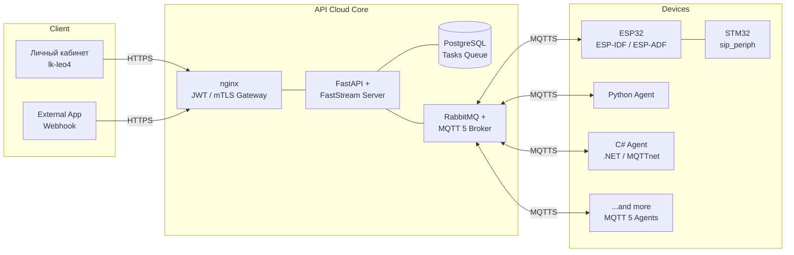

### Компоненты системы

| Компонент | Репозиторий | Назначение |
|-----------|------------|------------|
| **Cloud Core (Backend)** | [iot-rpc-rest-app](https://github.com/OlegLebedevRU/iot-rpc-rest-app) | REST API, RPC-ядро, брокер сообщений, БД |
| **Личный кабинет (Frontend)** | [lk-leo4](https://github.com/OlegLebedevRU/lk-leo4) | Веб-интерфейс управления устройствами |
| **Периферийный модуль (Firmware)** | [sip_periph](https://github.com/OlegLebedevRU/sip_periph) | Прошивка STM32F411 — замки, датчики, NFC, дисплей |
| **SIP-модуль / микро-Edge Cloud** | [siplite](https://github.com/OlegLebedevRU/siplite) | SIP-клиент для ESP32 (голосовая связь, домофония), микро-Edge Cloud для облачной интеграции |

---

## 3. Инфраструктурный стек

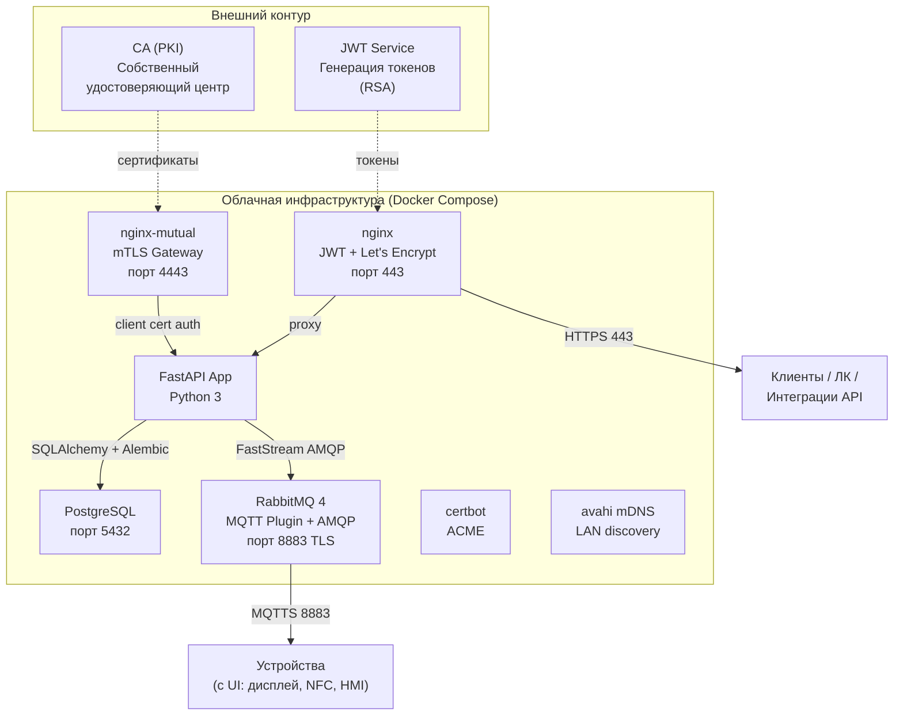

### Стек приложения

| Слой | Технологии |
|------|-----------|
| **Язык** | Python 3 |
| **Web Framework** | FastAPI |
| **Message Broker Client** | FastStream (AMQP) |
| **Валидация** | Pydantic |
| **ORM** | SQLAlchemy (asyncpg) |
| **Миграции** | Alembic |
| **WSGI** | Gunicorn |
| **Контейнеризация** | Docker Compose |
| **PKI** | OpenSSL, pyca/cryptography |

---

## 4. Протокол обмена — Async RPC over MQTT v5

Собственный прикладной протокол поверх MQTT v5 обеспечивает двунаправленный асинхронный RPC между облаком и устройствами.

### Структура топиков

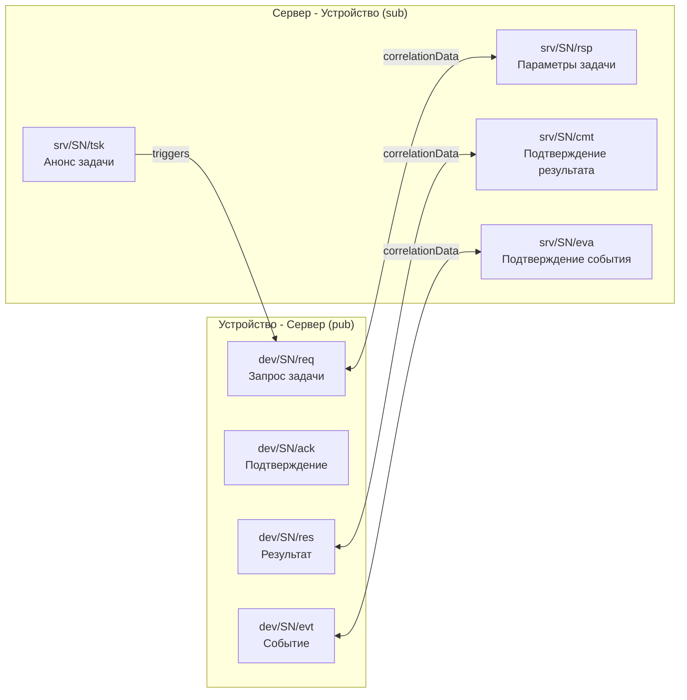

> **SN** — серийный номер устройства из x509-сертификата (CN).

### Жизненный цикл задачи (RPC)

```
[Trigger] TSK → REQ → RSP → RES → CMT
[Polling]        REQ → RSP → RES → CMT
```

| Этап | Топик | Направление | Описание |
|------|-------|------------|----------|
| **TSK** | `srv/<SN>/tsk` | Сервер → Устройство | Анонс задачи (method_code, без payload) |
| **REQ** | `dev/<SN>/req` | Устройство → Сервер | Запрос параметров задачи |
| **RSP** | `srv/<SN>/rsp` | Сервер → Устройство | Тело задачи (method_code + payload.dt) |
| **RES** | `dev/<SN>/res` | Устройство → Сервер | Результат выполнения (status_code) |
| **CMT** | `srv/<SN>/cmt` | Сервер → Устройство | Подтверждение приёма результата |

### Сквозная корреляция

Все этапы одного RPC-вызова связаны через `correlationData` (UUID4), что позволяет восстанавливать контекст без хранения состояния.

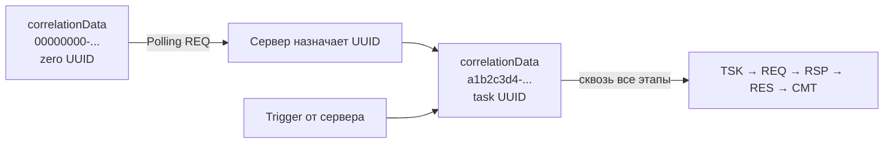

---

## 5. Состояния задачи

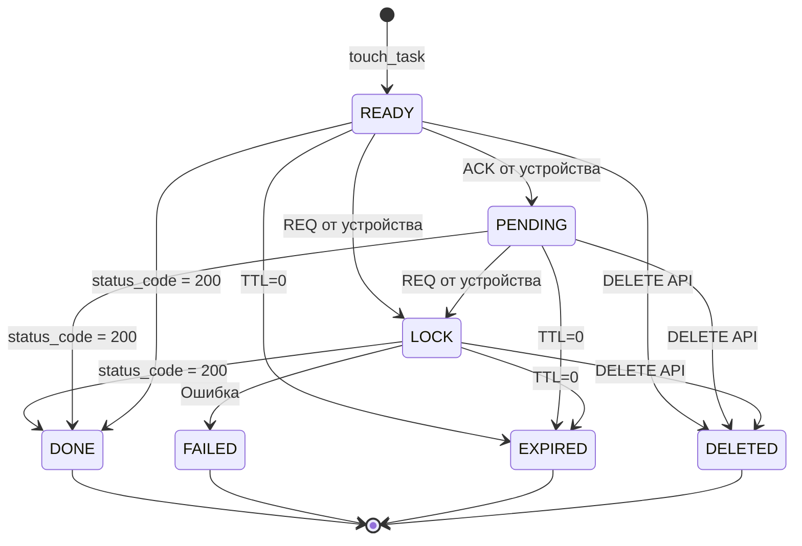

| Код | Состояние | Описание |
|-----|----------|----------|
| 0 | **READY** | Задача создана, ожидает устройство |
| 1 | **PENDING** | Устройство подтвердило получение |
| 2 | **LOCK** | Устройство запросило параметры, выполняет |
| 3 | **DONE** | Успешно выполнена |
| 4 | **EXPIRED** | TTL истёк |
| 5 | **DELETED** | Удалена через API |
| 6 | **FAILED** | Ошибка выполнения |

---

## 6. REST API — Управление задачами

**Базовый URL:** `https://dev.leo4.ru/api/v1/device-tasks`

### Основные методы

| Метод | Endpoint | Описание |
|-------|---------|----------|
| `POST /` | `touch_task` | Создать задачу для устройства |
| `GET /{id}` | Статус задачи | Поллинг результата |
| `GET /` | Список задач | Пагинированный список по device_id |
| `DELETE /{id}` | Удаление | Мягкое удаление задачи |

### Пример: создание задачи

```http
POST /api/v1/device-tasks/
Content-Type: application/json
x-api-key: ApiKey <key>
```
```json
{
  "ext_task_id": "hello-001",
  "device_id": 4619,
  "method_code": 20,
  "priority": 1,
  "ttl": 5,
  "payload": { "dt": [{ "mt": 0 }] }
}
```

**Ответ:**
```json
{
  "id": "a1b2c3d4-e5f6-7890-g1h2-i3j4k5l6m7n8",
  "created_at": 1712345678
}
```

### TTL и приоритет

- **TTL** (минуты, макс. 44640 ≈ 1 месяц) — время жизни задачи в очереди
- **Priority** — позволяет поставить срочную команду в начало очереди

---

## 7. Вебхуки — альтернатива поллингу

Для высоконагруженных систем вместо polling рекомендуются вебхуки.

| Тип события | Описание |
|------------|----------|
| `msg-task-result` | Результат выполнения задачи |
| `msg-event` | Асинхронное событие от устройства |

```http
PUT /api/v1/webhooks/msg-task-result
```
```json
{
  "url": "https://your-service.com/hooks/task-result",
  "headers": { "Authorization": "Bearer xxx" },
  "is_active": true
}
```

Ваш сервер получит `POST`-запрос с заголовками `X-Device-Id`, `X-Status-Code`, `X-Ext-Id`, `X-Result-Id` и телом JSON.

---

## 8. События устройств (Events API)

Асинхронные события передаются по отдельному каналу (`dev/<SN>/evt`), независимо от RPC.

### Формат событий

```json
{
  "101": 20338,
  "102": "2026-02-18T01:43:16+03:00",
  "200": 13,
  "300": [{ "304": 12, "305": 1, "306": 22 }]
}
```

| Тег | Назначение |
|-----|-----------|
| `101` | ID события на устройстве |
| `102` | Временная метка (ISO 8601, числовой TZ-offset, например `+03:00`) |
| `200` | Код типа события |
| `300` | Массив параметров |

### Основные типы событий

#### Общие (системные) события

| Код | Название | Описание |
|-----|---------|----------|
| 0 | Hello | Инициализация устройства |
| 3 | IdInput | Ввод идентификатора (NFC, пинкод) |
| 44 | DevHealthCheck | Пинг от устройства (раз в 10 минут) |
| 46 | UartToCloud | Данные UART → облако |

#### Примеры доменных (частных) событий

| Код | Название | Описание |
|-----|---------|----------|
| 13 | CellOpenEvent | Открытие ячейки/двери |
| 14 | CellCloseEvent | Закрытие ячейки/двери |
| 27 | CardDeleteEvent | Удаление карты/идентификатора |
| 54 | SlotBindEvent | Привязка слота/ячейки |

> Список доменных событий расширяется в зависимости от прикладного профиля устройства.

### Events API

| Endpoint | Описание |
|---------|----------|
| `GET /api/v1/device-events/` | Пагинированный список событий |
| `GET /api/v1/device-events/incremental` | Инкрементальное чтение |
| `GET /api/v1/device-events/fields/` | Выборка значений тегов (временные ряды) |

---

## 9. Личный кабинет (lk-leo4)

Веб-приложение для управления IoT-устройствами, доступное по адресу **dev.leo4.ru**.

### Назначение

- Управление устройствами и задачами через веб-интерфейс
- Мониторинг событий и состояния устройств
- **Поддержка интеграции с внешними системами** (API-ключи, вебхуки, внешние приложения)

### Технологии

| Технология | Версия |
|-----------|--------|
| React | 19 |
| TypeScript | 5.9 |
| Vite | 7 |
| Ant Design + Pro Components | 5 / 2 |
| React Query | 5 |
| React Router | 7 |
| Axios | — |

### Функциональность

Веб-интерфейс отображён на скриншоте личного кабинета и включает:

**Список устройств** (левая панель):
- Номер связи (device_id)
- Серийный номер (SN)
- Приложение (APP)
- Описание устройства
- Индикатор связи (онлайн/офлайн)

**Карточка устройства** (правая панель) — вкладки:
- **Контекст** — общая информация об устройстве
- **Команды/задачи** — список заданий с датой, статусом, кодом команды, приоритетом и TTL
- **Журнал событий** — история асинхронных событий
- **Теги** — метаданные устройства


**Управление задачами:**
- Кнопка «Создать задачу» — инициация `touch_task`
- Статусы: Выполнено ✅, Таймаут ⏱️
- Код команды, приоритет, TTL (мин) для каждой задачи

### Консоль создания задач

«Создать задачу» предоставляет интерактивную консоль с набором готовых команд. Каждая команда формирует JSON-пакет задачи с параметрами `ext_task_id`, `device_id`, `method_code`, `priority`, `ttl` и `payload.dt`.

Набор доступных команд определяется шаблоном [methodCodes.json](https://github.com/OlegLebedevRU/lk-leo4/blob/main/src/features/tasks/domain/methodCodes.json), что позволяет гибко расширять список команд.


#### Основные команды (method_code)

| Код | Команда | Описание |
|-----|---------|----------|
| 16 | Привязка карты/пинкода | Привязка ID карты/пинкода к слоту/ячейке |
| 20 | Короткие команды | Отправка коротких команд (mt-подкоманды) |
| 21 | Перезагрузка | Удалённая перезагрузка устройства |
| 35 | Ввод пинкода | Удалённый ввод пинкода |
| 47 | Удаление привязок | Удаление привязок к слоту/списку слотов |
| 49 | Запись данных в БД (NVS) | Запись параметров в NVS-хранилище контроллера |
| 50 | Чтение данных из БД (NVS) | Получение данных из NVS-хранилища контроллера |

#### Удалённая работа с NVS-хранилищем

Команды `method_code: 49` (запись) и `method_code: 50` (чтение) обеспечивают удалённый доступ к флеш-хранилищу контроллера (NVS — Non-Volatile Storage). Это позволяет:

- **Чтение**: получить текущие параметры конфигурации устройства (разделы `cfg_sip`, `cfg_eth`, `system` и др.)
- **Запись**: удалённо изменить конфигурацию устройства, задав раздел (`ns`), ключ (`k`), тип данных (`t`: i8, u8, i16, u16, i32, u32, str) и значение (`v`)


---

## 10. Устройства — Аппаратный уровень

### ESP32 — Основной контроллер устройства

- **Платформа:** ESP-IDF / ESP-ADF
- **Связь:** Wi-Fi/Ethernet → MQTT 5 over TLS (mutual)
- **Функции:**
  - MQTT-клиент с поддержкой RPC-протокола
  - I2C Master для периферийного модуля (STM32)
  - I2C HW Bootloader для STM32 (обновление прошивки периферии)
  - SIP-клиент (siplite) для голосовой связи
  - RS-485, UART-шлюз
  - OTA — обновление прошивки по воздуху

### STM32F411 (sip_periph) — Периферийный модуль

- **MCU:** STM32F411CEU6
- **RTOS:** FreeRTOS
- **Связь с ESP32:** I2C Slave (адрес 0x80)
- **Периферия:**
  - DS3231M — RTC (часы реального времени, 1Hz INT)
  - TCA6408a — I2C GPIO expander
  - PN532 — NFC-считыватель (Wiegand, I2C)
  - DWIN — сенсорный дисплей (UART)
  - Замковые платы — управление по RS-485
  - USB Device — диагностика

### Схема взаимодействия внутри устройства

```
┌─────────────────────────────────────────────┐
│  ESP32 (Master)                             │
│  ┌────────────┐  ┌──────────┐  ┌─────────┐ │
│  │ MQTT Client│  │SIP Client│  │UART/485 │ │
│  │ (mqtts)    │  │(siplite) │  │ Gateway │ │
│  └─────┬──────┘  └──────────┘  └─────────┘ │
│        │ I2C Master                         │
└────────┼────────────────────────────────────┘
         │
    ┌────┴────┐
    │ I2C Bus │
    └────┬────┘
         │
┌────────┼────────────────────────────────────┐
│  STM32F411 (Slave, addr 0x80)               │
│  ┌─────────┐ ┌────────┐ ┌───────┐ ┌──────┐ │
│  │ DS3231M │ │TCA6408a│ │ PN532 │ │ DWIN │ │
│  │  RTC    │ │ GPIO   │ │  NFC  │ │ LCD  │ │
│  └─────────┘ └────────┘ └───────┘ └──────┘ │
│  ┌──────────────────┐                       │
│  │ Замковые платы   │                       │
│  │ (RS-485 bus)     │                       │
│  └──────────────────┘                       │
└─────────────────────────────────────────────┘
```

---

## 11. Безопасность

### Многоуровневая модель безопасности

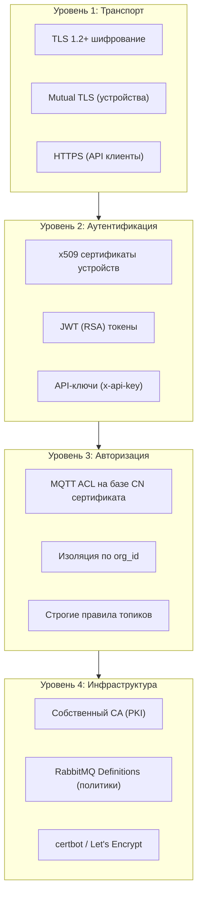

| Слой | Механизм | Применение |
|------|---------|------------|
| Устройства → Брокер | Mutual TLS (x509) | Каждое устройство имеет уникальный сертификат |
| Клиенты → API | JWT (RSA) / API-Key | Токены привязаны к организации |
| Топики MQTT | ACL по CN (SN) | Устройство видит только свои топики |
| Данные | Сквозная изоляция по org_id | Мультитенантность |

---

## 12. Сценарии применения

### Сценарий: Начало от HMI устройства (NFC → Siplite Frontend)

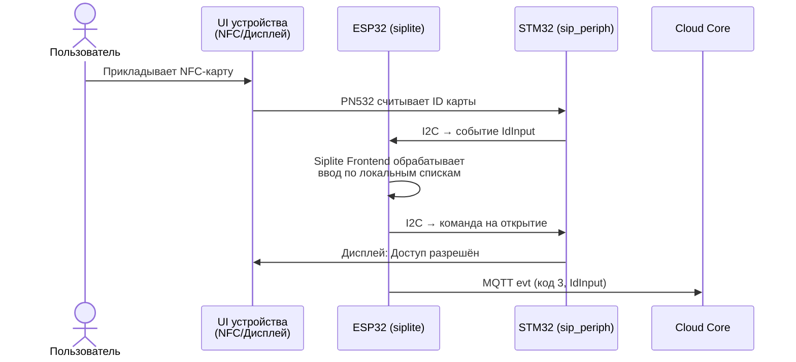

> **Siplite Frontend** — встроенный интерфейс ввода на устройстве ([документация](https://github.com/OlegLebedevRU/siplite/blob/master/docs/l4_input_frontend.md)), обрабатывающий NFC, пинкоды и другие способы идентификации.

### Сценарий: Использование через API (iot-rpc-rest-app)

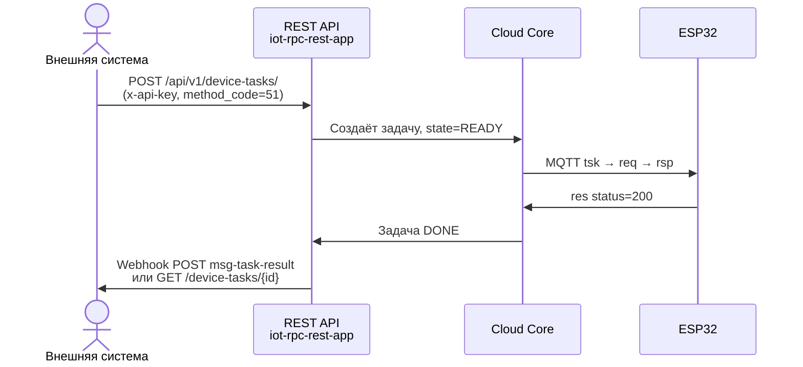

> Внешние системы интегрируются напрямую через REST API с использованием API-ключей, без необходимости использования личного кабинета.

### Локальные сценарии (без облака)

Ряд сценариев могут работать **полностью автономно**, без подключения к облаку. Siplite-контроллер обеспечивает локальную обратную связь по заранее загруженным спискам пользователей и их скриптам:

- **NFC/пинкод → открытие замка** — идентификация и выполнение действия по локальной базе
- **Управление по расписанию** — выполнение запрограммированных действий без сетевого подключения
- **Офлайн-журналирование** — накопление событий в локальном хранилище с последующей синхронизацией при восстановлении связи

> Это критически важно для объектов с нестабильным интернетом: устройство продолжает функционировать автономно.

### Системы контроля доступа (Постаматы, локеры)

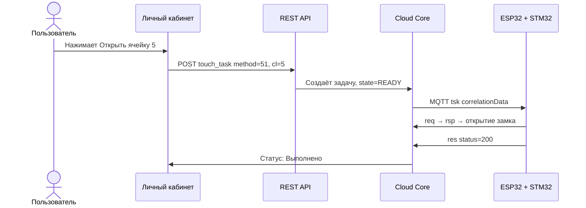

### Дополнительные сценарии

| Сценарий | method_code | Описание |
|---------|-------------|----------|
| Hello-пакет | 20 (mt=0) | Запрос информации об устройстве |
| Открытие ячейки | 51 | Дистанционное открытие замка |
| Привязка пинкода | 16 | Привязка идентификатора к ячейке |
| Список ячеек | 20 (mt=4) | Получение конфигурации замков |
| Перезагрузка | 21 | Удалённая перезагрузка контроллера |
| Удаление карт | 26 | Очистка базы идентификаторов |
| SIP-вызов | — | Инициация голосового вызова (ESP-ADF + siplite) |
| Шлюз UART→Cloud | 46 | Проброс данных с порта в облако |
| Чтение NVS | 50 | Удалённое чтение конфигурации из флеш-хранилища |
| Запись NVS | 49 | Удалённая запись конфигурации во флеш-хранилище |
| NFC → локальное открытие | — (офлайн) | Идентификация и действие по локальной базе без облака |
| Интеграция через API | любой | Внешняя система отправляет задачу через REST API |

---

## 13. Полный Workflow — API-сценарии и онлайн-пользовательская петля

### Workflow через REST API (интеграция внешней системы)

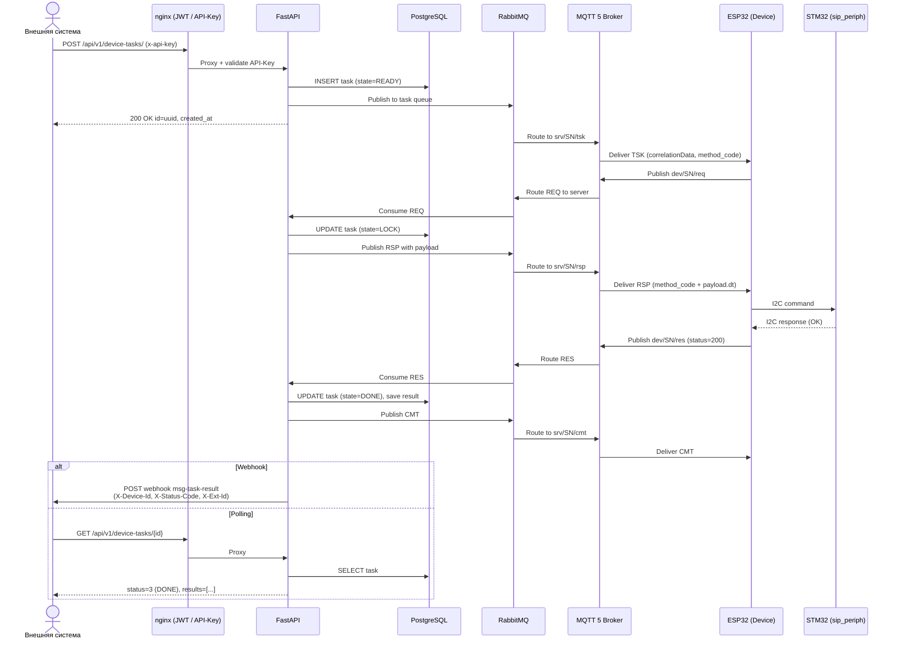

### Workflow через Личный кабинет (онлайн-пользовательская петля)

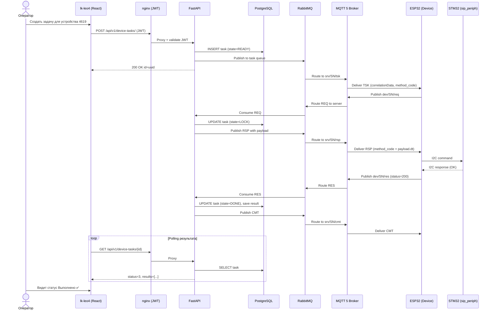

---

## 14. Клиентские примеры и интеграции

Платформа предоставляет примеры для различных окружений:

| Платформа | Файл | Описание |
|-----------|------|----------|
| Python | `mqtt5-paho-full-rpc-client-example.py` | Полный RPC-клиент (paho MQTT) |
| Python | `mini-native-paho-mqttv5-corrdata-client.py` | Минимальный клиент с correlationData |
| Python | `rpc-client-example.py` | Пример REST + MQTT клиента |
| C# (.NET) | `rpc-client-example.cs` | RPC-клиент на MQTTnet |
| C# (.NET) | `rpc-client-native-correlation-example.cs` | Клиент с нативным correlation data |
| C# (.NET) | `rpc-client-extract-SN-from-cert-example.cs` | Извлечение SN из сертификата |

### Поддерживаемые типы устройств

- **MQTTX** — no-code сценарии (отправка файлов, запуск exe/cmd/sh)
- **Python** — автоматизация (Tkinter-алерты, удалённый Python-код, Raspberry Pi Camera→WebRTC)
- **ESP32 (ESP-IDF)** — PWM, RS-485, SIP-вызовы, управление замками
- **STM32 (FreeRTOS)** — измерения, датчики, периферия

---

## 15. Развёртывание

### Docker Compose (единая команда)

```bash
docker compose up -d
```

Сервисы:
- `app1` — FastAPI-приложение
- `rabbitmq` — RabbitMQ 4 + MQTT Plugin (порты 5672, 8883)
- `pg` — PostgreSQL
- `nginx` — JWT-прокси (порты 80, 443)
- `nginx-mutual` — mTLS-прокси (порт 4443)
- `certbot` — автоматическое обновление SSL
- `avahi` — mDNS для локальных инсталляций
- `pgadmin` — администрирование БД

### Окружение

```
Домен:     dev.leo4.ru
API:       https://dev.leo4.ru/api/v1/
MQTT:      mqtts://dev.leo4.ru:8883
ЛК:        https://dev.leo4.ru (lk-leo4)
```

---

## 16. Итого — Ключевые преимущества

| Характеристика | Описание |
|---------------|----------|
| 🔒 **Безопасность** | Mutual TLS, JWT, x509 PKI, ACL — сквозная защита |
| ⚡ **Надёжность** | Push + Pull стратегия, TTL, приоритеты, retry |
| 🌐 **Масштабируемость** | RabbitMQ, Docker, слабая связность |
| 🔗 **Интеграция** | REST API, Webhooks, MQTT, AMQP, примеры на Python/C# |
| 📱 **Управление** | Личный кабинет (React), Swagger, pgAdmin |
| 🏭 **Кроссплатформенность** | ESP32, STM32, Python-агенты, Windows/Linux |
| 📊 **Мониторинг** | События, журнал, healthcheck, временные ряды |
| 🏗️ **Мультитенантность** | Изоляция по org_id, организационные ключи |

---

> © 2026 Leo4 / Platerra. Все права защищены.  
> Контакты: info@platerra.ru | +7 (916) 206-71-24 | https://platerra.ru
