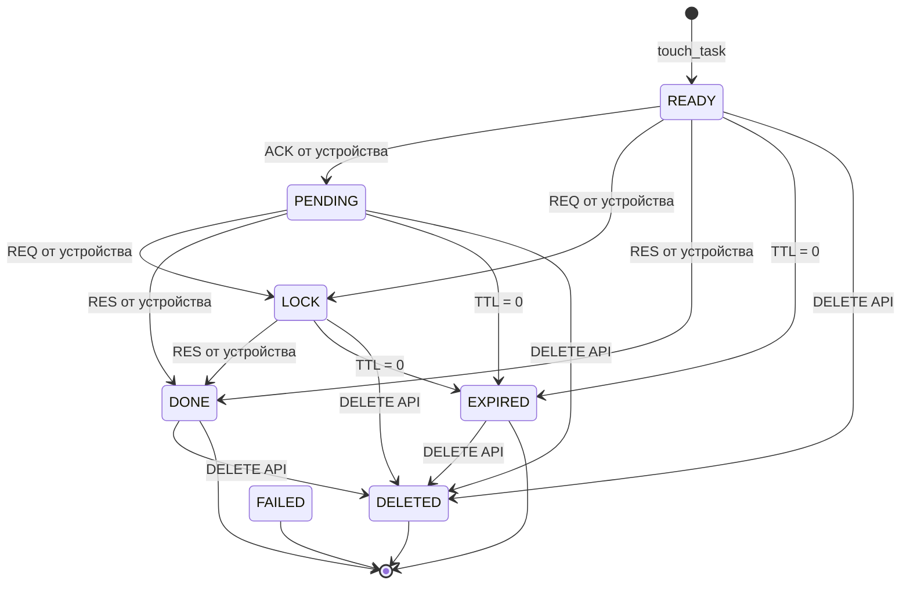

# Статусы задач

Перечисление `TaskStatus` используется для отслеживания жизненного цикла задачи в системе.

## Значения статусов

| Код | Константа | Описание                                            |
|-----|-----------|-----------------------------------------------------|
| `0` | READY     | Задача создана, ожидает выборки устройством         |
| `1` | PENDING   | Устройство подтвердило получение (ACK)              |
| `2` | LOCK      | Устройство выбрало задачу (REQ) и начало выполнение |
| `3` | DONE      | Задача завершена — устройство прислало результат    |
| `4` | EXPIRED   | Истёк TTL, задача снята с выполнения                |
| `5` | DELETED   | Задача удалена через DELETE API                     |
| `6` | FAILED    | Ошибка выполнения *(зарезервировано)*               |
| `7` | UNDEFINED | Неопределённое состояние *(зарезервировано)*        |

## Диаграмма переходов состояний

## Описание переходов

| Событие              | Переход                          | Инициатор   |
|----------------------|----------------------------------|-------------|
| `POST /` touch_task  | `[*] → READY`                    | API-клиент  |
| `ack` по MQTT        | `READY → PENDING`                | Устройство  |
| `req` по MQTT        | `READY/PENDING → LOCK`           | Устройство  |
| `res` по MQTT        | `READY/PENDING/LOCK → DONE`      | Устройство  |
| TTL достиг 0         | `READY/PENDING/LOCK → EXPIRED`   | Планировщик |
| `DELETE /{id}`       | Любой статус `→ DELETED`         | API-клиент  |

> **Примечание.** Статусы `FAILED` (6) и `UNDEFINED` (7) зарезервированы в перечислении, но не используются текущим кодом.

---

**См. также:**
- [`TTL.md`](./TTL.md) — механизм TTL и стратегия поллинга
- [`sequence.md`](./sequence.md) — сценарии взаимодействия
- [`1-task-workflow-doc.md`](./1-task-workflow-doc.md) — API workflow