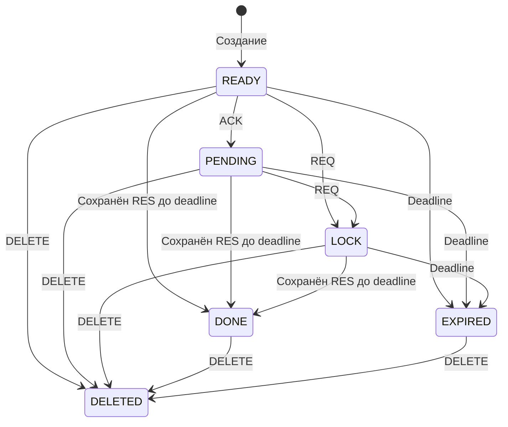

# 🚦 Состояния задачи

> Статус описывает жизненный цикл в IoT. Успех команды определяется результатом, физический эффект — событием устройства.

[← Документация](README.md) · [REST задач](1-task-workflow-doc.md) · [TTL](TTL.md)

## 🧭 Значения

| Код | Статус | Что произошло |
| :--- | :--- | :--- |
| `0` | `READY` | Задача сохранена; один анонс TSK не меняет этот статус |
| `1` | `PENDING` | Принят адресный ACK устройства |
| `2` | `LOCK` | Сервер обработал REQ и выдал задачу в RSP |
| `3` | `DONE` | Сохранён результат RES, включая ответ с ошибкой |
| `4` | `EXPIRED` | Истёк внутренний deadline |
| `5` | `DELETED` | Выполнен soft delete через API |
| `6` | `FAILED` | Зарезервирован; обычный RES с ошибкой не переводит сюда |
| `7` | `UNDEFINED` | Зарезервирован |

## 🔄 Переходы

```mermaid
stateDiagram-v2
    [*] --> READY: Создание
    READY --> PENDING: ACK
    READY --> LOCK: REQ
    PENDING --> LOCK: REQ
    READY --> DONE: Сохранён RES до deadline
    PENDING --> DONE: Сохранён RES до deadline
    LOCK --> DONE: Сохранён RES до deadline
    READY --> EXPIRED: Deadline
    PENDING --> EXPIRED: Deadline
    LOCK --> EXPIRED: Deadline
    READY --> DELETED: DELETE
    PENDING --> DELETED: DELETE
    LOCK --> DELETED: DELETE
    DONE --> DELETED: DELETE
    EXPIRED --> DELETED: DELETE
```

ACK необязателен. `LOCK` означает выдачу параметров сервером и допускает повторную выдачу; факт начала исполнения этим статусом не подтверждается. RSP содержит снимок состояния до обновления LOCK.

Повторный RES получает исходный `result_id`. Поздний RES для EXPIRED/DELETED сохраняется и подтверждается CMT, не возвращая задачу в DONE. Новый RES, поступивший после deadline, переводит ещё активную задачу в EXPIRED, даже если фоновая проверка срока ещё не сработала.

`ttl=0` при создании — отдельный Trigger-only режим с внутренним окном до одной минуты, а не немедленный EXPIRED. [Правила TTL](TTL.md).

**Реализация:** [TaskStatus](../app-service/core/models/common.py) · [переходы и сохранение](../app-service/core/crud/dev_tasks_repo.py). Сверено с `master` на 09.10.2026.
