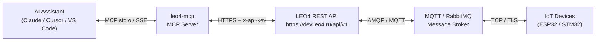

# LEO4 MCP Server

> **Model Context Protocol server** for the [LEO4](https://dev.leo4.ru) IoT platform.
> Control ESP32/STM32-based smart lockers, postamats, and industrial devices from any MCP-compatible AI assistant.

---

## ⚠️ Critical: DONE ≠ Physically Executed

`status=3 (DONE)` from `get_task_status` means the command was **delivered to the device**, not that it was physically executed.

| Status | Meaning |
|--------|---------|
| 0 READY | Task queued, device not yet contacted |
| 1 PENDING | Device acknowledged receipt |
| 2 LOCK | Device is processing |
| **3 DONE** | **Command DELIVERED only** – not executed |
| 4 EXPIRED | TTL elapsed before delivery |
| 5 DELETED | Manually deleted |
| 6 FAILED | Delivery failed |

To confirm physical execution (e.g. cell actually opened), use `poll_device_event` or the composite `open_cell_and_confirm` tool.

---

## Overview



The MCP server translates natural-language AI requests into LEO4 REST API calls, handling authentication, retries, dry-run mode, and device allowlists transparently.

---

## Features

- **15 MCP tools** covering tasks, events, webhooks, and composite operations
- **4 MCP resources** – live device list, recent events, method codes, event types
- **3 prompt templates** – open cell, diagnose device, mass activate
- **Dry-run mode** (`LEO4_DRY_RUN=1`) – zero network calls, deterministic mock responses
- **Device allowlist** (`LEO4_ALLOWED_DEVICE_IDS`) – restrict which devices can be controlled
- **Automatic retries** with back-off for 5xx and network errors
- **SSE transport** for web-based deployments alongside default stdio
- **Optional webhook inbox** (FastAPI) to receive push events from LEO4

---

## Installation

```bash
# Clone the repo
git clone https://github.com/OlegLebedevRU/iot-rpc-rest-app.git
cd iot-rpc-rest-app/mcp

# Install with dev dependencies
pip install -e ".[dev]"

# Copy and edit environment
cp .env.example .env
# Set LEO4_API_KEY=ApiKey YOUR_ACTUAL_KEY
```

### Optional webhook inbox (requires FastAPI)

```bash
pip install -e ".[webhook]"
uvicorn leo4_mcp.webhook_inbox:app --port 8766
```

---

## Running

```bash
# stdio transport (default – for Claude Desktop, VS Code, Cursor)
python -m leo4_mcp

# SSE transport (web/HTTP-based MCP clients)
python -m leo4_mcp --transport sse --host 0.0.0.0 --port 8765

# Dry-run (no real API calls)
LEO4_DRY_RUN=1 python -m leo4_mcp
```

---

## Connecting AI Assistants

### Claude Desktop

Edit `~/Library/Application Support/Claude/claude_desktop_config.json` (macOS) or `%APPDATA%\Claude\claude_desktop_config.json` (Windows):

```json
{
  "mcpServers": {
    "leo4": {
      "command": "python",
      "args": ["-m", "leo4_mcp"],
      "cwd": "/path/to/iot-rpc-rest-app/mcp",
      "env": {
        "LEO4_API_KEY": "ApiKey YOUR_KEY_HERE",
        "LEO4_API_URL": "https://dev.leo4.ru/api/v1"
      }
    }
  }
}
```

See [`examples/claude_desktop_config.json`](examples/claude_desktop_config.json).

### VS Code (GitHub Copilot / MCP extension)

Add to `.vscode/mcp.json` or user settings:

```json
{
  "servers": {
    "leo4": {
      "type": "stdio",
      "command": "python",
      "args": ["-m", "leo4_mcp"],
      "cwd": "${workspaceFolder}/mcp",
      "env": {
        "LEO4_API_KEY": "ApiKey YOUR_KEY_HERE"
      }
    }
  }
}
```

See [`examples/vscode_mcp.json`](examples/vscode_mcp.json).

### Cursor

Add to `~/.cursor/mcp.json`:

```json
{
  "mcpServers": {
    "leo4": {
      "command": "python",
      "args": ["-m", "leo4_mcp"],
      "cwd": "/path/to/iot-rpc-rest-app/mcp",
      "env": {
        "LEO4_API_KEY": "ApiKey YOUR_KEY_HERE",
        "LEO4_ALLOWED_DEVICE_IDS": "4619,4620"
      }
    }
  }
}
```

See [`examples/cursor_mcp.json`](examples/cursor_mcp.json).

---

## Environment Variables

| Variable | Default | Description |
|----------|---------|-------------|
| `LEO4_API_URL` | `https://dev.leo4.ru/api/v1` | LEO4 REST API base URL |
| `LEO4_API_KEY` | `ApiKey CHANGE_ME` | Authentication key (format: `ApiKey <key>`) |
| `LEO4_DRY_RUN` | `0` | Set to `1` to enable dry-run mode (no real API calls) |
| `LEO4_ALLOWED_DEVICE_IDS` | *(empty = all)* | Comma-separated device IDs to allow (e.g. `4619,4620`) |
| `LEO4_TIMEOUT_S` | `30` | HTTP request timeout in seconds |
| `LEO4_HTTP_RETRIES` | `3` | Number of retry attempts for 5xx / network errors |
| `LEO4_KNOWN_DEVICES` | `[]` | JSON array of device objects to use as `leo4://devices` resource |

---

## DRY_RUN Mode

Setting `LEO4_DRY_RUN=1` makes all tools return deterministic mock responses without making any network calls. This is useful for:

- Developing MCP prompt chains without a real LEO4 account
- CI/CD testing
- Demonstrating to stakeholders

```bash
LEO4_DRY_RUN=1 python -m leo4_mcp
```

All dry-run responses are defined in [`leo4_mcp/dry_run.py`](leo4_mcp/dry_run.py).

---

## Tests

```bash
cd mcp
pip install -e ".[dev]"
pytest tests/ -v
```

Tests use `respx` to mock HTTP calls – no real network access needed.

---

## Real-World Scenarios

### Smart Postamats / Package Lockers

```
User: "Open cell 7 on device 4619 and confirm it physically opened"
AI → open_cell_and_confirm(device_id=4619, cell_number=7)
   → POST /device-tasks/ (method_code=51, payload={"dt":[{"cl":7}]})
   → GET /device-tasks/{id} (wait for status=3)
   → GET /device-events/fields/ (poll for CellOpenEvent tag=304 value=7)
   → Returns confirmed=True
```

### Industrial Monitoring

```
User: "Check the health of all devices in the last hour"
AI → get_telemetry(device_id=..., interval_m=60)
   → Returns battery, signal, temperature readings
```

### Remote Administration (ESP32/STM32)

```
User: "Write config key 'wifi_ssid' = 'MyNetwork' to device 4620"
AI → write_nvs(device_id=4620, namespace="wifi", key="wifi_ssid", value="MyNetwork", type="str")
```

### Mass Activation

```
User: "Send hello to all devices 4619, 4620, 4621"
AI → mass_activate(device_ids=[4619,4620,4621], method_code=20, payload={"dt":[{"mt":0}]})
   → 3 concurrent POST /device-tasks/ requests
   → Returns {total:3, success:3, failed:0, results:[...]}
```

### Webhook-Driven (Production)

```
User: "Set up a webhook to receive cell-open events at https://my-app.com/hooks/events"
AI → configure_webhook(event_type="msg-event", url="https://my-app.com/hooks/events")
```

---

## Architecture

See [`docs/architecture.md`](docs/architecture.md) for detailed flow diagrams including:
- Full open-cell cycle sequence diagram
- Task lifecycle state machine
- Webhook mode comparison

## Tools Reference

See [`docs/tools-reference.md`](docs/tools-reference.md) for complete tool documentation with input/output schemas and examples.

## API Deep Dive

See [`docs/deep-dive.md`](docs/deep-dive.md) for all REST endpoints, method codes, and event types.

---

## Security Notes

- **Never commit `LEO4_API_KEY`** – use environment variables or `.env` (already in `.gitignore`)
- **Use `LEO4_ALLOWED_DEVICE_IDS`** to restrict which devices an AI assistant can control
- The API key is sent as `x-api-key` header and never logged at INFO level
- All mutating operations (`create_device_task`, `configure_webhook`) require the API key

---

## Roadmap

- [ ] Streaming events via SSE subscription (replace polling)
- [ ] `GET /device-events/incremental` support for efficient long-polling
- [ ] Device group management (`PUT /devices/{id}` tags)
- [ ] Persistent webhook inbox with SQLite backend
- [ ] OpenTelemetry tracing
- [ ] Rate limiting and circuit breaker
