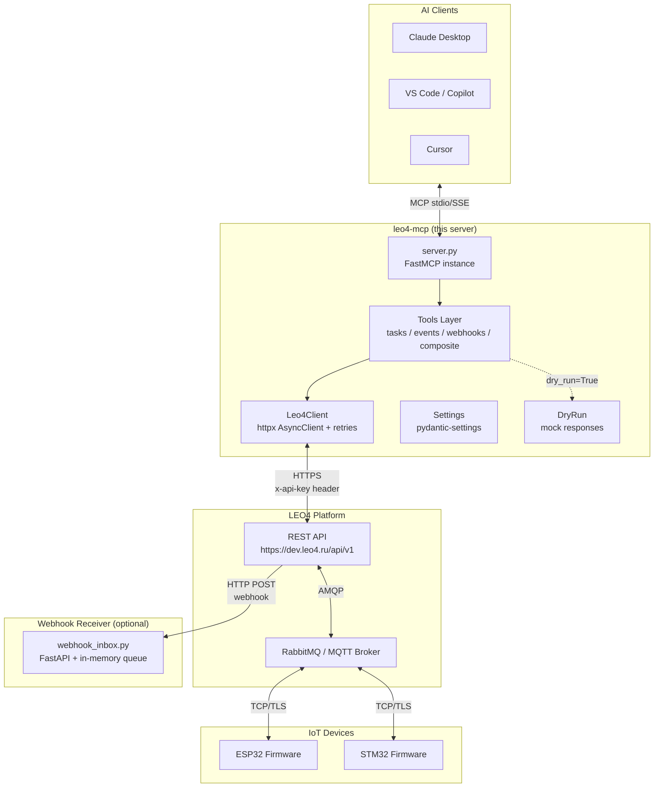
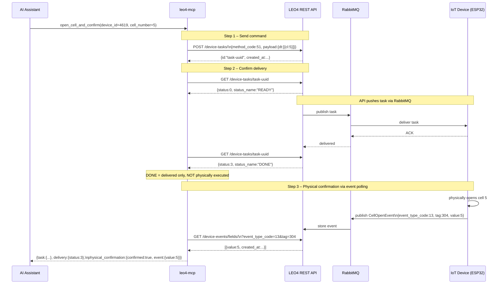
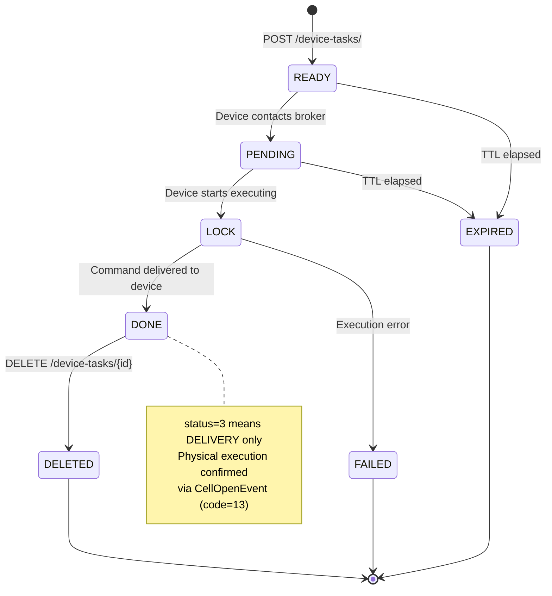
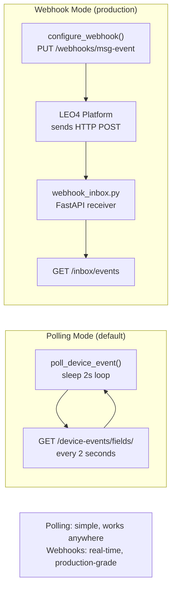

# LEO4 MCP Server – Architecture

## System Overview



---

## Open-Cell Full Cycle

The `open_cell_and_confirm` composite tool performs three steps to guarantee physical confirmation:



---

## Task Lifecycle State Machine



---

## Composite Tools

Composite tools in `leo4_mcp/tools/composite.py` combine multiple API calls into single high-level operations:

| Composite Tool | Steps | Use Case |
|----------------|-------|----------|
| `hello` | create_task → get_status | Ping / connectivity check |
| `open_cell_and_confirm` | create_task → get_status → poll_event | Full locker open cycle |
| `reboot_device` | create_task → get_status | Remote reboot |
| `bind_card_to_cell` | create_task → get_status | Access control setup |
| `write_nvs` | create_task → get_status | Remote config write |
| `read_nvs` | create_task → get_status | Remote config read |
| `mass_activate` | asyncio.gather N × create_task | Broadcast to many devices |

---

## Webhook Mode vs Polling



**Recommendation**: Use `poll_device_event` for development and low-volume scenarios. Use `configure_webhook` + `webhook_inbox.py` for production deployments where latency matters.

---

## Module Structure

```
mcp/
├── leo4_mcp/
│   ├── __init__.py          # Package version
│   ├── __main__.py          # CLI entry point (argparse)
│   ├── config.py            # pydantic-settings (LEO4_* env vars)
│   ├── client.py            # Leo4Client – async httpx with retries
│   ├── dry_run.py           # Deterministic mock responses
│   ├── resources.py         # MCP resource handlers
│   ├── prompts.py           # MCP prompt templates
│   ├── server.py            # FastMCP server, tool/resource registration
│   ├── webhook_inbox.py     # Optional FastAPI webhook receiver
│   └── tools/
│       ├── tasks.py         # create_device_task, get_task_status, list_device_tasks
│       ├── events.py        # get_recent_events, get_telemetry, poll_device_event
│       ├── webhooks.py      # configure_webhook, list_webhooks
│       └── composite.py     # hello, open_cell_and_confirm, reboot_device, ...
├── tests/
│   ├── test_client.py
│   ├── test_tools_tasks.py
│   ├── test_tools_events.py
│   └── test_composite.py
├── examples/
│   ├── claude_desktop_config.json
│   ├── vscode_mcp.json
│   ├── cursor_mcp.json
│   └── curl_smoke_test.sh
├── docs/
│   ├── architecture.md      # This file
│   ├── tools-reference.md
│   └── deep-dive.md
├── pyproject.toml
├── .env.example
└── README.md
```
