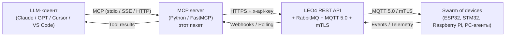
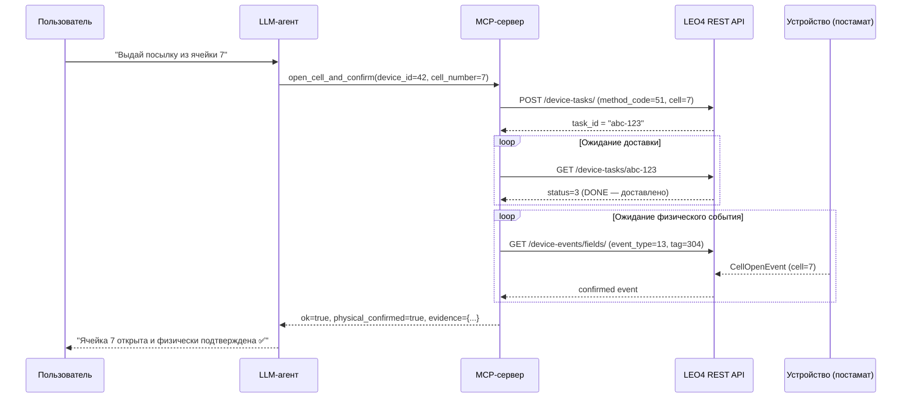
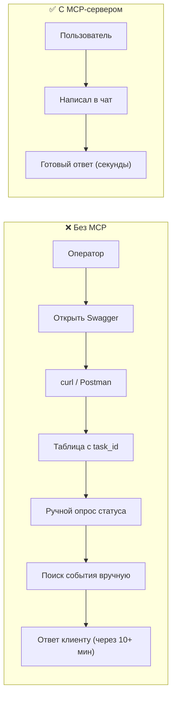
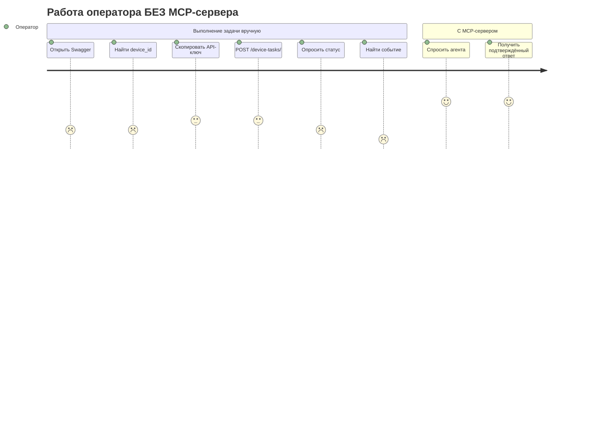
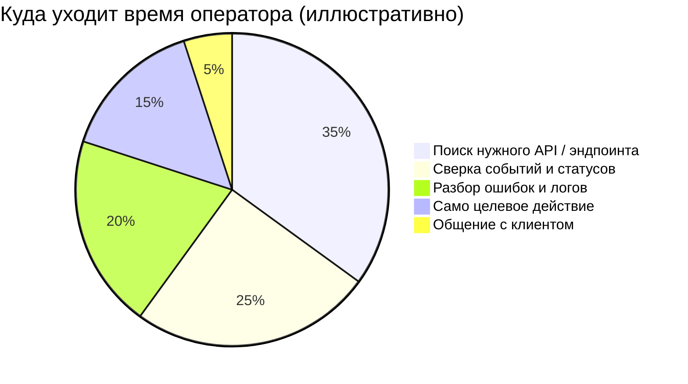
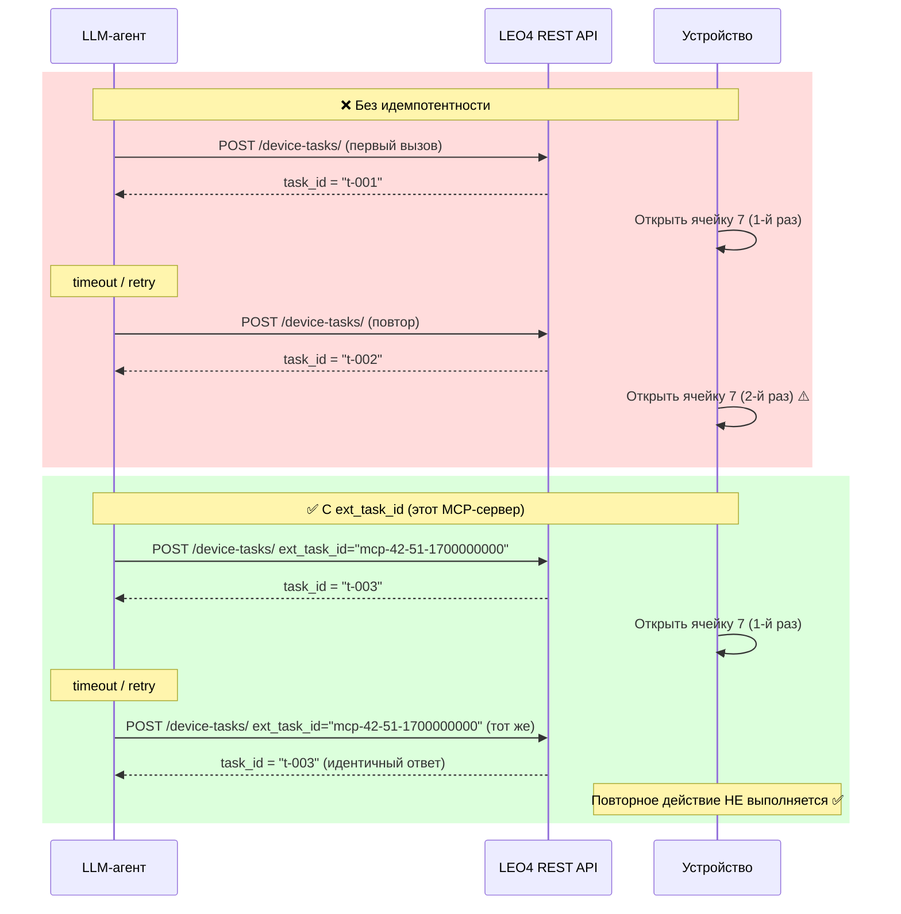

# MCP-сервер для LEO4 IoT Platform

> **Управляйте роем IoT-устройств голосом и текстом — через любой LLM, поддерживающий MCP**

Один пакет. Одна строка в `mcp.json`. Полный контроль над тысячами IoT-устройств из любого AI-клиента.

- 🚀 **Подключение за 5 минут** — Claude Desktop, VS Code, Cursor, любой MCP-совместимый агент.
- 🔒 **Безопасно по умолчанию** — `x-api-key`, изоляция по организации, идемпотентные вызовы, `DRY_RUN`-режим.
- ⚙️ **Composite-tools** — «открой ячейку и подтверди физически» — один вызов вместо трёх запросов.
- 📡 **Любые устройства** — ESP32, STM32, Raspberry Pi, PC-агенты, постаматы, промышленные контроллеры.

---

## Содержание

- [Архитектура за 30 секунд](#архитектура-за-30-секунд)
- [Один цикл вместо трёх запросов](#один-цикл-вместо-трёх-запросов)
- [Реальные сценарии применения](#реальные-сценарии-применения)
- [Маркетинговая иллюстрация ценности](#маркетинговая-иллюстрация-ценности)
- [Безопасные повторные вызовы — встроено](#безопасные-повторные-вызовы--встроено)
- [Почему именно MCP, а не «самописный коннектор»](#почему-именно-mcp-а-не-самописный-коннектор)
- [Метрики, которые улучшаются](#метрики-которые-улучшаются)
- [Запустите за 5 минут](#запустите-за-5-минут)

---

## Архитектура за 30 секунд



**Что вы получаете:**
MCP-сервер — тонкий адаптер, который публикует HTTP-вызовы LEO4 как MCP-инструменты.
LLM-клиент видит готовые `tools` с описаниями на человеческом языке.
Никакой кастомной интеграции под каждый AI-клиент — один `mcp.json`, и всё работает.
Изоляция данных по организации и двусторонний TLS (mTLS) до устройства — без дополнительных настроек.

---

## Один цикл вместо трёх запросов

Классическая проблема IoT + LLM: задача доставлена на устройство ≠ физически исполнена.
MCP-сервер решает это через composite-tool `open_cell_and_confirm`, который внутри делает весь цикл
и возвращает агенту единственный ответ с физическим подтверждением.



**Ключевое преимущество composite-tools:**
LLM не путает `status=DONE` (доставлено на устройство) с фактическим открытием ячейки.
Агент отвечает пользователю только после получения `CellOpenEvent` с нужным номером ячейки.
Меньше токенов, меньше ошибок, правильные ожидания пользователя — с первой попытки.

---

## Реальные сценарии применения

### 🏪 Постаматы и locker-системы

**Постановка:** Сеть постаматов, школьных шкафчиков, хранилищ инструментов на производстве.
Оператору нужно открыть ячейку, привязать карту, провести массовую выдачу — голосом или текстом из любого интерфейса.

**Пример:** *«Привяжи карту 04A1B2 к ячейке 12 на устройстве 42»*

**Результат:** composite-tool выполняет `bind_card_to_cell` и подтверждает привязку событием — без Swagger и без ошибок оператора.

---

### 🏭 Промышленный мониторинг и closed-loop управление

**Постановка:** ESP32/STM32-контроллеры собирают температуру, давление, RS-485-данные.
При аномалиях нужно автоматически снизить мощность или отправить алерт — без участия оператора.

**Пример:** *«Покажи аномалии температуры за сутки по 200 ESP32-устройствам»*

**Результат:** агент вызывает `get_telemetry`, анализирует данные и автоматически посылает `method_code=20` при превышении порога.

---

### 📡 Удалённое администрирование PC-парка

**Постановка:** Распределённый парк ноутбуков и серверов. Нужно выгрузить файл в Telegram, записать экран, перезапустить скрипт — из чата, без VPN и RDP.

**Пример:** *«Выгрузи последний отчёт с ноутбука инженера в Telegram»*

**Результат:** `create_device_task` отправляет RPC-команду PC-агенту, ответ с файлом приходит событием — оператор получает ссылку в ту же минуту.

---

### 📷 Raspberry Pi и видео

**Постановка:** Видеонаблюдение и стриминг по запросу. Включить WebRTC-стрим нужно только тогда, когда это действительно нужно — экономия трафика и вычислительных ресурсов.

**Пример:** *«Включи WebRTC-стрим с камеры RPi-3 на 5 минут»*

**Результат:** composite-tool запускает стрим, ждёт healthcheck-события и возвращает готовый URL — одним сообщением в чате.

---

### ☎️ ИИ-диспетчер для оператора call-центра

**Постановка:** Клиент звонит: «не открывается ячейка». Оператору нужно быстро найти причину — истёк TTL, ошибка доставки, нет физического события — без копания в Swagger и таблицах.

**Пример:** *«У клиента ID 4619 не открывается ячейка 5, посмотри что было за 15 минут»*

**Результат:** агент сам вызывает `get_task_status` и `poll_device_event`, выдаёт причину (`TTL_EXPIRED` / нет `CellOpenEvent`) — оператор получает ответ за секунды, а не минуты.

---

### 🛠 DevOps / SRE для IoT-парка

**Постановка:** Разработчик хочет проверить стенд, сделать массовую операцию, отладить сценарий — прямо из VS Code или Cursor, без переключения в Swagger.

**Пример:** *«Сделай hello на устройство 4619, перезагрузи, покажи healthcheck за 10 минут»*

**Результат:** vibe-coding в IDE — последовательность инструментов выполняется в одном чате, результаты приходят в том же окне. Zero context-switch.

---

## Маркетинговая иллюстрация ценности

### До MCP и после MCP



---

### Customer Journey оператора



---

### Распределение времени оператора без MCP



*Цифры иллюстративные — замените на ваши после пилота.*

---

## Безопасные повторные вызовы — встроено

> **LLM-агенты ретраят. Наивная REST-обвязка — это проблема. Этот MCP-сервер — нет.**

LLM-агенты часто повторяют вызовы: тайм-ауты сети, перезапуск сессии, параллельные tool-calls
в reasoning-режиме, перезагрузка чата пользователем. В наивной REST-обвязке каждый повтор
создаёт новую задачу на устройстве — и вы получаете двойное открытие ячейки, двойную перезагрузку
или каскад ложных событий. В продакшене это недопустимо.

Этот MCP-сервер защищает от этого через `ext_task_id`:



**Что MCP-сервер делает за вас:**

- **Авто-генерация осмысленного `ext_task_id`** — формат `mcp-{device_id}-{method_code}-{timestamp}`, уникален для сессии.
- **Короткий TTL по умолчанию** — команда истекает через 1–5 мин, случайный повтор через час не выполнится.
- **Защита от дублей в composite-tools** — `open_cell_and_confirm` использует один и тот же `ext_task_id` при ретрае.
- **Allowlist `device_id`** — ENV-переменная ограничивает, какими устройствами вообще можно управлять через этот MCP-сервер.
- **`LEO4_DRY_RUN=1`** — безопасный sandbox: tools работают, возвращают мок-ответы, ни одна команда не идёт на устройства.
- **Понятные ошибки для LLM** — `401 Unauthorized` и `422 Unprocessable Entity` сопровождаются текстовым описанием, которое модель включает в ответ пользователю.

---

## Почему именно MCP, а не «самописный коннектор»

| Критерий | Самописная REST-обвязка | MCP-сервер LEO4 |
|---|---|---|
| Подключение к Claude / Cursor / VS Code | ручная интеграция в каждый клиент | один `mcp.json` |
| Композитные сценарии (открыть + подтвердить) | пишутся каждый раз заново | встроены |
| Защита от дублей при ретраях LLM | нет | `ext_task_id` из коробки |
| Sandbox для тренировки промптов | нет | `LEO4_DRY_RUN=1` |
| Time-to-first-prompt | дни | минуты |

---

## Метрики, которые улучшаются

- **–80%** времени на L1-поддержку постаматов
- **–60%** ошибок оператора при работе с устройствами
- **×10** скорость онбординга нового оператора
- **+1** канал самообслуживания (голосом или текстом)
- **0 строк кода** со стороны клиента — только промпт

*Цифры иллюстративные, замените на ваши после пилота.*

---

## Запустите за 5 минут

```bash
git clone https://github.com/YOUR_ORG/iot-rpc-rest-app.git
cd iot-rpc-rest-app/mcp
cp .env.example .env
# Откройте .env и укажите LEO4_API_KEY и LEO4_API_URL
python -m leo4_mcp
```

Или подключите напрямую через `mcp.json` в вашем AI-клиенте:

```json
{
  "mcpServers": {
    "leo4-iot": {
      "command": "python",
      "args": ["-m", "leo4_mcp"],
      "cwd": "/path/to/iot-rpc-rest-app/mcp",
      "env": {
        "LEO4_API_KEY": "ApiKey YOUR_API_KEY_HERE",
        "LEO4_API_URL": "https://dev.leo4.ru/api/v1"
      }
    }
  }
}
```

---

### Документация

- [← README репозитория](../README.md)
- [Архитектура MCP-сервера](./architecture.md)
- [Справочник инструментов](./tools-reference.md)
- [Deep-dive: внутреннее устройство](./deep-dive.md)

---

### Контакты

**Platerra** — платформа LEO4 для управления распределёнными IoT-устройствами.

Сайт: [https://platerra.ru](https://platerra.ru)
Email: [info@platerra.ru](mailto:info@platerra.ru)
