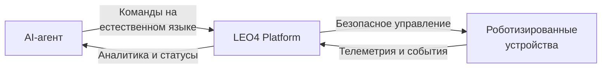
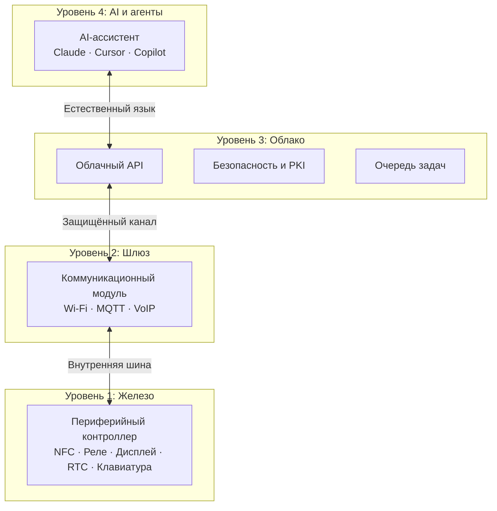
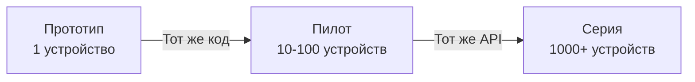
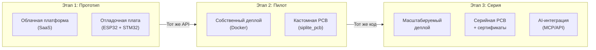
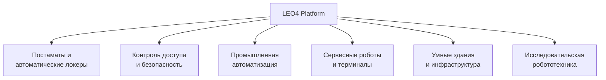

# LEO4 Robotics Platform — Маркетинговый обзор

> Полноценная платформа для управления автономными устройствами и роботами: от встроенного железа до AI-агентов.

---

## Что такое LEO4 Robotics Platform?

LEO4 — это готовая технологическая платформа для создания управляемых роботизированных систем: умных терминалов, постаматов, систем контроля доступа, промышленных сенсорных узлов и автономных роботов-помощников.

Платформа закрывает весь стек — от аппаратного контроллера с сенсорами и актуаторами до облачного API и AI-агента, который может управлять роботом на естественном языке.

---

## Почему это важно для робототехники

Создание управляемого робота традиционно требует сборки стека из несовместимых компонентов: отдельный контроллер, отдельный брокер сообщений, отдельная система аутентификации, отдельный API, отдельная интеграция с AI. Каждый стык — потенциальная точка отказа и дополнительные месяцы разработки.

**LEO4 предоставляет этот стек в виде готовой платформы.**

---

## Архитектура: четыре уровня, одна платформа

**Уровень 1 — Аппаратный узел.** Встраиваемый контроллер с набором готовых периферийных модулей: считыватель NFC/RFID, дисплей с тачскрином, OLED-индикатор, матричная клавиатура, реле-актуатор, считыватель Wiegand, прецизионные часы реального времени. Всё работает под управлением RTOS в реальном времени.

**Уровень 2 — Коммуникационный шлюз.** Аппаратный модуль с Wi-Fi, клиентом MQTT и встроенным SIP-стеком для голосовой связи. Он является мостом между физическим устройством и облаком, обеспечивая шифрование и аутентификацию каждого соединения.

**Уровень 3 — Облачная платформа.** REST API с очередью задач, брокером сообщений, базой данных событий, системой PKI и webhook-интеграцией. Поддерживает тысячи устройств одновременно с гарантированной доставкой команд.

**Уровень 4 — AI и агенты.** Нативная интеграция с AI-ассистентами через Model Context Protocol (MCP). Агент может управлять устройствами, читать телеметрию, настраивать конфигурацию и реагировать на события — на естественном языке.

---

## Ключевые возможности

### Безопасность уровня enterprise

Каждое устройство имеет уникальный криптографический сертификат. Все соединения защищены взаимной TLS-аутентификацией. API-доступ контролируется через JWT с RSA-подписью. Платформа включает собственный центр сертификации.

### AI-native управление

Первая в своём классе IoT-платформа с нативной поддержкой MCP (Model Context Protocol). AI-агент видит устройства как инструменты и может:

- Открыть конкретную ячейку и дождаться физического подтверждения
- Получить телеметрию парка устройств за любой период
- Настроить конфигурацию устройства без физического доступа
- Активировать группу роботов одновременно

### Физическое подтверждение действий

В отличие от простых IoT-платформ, LEO4 разделяет **доставку команды** и **физическое выполнение**. Система может дождаться и подтвердить, что замок реально открылся, что двигатель реально запустился, что сенсор реально сработал.

### Масштабирование от прототипа до серийного изделия

Один и тот же API, один и тот же код устройства, одна и та же система безопасности — от первого прототипа до тысяч устройств в поле.

---

## Сценарии применения

### Умные постаматы и роботизированные терминалы выдачи

Роботизированная ячейка хранения с NFC-аутентификацией, HMI-дисплеем и удалённым управлением. Оператор или AI-агент могут открыть любую ячейку, проверить статус, настроить код доступа — без физического присутствия.

**Что даёт платформа:** полный цикл от сканирования NFC-метки до открытия замка с подтверждением, HMI для пользователя, история всех событий в облаке.

### Системы контроля и управления доступом

Интеллектуальный контроллер доступа с поддержкой NFC, Wiegand, PIN-кода и голосовой связи. Решение принимается в облаке на основе актуальных прав, без хранения критических данных на устройстве.

**Что даёт платформа:** мультифакторная аутентификация, аудит доступа в реальном времени, удалённая блокировка/разблокировка, AI-диспетчер для нестандартных ситуаций.

### Промышленные сенсорные роботы

Автономный узел для сбора телеметрии в труднодоступных местах: показания датчиков с точными временны́ми метками, передача по защищённому каналу, удалённый запуск измерений с нужными параметрами.

**Что даёт платформа:** прецизионное время RTC, асинхронная передача данных, очередь с TTL и приоритетами, API для аналитики.

### SIP-коммуникация с роботом

Робот может инициировать голосовой вызов оператору при нештатной ситуации. Оператор получает аудиосвязь и полный контекст телеметрии. AI-агент может присутствовать в сессии и предлагать решения.

**Что даёт платформа:** встроенный SIP-стек, MQTT-триггер для вызова, параллельная телеметрия, возможность управления роботом во время разговора.

### Роботы-помощники с HMI-интерфейсом

Терминал с цветным тачскрином, голосовой связью и NFC-аутентификацией. Интерфейс управляется из облака — оператор может обновить экраны и сценарии взаимодействия без перепрошивки.

**Что даёт платформа:** удалённое обновление HMI-контента, история взаимодействий, AI-агент для анализа паттернов использования.

### Распределённый рой роботов

Централизованное управление парком автономных устройств: массовые команды, индивидуальный мониторинг, приоритизация задач, автоматическая обработка событий через webhook.

**Что даёт платформа:** параллельные команды для любого числа устройств, индивидуальные очереди с TTL, события через webhook для интеграции с бизнес-системами.

---

## Путь от прототипа к серийному внедрению

**Этап 1 (дни):** Подключить отладочные платы ESP32/STM32 к облачному API. Убедиться в работе базового цикла команда → устройство → подтверждение.

**Этап 2 (недели):** Развернуть собственный экземпляр платформы в Docker. Изготовить первую версию кастомной PCB. Провести пилот на реальном объекте.

**Этап 3 (месяцы):** Наладить серийное производство PCB. Автоматизировать выпуск сертификатов устройств. Интегрировать AI-агента для автоматизации операций.

---

## Ценностное предложение

| Задача | Без LEO4 | С LEO4 |
|--------|----------|--------|
| Безопасное подключение устройства | 2-4 недели разработки | Готово из коробки |
| Управление из AI-агента | Кастомная интеграция | MCP-сервер готов |
| Подтверждение физического действия | Сложная логика polling | Встроено в платформу |
| Масштабирование до 1000 устройств | Переработка архитектуры | Тот же API |
| Аудит и история событий | Отдельная разработка | PostgreSQL + API |
| VoIP-связь с устройством | Отдельный стек | Встроен SIP |

---

## Сегменты рынка

**Постаматы и автоматические локеры** — основной подтверждённый сценарий. Умные ячейки хранения с NFC-доступом и удалённым управлением.

**Контроль доступа** — смарт-замки, турникеты, шлагбаумы с мультифакторной аутентификацией и AI-диспетчером.

**Промышленная автоматизация** — сенсорные узлы для мониторинга оборудования, дистанционный запуск процессов, RS-485 интеграция.

**Сервисные роботы** — роботы-ассистенты, информационные терминалы, роботы охраны с голосовой связью.

**Умные здания** — интегрированные системы доступа, управления освещением и климатом с единым API.

**Исследовательская робототехника** — быстрый старт для прототипирования: готовый стек позволяет сосредоточиться на задаче, а не на инфраструктуре.

---

## AI — встроенная суперспособность платформы

LEO4 — первая IoT-платформа, где AI-агент является гражданином первого класса.

Через MCP-протокол любой современный AI-ассистент (Claude, GitHub Copilot, Cursor) получает прямой доступ к управлению устройствами. Агент может:

- Принимать решения на основе телеметрии
- Автоматизировать операционные процессы
- Реагировать на события в реальном времени через webhook
- Управлять конфигурацией парка устройств
- Проводить диагностику и предиктивное обслуживание

Это открывает новый класс применений: **автономные роботизированные операции**, где AI управляет физическими устройствами без участия оператора.

---

## Техническая надёжность

Платформа спроектирована для production-нагрузок:

- **Очередь с TTL** — задача автоматически истекает, если устройство недоступно, без зависания системы
- **Retry с back-off** — автоматические повторные попытки при сетевых сбоях
- **Dry-run режим** — полная симуляция без реальных вызовов для тестирования и демонстраций
- **Webhook-доставка** — push-уведомления вместо polling для production-сценариев
- **Взаимная TLS** — аутентификация на уровне транспорта, не только на уровне приложения

---

## Начало работы

Платформа разворачивается с помощью Docker Compose. Первое устройство подключается за несколько часов.

AI-агент настраивается через стандартный конфигурационный файл — без кастомной разработки.

PCB для серийного производства доступна как отдельный аппаратный компонент стека.

---

*LEO4 — платформа для тех, кто строит роботизированные системы и хочет сфокусироваться на продукте, а не на инфраструктуре.*
