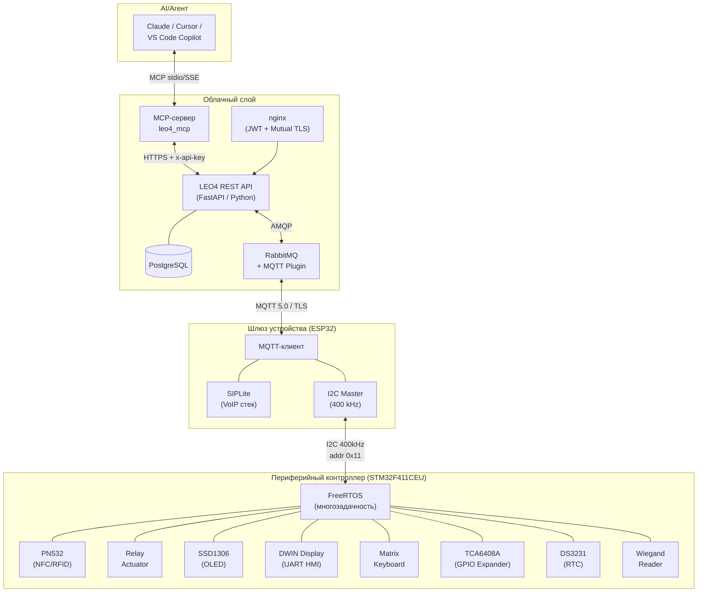
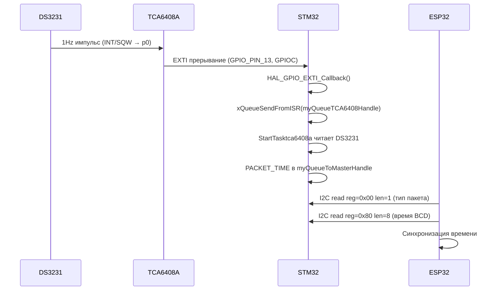
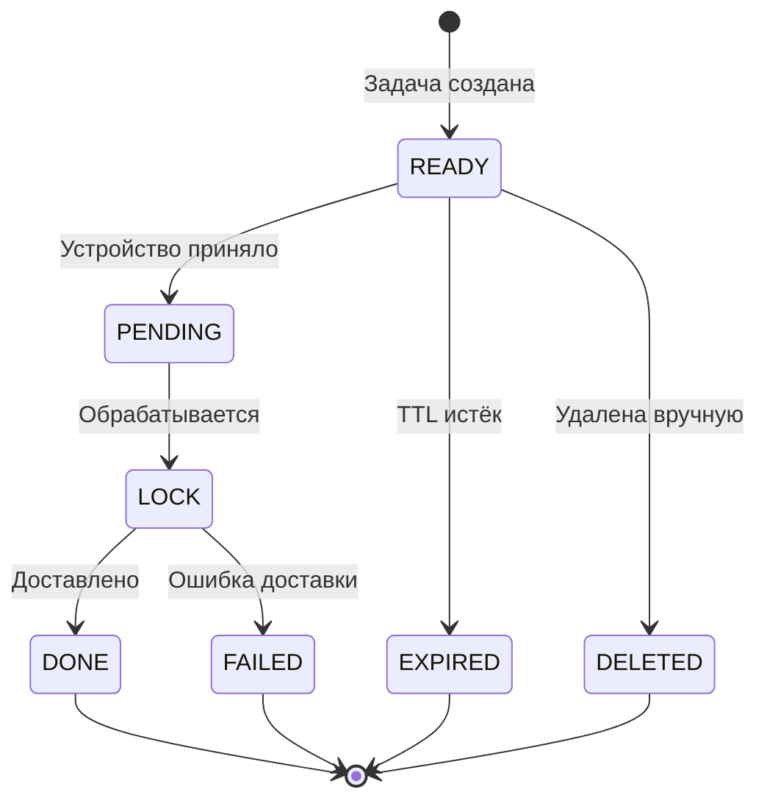
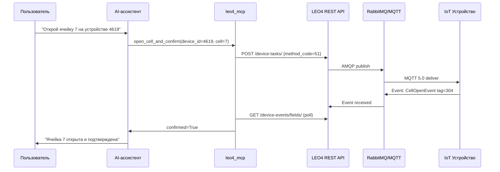
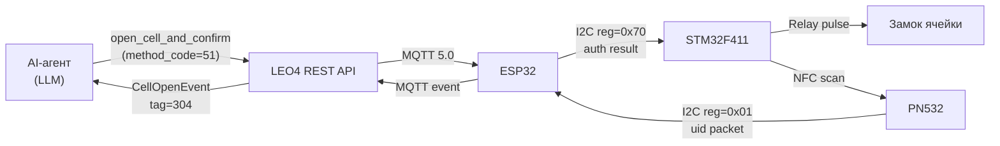
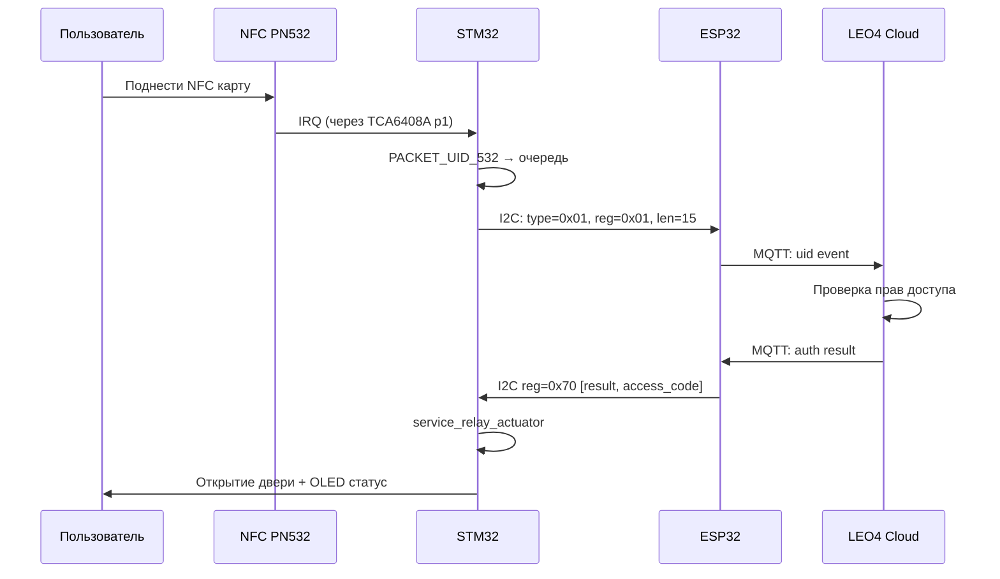
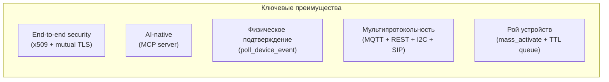

# Техническое исследование: LEO4 как робототехническая платформа

> **Версия:** 1.0  
> **Дата:** 2026-04-19  
> **Автор:** AI-исследование по запросу OlegLebedevRU  
> **Репозитории:** iot-rpc-rest-app · sip_periph · siplite · siplite_pcb

---

## Содержание

1. [Методология и источники](#1-методология-и-источники)
2. [Полный стек компонентов](#2-полный-стек-компонентов)
3. [Архитектура платформы](#3-архитектура-платформы)
4. [Аппаратный узел: sip_periph + siplite_pcb](#4-аппаратный-узел-sip_periph--siplite_pcb)
5. [Коммуникационный шлюз: siplite (ESP32)](#5-коммуникационный-шлюз-siplite-esp32)
6. [Облачный слой: iot-rpc-rest-app](#6-облачный-слой-iot-rpc-rest-app)
7. [AI/MCP-слой](#7-aimcp-слой)
8. [I2C-контракт: ESP32 ↔ STM32](#8-i2c-контракт-esp32--stm32)
9. [Сценарии использования в робототехнике](#9-сценарии-использования-в-робототехнике)
10. [Ограничения и предпосылки внедрения](#10-ограничения-и-предпосылки-внедрения)
11. [Выводы и синтез](#11-выводы-и-синтез)

---

## 1. Методология и источники

### Что подтверждено репозиториями напрямую

Исследование основано на следующих источниках:

| Репозиторий | Статус | Изученные файлы |
|-------------|--------|-----------------|
| `OlegLebedevRU/iot-rpc-rest-app` | ✅ Публичный | `README.md`, `compose.yaml`, `docs/`, `mcp/README.md`, `mcp/leo4_mcp/` |
| `OlegLebedevRU/sip_periph` | ✅ Публичный | `README.md`, `CHECKLIST.md`, `Core/Inc/`, `docs/i2c_global_contract.md`, `docs/tca6408_integration.md` |
| `OlegLebedevRU/siplite` | ⛔ Приватный / недоступен | — |
| `OlegLebedevRU/siplite_pcb` | ⛔ Приватный / недоступен | — |

> **Обозначения в тексте:**  
> ✅ **[подтверждено]** — факт прямо следует из кода или документации  
> 🔷 **[вывод]** — аккуратный вывод по совокупности доступных материалов  
> ⚪ **[предположение]** — гипотеза, требующая подтверждения

---

## 2. Полный стек компонентов



---

## 3. Архитектура платформы

### 3.1 Уровни стека ✅ [подтверждено]

Платформа состоит из четырёх уровней:

| Уровень | Репозиторий | Технологии |
|---------|-------------|------------|
| **AI/Agent** | iot-rpc-rest-app / `mcp/` | MCP (Model Context Protocol), Python, stdio/SSE |
| **Cloud API** | iot-rpc-rest-app / `app-service/` | FastAPI, FastStream, PostgreSQL, RabbitMQ, MQTT 5.0, nginx, JWT (RSA), x509 |
| **Gateway** | siplite | ESP32, FreeRTOS, MQTT, SIPLite, I2C Master |
| **Hardware** | sip_periph + siplite_pcb | STM32F411CEU, FreeRTOS, PN532, SSD1306, DWIN, TCA6408A, DS3231, реле |

### 3.2 Ключевые принципы архитектуры ✅ [подтверждено]

Из `README.md` iot-rpc-rest-app:

- **Loose coupling** — каждое устройство имеет уникальный адрес на базе x509
- **Async queued paradigm** — команды ставятся в очередь с TTL и приоритетами
- **"Last mile protocol"** — MQTT 5.0 для связи облака с устройством
- **Two-way SSL authentication** — обязательная взаимная TLS-аутентификация
- **Request/response + polling** — гибридная модель подтверждения выполнения

---

## 4. Аппаратный узел: sip_periph + siplite_pcb

### 4.1 Микроконтроллер ✅ [подтверждено]

**Файл:** `sip_periph/README.md`, `sip_periph/sip_periph.ioc`, `sip_periph/STM32F411CEUX_FLASH.ld`

- MCU: **STM32F411CEU** (ARM Cortex-M4 @ 100 MHz, 512 KB Flash, 128 KB RAM)
- IDE: STM32CubeIDE / STM32CubeMX (HAL)
- RTOS: **FreeRTOS** (конфигурация в `Core/Inc/FreeRTOSConfig.h`)
- Компиляция: Makefile + GCC ARM, целевые файлы `.elf`/`.bin`

### 4.2 Периферия ✅ [подтверждено]

Из заголовочных файлов `Core/Inc/`:

| Компонент | Заголовок | Назначение |
|-----------|-----------|------------|
| PN532 | `pn532_com.h`, `service_pn532_task.h` | NFC/RFID считыватель |
| SSD1306 | `ssd1306.h`, `ssd1306_conf.h` | OLED-дисплей I2C |
| DWIN | `app_uart_dwin.h`, `app_uart_dwin_tx.h`, `dwin_gfx.h` | HMI-дисплей UART с тачскрином |
| TCA6408A | `tca6408a_map.h`, `service_tca6408.h` | I2C GPIO-расширитель (8 пинов) |
| DS3231 | `service_time_sync.h` | Прецизионный RTC с 1Hz прерыванием |
| Matrix KBD | `service_matrix_kbd.h` | Матричная клавиатура |
| Relay | `service_relay_actuator.h` | Релейный актуатор |
| Wiegand | (в пакете PACKET_WIEGAND) | Считыватель доступа Wiegand |

### 4.3 Программные службы FreeRTOS ✅ [подтверждено]

Из `docs/tca6408_integration.md` и `CHECKLIST.md`:

- `StartTasktca6408a` — обработка прерываний GPIO-расширителя
- `StartTaskRxTxI2c1` — I2C обмен с ESP32 (мастер)
- `service_tca6408_process_irq_event()` — диспетчер событий (DS/кнопка/PN532)
- `HAL_GPIO_EXTI_Callback()` — роутер прерываний → FreeRTOS очереди

### 4.4 Поток данных: DS3231 → ESP32 ✅ [подтверждено]

Из `CHECKLIST.md` и `docs/i2c_global_contract.md`:



### 4.5 PCB: siplite_pcb 🔷 [вывод]

Репозиторий `siplite_pcb` недоступен публично. По контексту:
- Кастомная PCB, объединяющая STM32F411CEU + ESP32 + периферию
- Форм-фактор: компактный модуль для встраивания в устройства (постаматы, локеры)
- Вероятно содержит: KiCad/EasyEDA файлы, схемы, Gerber-файлы

---

## 5. Коммуникационный шлюз: siplite (ESP32)

### 5.1 Роль ESP32 в стеке 🔷 [вывод по совокупности]

Репозиторий `siplite` недоступен. По материалам `iot-rpc-rest-app/README.md` и `sip_periph/docs/i2c_global_contract.md`:

- ESP32 — **I2C Master** для STM32 (адрес STM32: `0x11`, скорость `400 kHz`)
- ESP32 — **MQTT-клиент** с mutual TLS к RabbitMQ
- ESP32 выполняет SIP-вызовы (упомянуто: "ESP32, ESP-ADF. Remote invoke SIP-Call")
- ESP32 синхронизирует время по NTP, затем через I2C reg=0x88 передаёт на STM32

### 5.2 SIPLite ✅ [подтверждено косвенно]

Из `iot-rpc-rest-app/README.md`:

```
ESP32, ESP-ADF. Remote invoke SIP-Call.
```

- SIPLite — лёгкий SIP-стек для ESP32/ESP-ADF
- Позволяет инициировать голосовые вызовы по команде через MQTT/REST API

---

## 6. Облачный слой: iot-rpc-rest-app

### 6.1 Сервисный стек ✅ [подтверждено]

Из `compose.yaml`:

| Сервис | Образ/Источник | Порты | Назначение |
|--------|----------------|-------|------------|
| `app1` | `./docker-files/app-service/Dockerfile` | — | FastAPI приложение |
| `rabbitmq` | `rabbitmq:4-management` | 8883, 5672 | MQTT + AMQP брокер |
| `pg` | `postgres` | 5432 | Хранилище задач и событий |
| `pgadmin` | `dpage/pgadmin4` | — | Управление БД |
| `nginx-mutual` | custom | 4443 | Mutual TLS (устройства) |
| `nginx` | custom | 80, 443 | JWT gateway (клиенты) |
| `avahi` | `ydkn/avahi` | host | mDNS для локального depl. |
| `certbot` | `certbot/certbot` | — | Let's Encrypt сертификаты |

### 6.2 Жизненный цикл задачи ✅ [подтверждено]

Из `mcp/README.md`:



> **Важно:** `status=3 (DONE)` означает **доставку** команды, а не физическое выполнение. Для подтверждения физического действия используется `poll_device_event`.

### 6.3 Протоколы и безопасность ✅ [подтверждено]

Из `README.md` и `docs/client-cert-ssl-rmq-config.md`:

- Устройства → брокер: **MQTT 5.0** через **Mutual TLS** (порт 8883)
- Клиенты → API: **HTTPS** с **JWT (RSA)**
- Устройство идентифицируется через **x509 сертификат**
- CA управляется через **openssl / pyca/cryptography**

---

## 7. AI/MCP-слой

### 7.1 Компонент leo4_mcp ✅ [подтверждено]

Из `mcp/README.md` и `mcp/leo4_mcp/`:

- **15 MCP-инструментов** (tools) для управления устройствами
- **4 MCP-ресурса** (resources): список устройств, события, коды методов, типы событий
- **3 шаблона промптов** (prompts): открытие ячейки, диагностика, массовая активация
- Поддерживаемые AI-клиенты: Claude Desktop, VS Code (Copilot), Cursor
- Транспорты: **stdio** (по умолчанию), **SSE** (для веб)

### 7.2 Инструменты MCP ✅ [подтверждено]

| Инструмент | Описание |
|------------|----------|
| `open_cell_and_confirm` | Открытие ячейки с подтверждением физического выполнения |
| `poll_device_event` | Опрос событий от устройства |
| `get_telemetry` | Телеметрия (батарея, сигнал, температура) |
| `write_nvs` | Запись конфигурации в NVS устройства |
| `mass_activate` | Параллельная команда для группы устройств |
| `configure_webhook` | Настройка webhook для push-событий |

### 7.3 Интеграция AI с устройствами ✅ [подтверждено]

Из `docs/ai-agent-integration-guide.md` (версия 2.0, 2026-04-04):



---

## 8. I2C-контракт: ESP32 ↔ STM32

### 8.1 Физические параметры ✅ [подтверждено]

Из `docs/i2c_global_contract.md`:

- ESP32 — **Master**, STM32 — **Slave** (адрес `0x11`, 7-бит)
- Скорость шины: **400 kHz**
- Каждая транзакция начинается с заголовка `[reg, len]`
- Нет транзакций с переменным заголовком

### 8.2 Регистровая карта STM32 ✅ [подтверждено]

| Регистр | Символ | Назначение |
|---------|--------|------------|
| `0x00` | `I2C_PACKET_TYPE_ADDR` | Тип ожидающего пакета |
| `0x01` | `I2C_REG_532_ADDR` | Данные PN532/NFC |
| `0x10` | `I2C_REG_MATRIX_PIN_ADDR` | PIN с матричной клавиатуры |
| `0x20` | `I2C_REG_WIEGAND_ADDR` | Данные Wiegand-считывателя |
| `0x30` | `I2C_REG_COUNTER_ADDR` | Сервисный счётчик |
| `0x40` | `I2C_REG_HMI_PIN_ADDR` | PIN с HMI-дисплея |
| `0x50` | `I2C_REG_HMI_MSG_ADDR` | Сообщение для HMI |
| `0x70` | `I2C_REG_HMI_ACT_ADDR` | Результат аутентификации/действия |
| `0x80` | `I2C_REG_HW_TIME_ADDR` | Чтение времени RTC |
| `0x88` | `I2C_REG_HW_TIME_SET_ADDR` | Установка времени |
| `0xE0` | `I2C_REG_CFG_ADDR` | Runtime-конфигурация |
| `0xF0` | `I2C_REG_STM32_ERROR_ADDR` | Диагностика/ошибки |

---

## 9. Сценарии использования в робототехнике

### 9.1 Умные постаматы и автоматические локеры ✅ [подтверждено]

Из `mcp/README.md` (раздел "Real-World Scenarios"):

**Стек:** STM32 (реле ячейки + NFC) → ESP32 (MQTT) → RabbitMQ → LEO4 API → AI-агент



**Ключевые компоненты:**
- `service_relay_actuator` — управление соленоидным замком
- `service_pn532_task` — сканирование NFC-метки для аутентификации
- MCP-инструмент `open_cell_and_confirm` — подтверждение физического открытия

### 9.2 Система контроля доступа ✅/🔷

**Подтверждено:** NFC-считыватель PN532 (`Core/Inc/pn532_com.h`), Wiegand-считыватель, матричная клавиатура, реле-актуатор.

**Поток аутентификации:**



### 9.3 Промышленный сенсорный узел 🔷 [вывод]

**Из README.md iot-rpc-rest-app:**
```
STM32. Remote starting measurements with custom parameters, sending an array of data.
ESP32, ESP-IDF. Remote send/receive to RS-485 bus.
```

**Сценарий для робота-манипулятора:**
- STM32 собирает данные датчиков по I2C/SPI с произвольными параметрами
- DS3231 обеспечивает точную временну́ю метку измерений
- Данные передаются через ESP32 → MQTT → LEO4 API
- Телеметрия доступна через MCP-инструмент `get_telemetry`

### 9.4 SIP-коммуникация с оператором 🔷 [вывод]

**Из README.md iot-rpc-rest-app:**
```
ESP32, ESP-ADF. Remote invoke SIP-Call.
```

**Сценарий для сервисного робота:**
- Робот обнаруживает нештатную ситуацию → инициирует SIP-вызов через SIPLite
- Оператор получает аудио/видео связь с роботом
- Параллельно через MQTT/REST передаётся телеметрия
- AI-агент может анализировать ситуацию и предлагать решения оператору

### 9.5 HMI-интерфейс автономного терминала ✅ [подтверждено]

Из `Core/Inc/app_uart_dwin.h`, `dwin_gfx.h`, `docs/dwin_tx_stage3_plan_2026-03-26.md`:

- DWIN HMI-дисплей с тачскрином управляется через UART (STM32)
- `dwin_gfx` — граф. функции для отрисовки элементов интерфейса
- Сообщения от облака → ESP32 → STM32 reg=0x50 → DWIN дисплей
- OLED SSD1306 — вспомогательный дисплей статуса

### 9.6 Массовое управление парком роботов ✅ [подтверждено]

Из `mcp/README.md` (раздел "Mass Activation"):

```
AI → mass_activate(device_ids=[4619,4620,4621], method_code=20)
   → 3 concurrent POST /device-tasks/
   → Returns {total:3, success:3, failed:0}
```

- Параллельные команды для группы устройств
- Индивидуальный мониторинг через webhook-события
- TTL и приоритеты для управления очередью

### 9.7 Удалённая конфигурация и прошивка 🔷 [вывод]

**Из mcp/README.md:**
```
write_nvs(device_id=4620, namespace="wifi", key="wifi_ssid", value="MyNetwork")
```

**Сценарий:**
- Удалённая запись конфигурации в NVS ESP32 через MCP/REST
- Изменение параметров без физического доступа к роботу
- Конфигурация STM32 через I2C reg=0xE0 (`I2C_REG_CFG_ADDR`)

### 9.8 Raspberry Pi как узел видеопотока ✅ [подтверждено]

Из README.md iot-rpc-rest-app:
```
Raspberry PI. Remote start Camera-streaming custom session to WebRTC.
```

- Raspberry Pi как более мощный вычислительный узел в рое
- Видеострим по команде через MQTT/REST
- Интеграция в ту же систему аутентификации (x509)

---

## 10. Ограничения и предпосылки внедрения

### 10.1 Технические ограничения

| Ограничение | Источник | Описание |
|-------------|----------|----------|
| `status=3 ≠ выполнено` | `mcp/README.md` | DONE означает доставку, не физическое выполнение |
| TTL задач | `docs/TTL.md` | Задача может истечь до доставки при потере связи |
| I2C атомарность | `docs/i2c_global_contract.md` | STM32 FSM требует полного заголовка [reg,len] до обработки |
| Буфер I2C | `docs/i2c_main_buffer_summary.md` | Ограниченный размер буфера для обмена данными |

### 10.2 Безопасность и PKI

- Каждое устройство требует уникального x509-сертификата от CA
- CA управляется через `openssl` / `pyca/cryptography` (в составе платформы)
- API-ключи не должны коммититься в репозиторий (`.env` в `.gitignore`)
- `LEO4_ALLOWED_DEVICE_IDS` — ограничение доступа AI-агента к конкретным устройствам

### 10.3 Инфраструктурные требования

| Требование | Обязательно |
|------------|-------------|
| Docker + Docker Compose | ✅ |
| Домен + TLS-сертификат (Let's Encrypt) | ✅ |
| PostgreSQL | ✅ |
| RabbitMQ с MQTT plugin | ✅ |
| CA для генерации сертификатов устройств | ✅ |
| Avahi/mDNS (для локального деплоя) | Опционально |

### 10.4 Аппаратные зависимости

- ESP32 должен поддерживать ESP-ADF для SIP-функциональности
- STM32F411CEU требует внешних компонентов (TCA6408A, DS3231, PN532, ...)
- PCB-дизайн (siplite_pcb) нужен для серийного производства аппаратных узлов
- Wiegand-совместимость требует согласования с конкретным форматом (26-bit, 34-bit, ...)

### 10.5 Миграционные пробелы в STM32 firmware ✅ [подтверждено]

Из `docs/i2c_global_contract.md`, раздел 10:

- `app_i2c_slave_addr_callback` содержит tolerant path для чтения без заголовка (legacy)
- `0x70` должен быть зафиксирован на `len=5` (в текущей реализации — relaxed)
- `0x50` (HMI message) требует явного определения фиксированной длины

---

## 11. Выводы и синтез

### 11.1 Что делает этот стек уникальным для робототехники



### 11.2 Полнота стека от сенсора до AI-агента

| Уровень | Компонент | Статус |
|---------|-----------|--------|
| Физический сенсор | PN532, DS3231, Wiegand, Matrix KBD | ✅ Реализовано |
| Актуатор | Relay (service_relay_actuator) | ✅ Реализовано |
| HMI | SSD1306 OLED, DWIN Touch | ✅ Реализовано |
| RT OS | FreeRTOS на STM32 | ✅ Реализовано |
| Шлюз | ESP32 + MQTT + I2C Master | ✅ Подтверждено |
| VoIP | SIPLite на ESP32 | ✅ Упомянуто |
| Брокер | RabbitMQ + MQTT 5.0 | ✅ Реализовано |
| API | FastAPI + PostgreSQL | ✅ Реализовано |
| Security | x509 + JWT + Mutual TLS | ✅ Реализовано |
| AI/Agent | MCP server (15 tools) | ✅ Реализовано |
| PCB | siplite_pcb (не доступен) | 🔷 Предположительно |

### 11.3 Нереализованные возможности (roadmap)

Из `mcp/README.md`:

- [ ] Streaming событий через SSE-подписку (замена polling)
- [ ] `GET /device-events/incremental` для эффективного long-polling
- [ ] Управление группами устройств (теги)
- [ ] Персистентный webhook inbox (SQLite)
- [ ] OpenTelemetry tracing
- [ ] Rate limiting и circuit breaker

---

*Исследование проведено на основе публично доступных репозиториев. Репозитории `siplite` и `siplite_pcb` были недоступны на момент исследования — соответствующие разделы основаны на косвенных источниках.*
